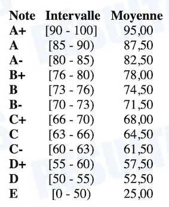

# INF5153 - Génie logiciel : Conception

## Informations Générales

* Équipe Enseignante :
  * Professeur titulaire : Sébastien Mosser ([Site web personnel](https://mosser.github.io), [Groupe de recherche ACE](https://ace-design.github.io))
  * Enseignant : William Flageol
  * Démonstrateur : À déterminer
  * Correcteur : À déterminer
* Horaire du groupe, session d'été 2020 :
  * Cours : Lundi, 09h30 - 12h30, Zoom
  * Atelier : Mercredi, 09h30 - 11h30, Zoom
* Communication :
  * [Mattermost](https://mattermost.info.uqam.ca/inf5153-20202/)
  * [Courriel]() (À éviter)

### Objectif du cours

Les notes de cours vont reprendre des principes de base de la programmation orientée objet, mais du point de vue du génie logiciel et non plus de l'informatique pure. Pour tous les cours passé le premier, la lecture des notes de cours de la semaine précédente est **obligatoire** pour vous préparer à bien comprendre les notions et exemples qui seront démontrées en présentation.

Les notes de cours seront mises à disposition au fur et à mesure sur le [Github](https://github.com/INF5153-E20/Notes) du cours.

### Évaluation & Planning de rendus

* **Les dates de remise s'entendent sur le fuseau horaire de Montréal, à 23:50 le jour de la date de remise. Tout rendu hors délais recevra automatiquement la note de zéro (0).**

* **Les règles concernant le plagiat seront appliquées sans aucune tolérance.**

<table>
<tr>
<td>

**Début**

</td>
<td>

**Remise**

</td>
<td>

**Travail à rendre**

</td>
<td>

**Objectif**

</td>
<td>

**Poids**

</td>
</tr>

<tr>
<td>05-04</td>
<td>06-15</td>
<td>

[Travail 1](https://github.com/INF5153-E20/Notes/blob/master/travail1.md)

</td>
<td>Comprendre l'utilité de la conception et gérer du code légataire.</td>
<td>20%</td>
</tr>

<tr>
<td>07-13</td>
<td>08-10</td>
<td>

Travail 2

</td>
<td>Utiliser les patrons de conception et expérimenter avec des concepts avancés</td>
<td>30%</td>
</tr>

<tr>
<td>06-01</td>
<td>06-29</td>
<td>

Projet de session - Phase 1

</td>
<td>Implémenter un logiciel de jeu non-trivial</td>
<td>20%</td>
</tr>

<tr>
<td>07-06</td>
<td>08-03</td>
<td>

Projet de session - Phase 2

</td>
<td>Appliquer un changement majeur à un logiciel</td>
<td>30%</td>
</tr>

</table>

Pour les travaux et le projet de session, le rendu se fera à travers la plateforme [Github Classroom](https://github.com/INF5153-E20/Travaux). Les dépôts de code seront clônés automatiquement par un script, et tout travail non rendu via ce biais ou hors délais ne sera pas évalué. La couverture _fonctionnelle_ de vos travaux est automatiquement vérifiée par la bonne exécution de scénarios de tests unitaires.

Il n'y aura pas d'examen durant cette session. À la place, les travaux 1 à 4 couvriront l'essentiel de la matière en vous demandant d'appliquer les concepts vus dans les notes de cours et en classe. Les pondérations réflètent la difficulté et niveau d'effort relatif de chaque travail.

Le projet de session est à faire en équipe (3 ou 4 personnes). L'évaluation se fera par le biais de présentations de chacune des équipes. Les présentations sont à huis clos. La correction tiendra compte du nombre de membres des équipes. **Un dépôt du code complet du projet devra aussi être déposé sur Github**.

Les travaux et projets sont placés de façon à balancer la charge de travail au cours de la session.

À noter que la date limite d'abandon sans échec (XX) pour cette session est le 20 août, soit à la fin du cours.

## Agenda des séances

<table>
<tr>
<td>

**Semaine**

</td>
<td>

**Date**

</td>
<td>

**Sujet**

</td>
<td>

**Travail**

</td>
<td>
Séance de cours
</td>
<tr>
<td>1</td>
<td>2020-05-04</td>
<td>

[Introduction : Génie Logiciel](https://github.com/INF5153-E20/Notes/blob/master/semaine1.md)

</td>
<td>

[Travail 1](https://github.com/INF5153-E20/Notes/blob/master/travail1.md) - [Code Kata : Harry Potter](https://classroom.github.com/a/jNioVm29)

</td>
<td>

[Vidéo](https://youtu.be/OTYOhm_Fwr8)

</td>
</tr>

<tr>
<td>2</td>
<td>2020-05-11</td>
<td>

Encapsulation, Types et Interfaces

</td>
<td>

[Travail 1](https://github.com/INF5153-E20/Notes/blob/master/travail1.md) - Poker

</td>
</tr>

<tr>
<td>3</td>
<td>2020-05-18</td>
<td>

Congé férié

</td>
<td></td>
</tr>

<tr>
<td>4</td>
<td>2020-05-25</td>
<td>

Composition _versus_ Héritage, Tests

</td>
<td></td>
</tr>

<tr>
<td>5</td>
<td>2020-06-01</td>
<td>

Principes de conception (GRASP, SOLID)

</td>
<td>

Projet de session - Phase 1

</td>
</tr>

<tr>
<td>6</td>
<td>2020-06-08</td>
<td>

Étude de cas _Jeu de Dés_

</td>
<td></td>
</tr>

<tr>
<td>7</td>
<td>2020-06-15</td>
<td>

Séance de travail

</td>
<td>

Remise du travail 1

</td>
</tr>

<tr>
<td>8</td>
<td>2020-06-22</td>
<td>

Intro aux Patrons de Conception (padawan)

</td>
<td></td>
</tr>

<tr>
<td>9</td>
<td>2020-06-29</td>
<td>

Présentations

</td>
<td>

Présentation de la phase 1

</td>
</tr>

<tr>
<td>10</td>
<td>2020-07-06</td>
<td>

Patrons de conception (chevalier)

</td>
<td>

Projet de session - Phase 2

</td>
</tr>

<tr>
<td>11</td>
<td>2020-07-13</td>
<td>

Patrons de conception (maître)

</td>
<td>

Travail 2

</td>
</tr>

<tr>
<td>12</td>
<td>2020-07-20</td>
<td>

Étude de cas

</td>
<td>
</td>
</tr>

<tr>
<td>13</td>
<td>2020-07-27</td>
<td>

Code as a crime scene

</td>
<td>

</td>
</tr>

<tr>
<td>14</td>
<td>2020-08-03</td>
<td>

Présentations

</td>
<td>

Présentation de la phase 2

</td>
</tr>

<tr>
<td>15</td>
<td>2020-08-10</td>
<td>

Séance de travail

</td>
<td>

Remise travail 2

</td>
</tr>
</table>

## Barème

Le cours utilise la grille d'évaluation standard de l'UQAM définie dans RESULTATS. La note de passage est de 50%.

## Bibliographie

### Livres d'enseignement

* Introduction to Software Design with Java. Springer, 2019.
  * Martin Robillard (McGill University).
  * [Accès PDF SpringerLink via UQAM](https://link.springer.com/book/10.1007%2F978-3-030-24094-3)
* UML@Classroom, Springer Verlag, 2015.
  * Martina Seidl, Marion Scholz, Christian Huemer & Gerti Kappel (Université de Technologie de Vienne).
  * [Accès PDF SpringerLink via UQAM](https://link.springer.com/book/10.1007%2F978-3-319-12742-2)
  * [Site web ressource (diapos additionelles)](http://www.uml.ac.at/en/)

### Livres professionels

* Software Systems Architecture: Working With Stakeholders Using Viewpoints and Perspectives, Addison Wesley, 2011.
  * Nick Rozanski & Eoin (pronounced “Owen”) Woods.
  * Disponible en bibliothèque (BU Sciences, cote QA 76.76 D47 R69 .2012)
* Head First Design Patterns, a brain friendly guide. O'REILLY.
  * Eric Freeman, Elisabeth Robson.
  * (Existe en version française: "Design patterns tête la première")
* Clean Code.
  * Robert Martin. Prentice Hall.
  * Disponible en bibliothèque (BU Sciences, cote QA 76.76 D47 M38 .2009)
  * (Existe en version française: "Coder proprement")
* Pragmatic Unit Testing. The pragmatic programmers.
  * Jeff Langr, with Andy Hunt and Dave Thomas.
  * Disponible en bibliothèque (BU Sciences, cote QA 76.73 J38 L36 .2015)
* Implementing Domain-Driven Design, Addison-Wesley Professional, 2013.
  * Vaughn Vernon
* Design Patterns: Elements of Reusable Object-Oriented Software, Addison Wesley, 1994.
  * Erich Gamma, Richard Helm, Ralph Johnson & John Vlissides.
  * Disponible en bibliothèque (BU Sciences, cote QA76.64D49)
  * (Existe en version française: "Design patterns catalogue de modèles de conception réutilisables")
* Refactoring: Improving the Design of Existing Code, Addison Wesley, 2018 (2nd edition)
  * Martin Fowler.
  * Disponible en bibliothèque (BU Sciences, cote QA 76.76 R42 F69 .1999)

## Règlement 18 sur les Infractions de nature académique

Tout acte de plagiat, fraude, copiage, tricherie ou falsification de document commis par un.e étudiant.e, de même que toute participation à ces actes ou tentative de les commettre, à l’occasion d’un examen ou d’un travail faisant l’objet d’une évaluation ou dans toute autre circonstance, constituent une infraction au sens de ce règlement.

La liste non limitative des infractions est définie comme suit :

* la substitution de personnes ;
* l’utilisation totale ou partielle du texte d’autrui en le faisant passer pour sien ou sans indication de référence ;
* la transmission d’un travail aux fins d’évaluation alors qu’il constitue essentiellement un travail qui a déjà été transmis aux fins d’évaluation académique à l’Université ou dans une autre institution d’enseignement, sauf avec l’accord préalable de l’enseignante, l’enseignant ;
* l’obtention par vol, manœuvre ou corruption de questions ou de réponses d’examen ou de tout autre document ou matériel non autorisés, ou encore d’une évaluation non méritée ;
* la possession ou l’utilisation, avant ou pendant un examen, de tout document non autorisé ;
* l’utilisation pendant un examen de la copie d’examen d’une autre personne ;
* l’obtention de toute aide non autorisée, qu’elle soit collective ou individuelle ;
* la falsification d’un document, notamment d’un document transmis par l’Université ou d’un document de l’Université transmis ou non à une tierce personne, quelles que soient les circonstances ;
* la falsification de données de recherche dans un travail, notamment une thèse, un mémoire, un mémoire-création, un rapport de stage ou un rapport de recherche.

Les sanctions reliées à ces infractions sont précisées à l’[article 3 du Règlement no 18](https://instances.uqam.ca/wp-content/uploads/sites/47/2017/12/REGLEMENT_NO_18.pdf) sur les infractions de nature académique.

Vous pouvez consulter sur le site [r18.uqam.ca](r18.uqam.ca) des capsules vidéos qui vous en apprendront davantage sur l’intégrité académique et le R18, tout en vous orientant vers les ressources mises à votre disposition par l’UQAM pour vous aider à éliminer le plagiat de vos travaux.

