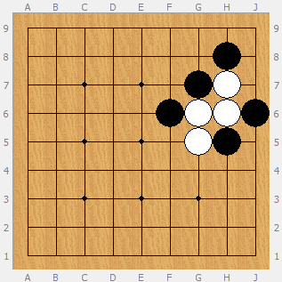
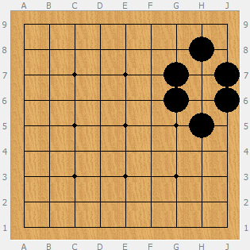
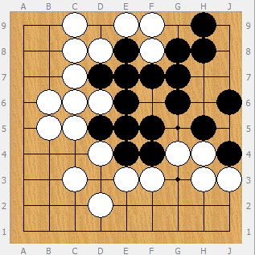

# Projet de session

Le projet que vous aurez à compléter durant le cours de cette session est une implémentation du jeu de Go. L'objectif est de vous mettre dans une situations où vous devrez implémenter un logiciel avec des spécifications qui n'ont pas été écrites par ou pour un développeur.

Voici les spécifications que vous pouvez utiliser : [https://fr.wikibooks.org/wiki/Jeu_de_go/R%C3%A8gles_de_base](https://fr.wikibooks.org/wiki/Jeu_de_go/R%C3%A8gles_de_base).

Si vous ne connaissez pas du tout ce jeu et vous préféreriez l'apprendre en y jouant, voici un tutoriel interactif qui vous donnera les bases : [https://online-go.com/learn-to-play-go](https://online-go.com/learn-to-play-go).

## Spécifications

Pour faciliter l'évaluation, voici quelques spécifications à considérer dans votre travail :

* Votre programme prendra en entrée un fichier texte d'un format spécifique (décrit plus bas) décrivant une partie de Go et devra simuler la partie et afficher l'état à la fin de la simulation.
  * Votre simulation doit respecter les règles du jeu Go.
  * Le plateau sera une grille de 9x9.
  * Vous êtes libre d'afficher le résultat de la simulation comme vous le voulez, mais vous serez évalués sur sa lisibilité.
* Votre code doit respecter les principes SOLID et utiliser les patrons de conception GRASP vu dans les notes de cours.
* Vous devrez présenter votre programme fonctionnel et son code à la date de remise. Je vous fournirai des fichiers à utiliser en entrée pour vérifier son bon fonctionnement.

## Format du fichier d'entrée

Le fichier de simulation de partie sera une simple ligne de texte sous le format suivant :

    G7 G6 F6 G5 H5 H6 J6 H7 H8
    
Le fichier représente chaque action des joueurs à tour de rôle, commençant par le joueur noir. La chaîne ci-dessus donnerait le résultat suivant :

Chaque entrée est tuple de coordonnées : la colonne (A-J) suivi de la rangée (1-9). Un joueur peut aussi passer son tour (``PASS``). (La lettre _I_ est omise des colonnes dans la notation officielle pour éviter la confusion avec le chiffre _1_ et le _L_ minisucule.)

Voici un deuxième exemple :

    G7 H7 J7 H6 H8 PASS G6 PASS J6 PASS H5
    

(Les jetons blancs ont été retirés parce que capturés.)

Et un exemple d'une partie complète :

    G7 F3 G6 C3 D3 D2 D5 C7 F5 B5 C6 B6 D7 C8 E6 G4 F7 F9 E8 E9 D9 D8 H8 F8 H9 D4 E4 E3 H5 H4 J6 C5 J4 D6 E7 H3 E5 J3 F4 C6 G8 C9 PASS PASS
    

## Questions et hypothèses

Je ne répondrai à aucune question concernant les règles du jeu ou les spécifications autre que celles mentionnées dans la section ci-dessus. 

Si vous rencontrez un problème et que vous devez faire un choix, l'approche que vous devez prendre est d'émettre une hypothèse. Par exemple, il n'est pas mention d'à quoi doit ressembler l'interface graphique. Vous allez donc devoir émettre une hypothèse sur la façon dont vous allez afficher les résultats du programme (e.g. on va utiliser un affichage console pour éviter de créer une dépendance à un système d'affichage GUI).

## Travail d'équipe

Le travail est à réaliser en équipes de 4. Vos équipes sont normalement déjà formées. Si vous n'avez pas d'équipe, veuillez me le faire savoir au plus vite et je vous ajouterai à une équipe existante au hasard.

**_Les travaux remis individuellement ne seront pas évalués!_**

## Dépôt Git

Vous pouvez obtenir votre dépôt Git au lien suivant : [https://classroom.github.com/g/eBfQzPpr](https://classroom.github.com/g/eBfQzPpr).

## Critères de correction

La correction du travail se fera sous la forme d'une présentation de 15 minutes que vous devrez préparer. Les présentations vont se faire à huit-clos et vous n'aurez à être présent qu'à l'heure allouée à votre équipe. Le cours 9 est réservé pour les présentations (nous détermirons l'ordre et les heures de chaque équipe durant les semaines des cours 7 et 8).

Votre présentation devra démontrer le bon fonctionnement de votre logiciel en prenant en entrée quelques (~5) fichiers de simulation de partie (format ci-dessus) et afficher le résultat de la simulation. De plus, vous devrez montrer votre code et vos décisions de conception. Voici les critères de correction que vous devez démontrer :

| Critère                                             | Poids |
| ---                                                 | ---   |
| Résultats des simulations exacts                    | 30%   |
| Affichage des résultats clair                       | 10%   |
| Démonstration des principes SOLID (5% par principe) | 25%   |
| Démonstration de 3 patrons GRASP (5% par patron)    | 15%   |

## Remise des travaux

La présentation du cours 9 sera la base de votre évaluation, mais vous devez tout de même remettre votre code sur votre dépôt Git avant la fin de la date de remise pour que je puisse le vérifier si nécessaire.

Bonne chance!
