# INF5153 - Semaine 1

## Bienvenue dans ce cours de Génie Logiciel!

> _The most obvious proof that Devs are better than Wizards: Devs are often asked to perform magic. Wizards are never asked to write software._
>
> -- <cite>Michalis Famelis, professeur à l'UQAM</cite>

Jusqu'à maintenant, dans votre cheminement académique, vous avez appris à programmer et à analyser des logiciels (INF3135 et INF5151). Dans ce cours, nous allons voir différentes techniques qui vous permettront de développer des logiciels plus intelligemment.

Un des objectifs de ce cours est de démystifier le Génie Logiciel comme étant cette pratique où l'on dessine des diagrammes UML qui ne serviront jamais à rien. Les techniques et patrons de conception que nous verrons dans ce cours seront tous directement applicable au code que vous allez produire durant la session. Bien entendu, il est possible qu'un diagramme UML (ou une douzaine) se cachent quelque part dans les notes, mais l'objectif du cours n'est pas de produire du UML, mais bien des programmes et logiciels fonctionnels et bien structurés.

### Quelques mots par rapport à moi

Mon nom est William Flageol, je suis un nouvel enseignant engagé à l'UQAM il y a deux jours à la date d'écriture de ces notes. Je suis aussi enseignant à l'UQTR et étudiant au doctorat en Génie Logiciel à l'Université Concordia.

Mon sujet de recherche porte sur la relation entre les fonctionalités et paradigmes supportés par un langage de programmation et l'implémentation des patrons de conception orientés objet.

De plus, j'ai une dizaine d'années d'expérience dans l'industrie en tant que développeur et architecte logiciel. Voici un aperçu des endroits où j'ai travaillé :

* 2008-2009 : Soutien technique chez Service Canada et Revenu Canada;
* 2010 : Programmeur chez ICO Technologies, Shawinigan;
* 2011-2012 : Contrats de programmation indépendants;
* 2012-2013 : Soutien au développement chez Groupe LGS, Québec;
* 2014-2015 : Développeur/Chef d'équipe chez 6i Solutions, Trois-Rivières;
* 2015-2019 : Architecte logiciel chez Groupe CGI, Shawinigan.

J'ai utilisé un bon nombre de technologies et langages de programmation autant professionellement que pour des projets personnels. Entre autres, je programme couramment en C#, F#, Java, Kotlin, Common Lisp et Haskell.

## Section 1 - Logistique du cours

Comme mentionné dans le plan de cours, ce cours est divisé en trois parties importantes :

* Les notes de cours que vous lisez présentement;
* Les travaux à faire tout le long de la session qui seront la base de votre évaluation;
* Les séances du lundi matin où nous verrons des exemples, études de cas et où je répondrai à vos questions.

**Il est important de suivre et lire les notes de cours tout le long de la session. Je ne répondrai pas aux questions dont les réponses se trouvent dans ces notes durant les séances.**

Les notes de cours sont une version explosée et détaillée des présentations de Sébastien Mosser (2019).

### Comment me contacter

Vous avez normalement tous été ajouté à un groupe de conversation Mattermost. Ce sera l'outil principal à utiliser pour communiquer avec moi en dehors des séances de cours. Vous pouvez utiliser la salle _Questions Génie Logiciel_ pour me poser des questions concernant les travaux ou demander des clarifications concernant la matière.

* J'invite chacun d'entre vous à écrire une courte présentation dans la salle _Présentations_ en donnant votre nom, votre programme et ce qui vous a attiré à étudier en informatique et/ou génie logiciel. Ça pourra vous être utile plus tard lorsqu'il faudra former des équipes!

S.V.P. ne pas m'envoyer de questions par courriel; j'en reçois déjà beaucoup trop et il se pourrait que votre question se perde. Mattermost est l'outil à utiliser.

### Disponibilité

Je réserve une partie (idéalement la moitié) de chaque séance de cours pour que vous puissiez travailler sur les différents travaux au cours de la session et pour me poser des questions. De plus, des laboratoires sont prévus les mercredi matin (responsable à déterminer) si vous avez des questions spécifiques aux technologies des projets (Java, IntelliJ, Git, etc.). En dehors de ça, vous pouvez me contacter en messagerie privée sur Mattermost si vous avez des questions d'ordre plus personnel. Je serai principalement disponible du lundi au mercredi durant les heures ouvrables (9 à 17). Il est possible que je répondre en dehors de ces heures, mais je ne garanti rien!

### Avertissement final

Attention, INF5153 (et la conception de logiciel en général) est un cours difficile, qui demande un travail continu et régulier durant la session. Il y a beaucoup de travaux à remettre; si vous tentez de tous les faire en même temps la dernière semaine, vous allez très certainement vous planter. Vous devrez gérer votre temps intelligemment pour bien réussir ce cours!

### Projet de session

> _Now it's our time to go out  
> (My best friend)  
> And set the world's people free  
> And **we can do it together, you and me  
> But mostly me  
> You and me, but mostly me**  
> Are gonna change the world forever  
> **'Cause I can do most everything**_

> _--The Book of Mormon (the musical)_

<table>
<tr>
<td>
"_Je travaille mieux tout seul_"

 

"_Les autres me ralentissent_"

 

"_Je suis meilleur que les autres_"

 

"_Je connais pas les autres_"
</td>
<td>
>
</td>
</tr>
</table>

En plus des travaux à remettre tout le long de la session, ce cours comporte un projet de session qui se déroulera en deux phase. En première phase, vous aurez à développer une implémentation d'un jeu de société non-trivial (qui sera dévoilé à la semaine 3, surprise!). La deuxième phase consistera à appliquer une modification majeure à votre logiciel qui mettra à l'épreuve le design que vous aurez choisi.

Le jeu choisi ne sera pas nécessairement facile à transformer en programme et il n'y aura pas de clarifications aux règles autres que celles que je fournirai dans l'énoncé. Vous devrez émettre vos propres hypothèses et procéder de la façon dont vous jugerez la meilleure. Ni moi ni le responsable des laboratoires ne répondront aux questions concernant les spécifications.

Le travail sera effectué en équipe de 4 (dépendemment du nombre d'étudiants, il pourra y avoir un nombre d'équipes de 3). Le projet de session est un travail ambitieux et la conception est une discipline qui nécessite de la discussion et de la collaboration. Il n'y aura pas d'exceptions.

Je suis conscient que former des équipe dans le contexte d'un cours à distance ne sera pas nécessairement évident. Une salle _Formation d'équipe_ sera créée sur Mattermost pour que vous puissiez discuter entre vous et former vos équipes.

L'évaluation du projet de session se fera sous forme de présentations où vous devrez me démontrer le bon fonctionnement de votre logiciel ainsi que les choix de conception que vous aurez faits. Deux séances sont prévues dans le plan de cours à cet effet. Dû au nombre d'inscriptions, les présentations devront être limitées à 15 minutes par équipe.

Le projet de session équivaut à 40% de la note finale du cours, séparé en 20% par phase.

### Outils et technologies

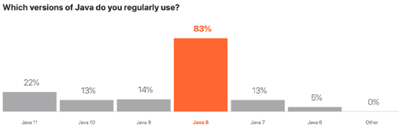
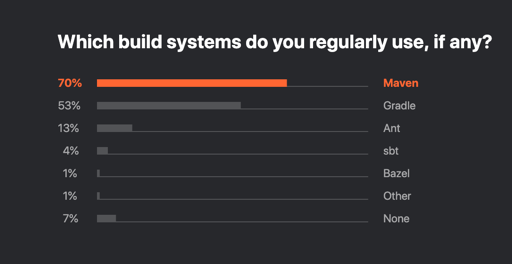
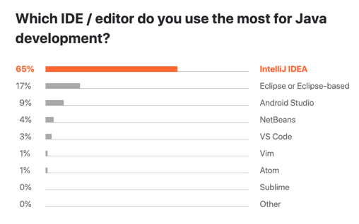

Tout au long du cours, la majorité des explications et exemples seront donné avec le langage de programmation Java et la plateforme IntelliJ IDEA. Les devoirs devront obligatoirement être complété avec ces plateformes aussi par soucis de simplicité.

Comme l'évaluation du travail de session se fera sous forme de présentation, je vous donne le choix d'utiliser les technologies que vous voudrez pour le compléter. Cependant, prenez note que la personne responsable des laboratoires ne répondra qu'aux questions concernant Java, IntelliJ et Git (et les questions concernant la conception en général). Si vous utilisez une technologie que je connais bien (voir ma présentation plus haut), je pourrai peut-être vous aider avec.

## Section 2 - Génie Logiciel ?

> _Le génie logiciel est une **science de génie** industriel qui étudie les **méthodes de travail** et les **bonnes pratiques** des ingénieurs qui **développent** des logiciels._

> "_On time, on specs, on budget._"

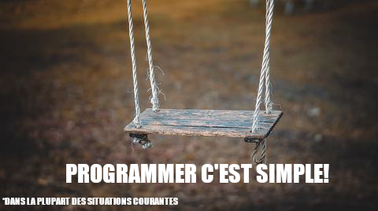

Si vous avez besoin de créer un script pour aller extraire les images d'une page Web, ou si vous voulez créer un logiciel pour rouler des jets de dés, il n'y a rien de compliqué à ça; pas besoin de génie logiciel. On parle de génie logiciel lorsqu'on a affaire à des logiciels de grande envergure : un système de gestion de paie d'entreprise, un navigateur Web, un logiciel de traitement de texte. De plus, en entreprise, il y a toujours une date de remise qui approche, et plusieurs projets à jongler; tout devient plus complexe.

C'est pourquoi on travaille alors avec de plus grandes équipes, où les membres occupent des rôles différentes, comme développeur, testeur, architecte logiciel, etc.

En ce moment, vous avez appris à programmer. Vous êtes certainement capables de prendre une spécification claire et la transformer en programme fonctionnel. En maîtrisant le génie logiciel, vous apprendrez à _développer_ des logiciel pour qu'ils soient compréhensibles, testables, maintenables, conviviaux et selon les critères voulus par les utilisateurs. La différence entre un _programmeur_ et un _développeur_ est la qualité des produits développés.

> _Le génie logiciel s'intéresse en particulier aux **procédures systématiques** qui permettent d'arriver à ce que des **logiciels de grande taille** correspondent aux **attentes du client**, soient *fiables*, aient un **coût d'entretien réduit** et de **bonnes performances** tout en **respectant les délais** et les **coûts de construction**._

#### Un logiciel de grande envergure

Lorsqu'on parle de logiciel de taille non-triviale; les logiciels qu'on voient souvent apparaître en contexte d'entreprise, on ne parle pas de seulement quelques milliers de lignes de code.

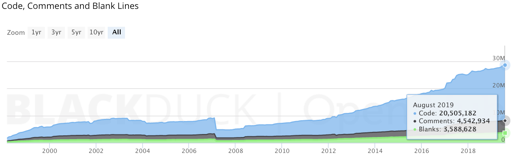

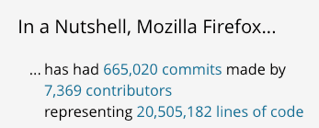

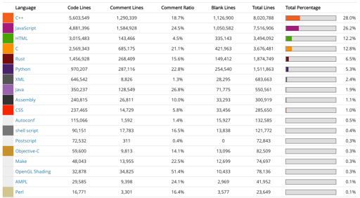

Le navigateur Mozilla Firefox est un projet comportant plus de 20 millions lignes de code, une quinzaine de langages de programmations différents.

Il devient clair alors qu'il est complètement impossible d'avoir une compréhension d'un tel projet simplement en _lisant son code_. Et comment développe-t-on une telle monstruosité de projet sans que tout foire avant la première livraison? Comment fait-on pour continuer de faire évoluer un tel logiciel sans que son code ne devienne qu'une boule géante de spaghetti? Souvent avec une équipe réduite et des spécifications qui changent à travers l'évolution du projet!

C'est à ces réponses que le génie logiciel veut répondre.

#### Et l'analyse alors?

> _Le client **exprime ses besoins**, exigences et spécifications dans un **cahier des charges formalisé** qui permet au développeur de **livrer un produit conforme** en tout point à ce qui est attendu par celui-ci._

Dans la "vraie vie", on est souvent rendu à devoir travailler avec un ensemble de récits utilisateurs mal fichus, et à devoir faire avec!

Et c'est le développeur que l'on blâmera en cas de bogue.

#### Comment on fait alors ?

Voici un exercice que vous pouvez faire : écrivez des spécifications en texte pour que quelqu'un soit en mesure de dessiner l'image qui suit.

Une fois que ce sera fait, continuez à lire.

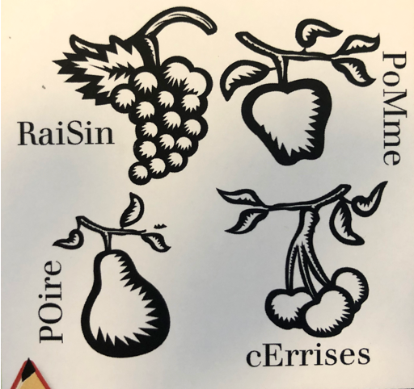

&nbsp;

&nbsp;

&nbsp;

&nbsp;

&nbsp;

&nbsp;

C'est fait?

&nbsp;

&nbsp;

&nbsp;

&nbsp;

Maintenant, imaginez que quelqu'un utilise vos spécifications pour dessiner une image et que je la corrige en utilisant ces critères d'acceptations :

* Il y a au moins sept (7) grains de raisin sur la grappe;
* La pomme est située à droite du raisin et au-dessus des cerises;
* On voit exactement quatre (4) feuilles sur la branche supportant la pomme;
* Il y a exactement trois cerises sur la branche;
* Dans le mot "RaiSin", seuls le "R" et le "S" sont en majuscule;
* On voit exactement une feuille sur la grappe de raisin;
* Le mot "POire" est écrit verticalement à gauche de la poire;
* Seules les deux (2) premières lettres du mot "POire" sont en majuscules;
* Le mot "PoMme" est écrit verticalement à droite de la pomme;
* Le mot "cErrises" est mal orthographié.

Est-ce que vos spécifications couvraient tous ces critères?

#### Bref, posez des questions!

Lorsque vous avez un projet à faire avec des spécifications qui vous sont données, la première étape est de clarifier les points qui sont flous ou qui semblent porter à confusion. Le manque de communication est la cause numéro un d'échec de projets en entreprise.

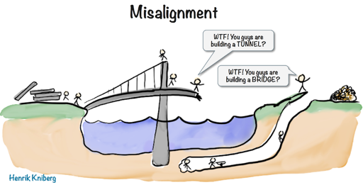

#### Les modèles à la rescousse

L'adage dit "**The code is the truth**". Mais êtes-vous capable de lire 20 millions de lignes de code? Si vous lisiez une ligne par seconde (ce qui n'est définitivement pas le cas), ça vous prendrait quand même 232 jours de lecture sans arrêt!

Pour aider à **maîtriser le produit**, on utilise des modèles de conceptions pour donner une "vue d'en haut du système". Parfois, ces modèles peuvent aussi aider à détailler des points critiques.

Pour éviter que tout le monde se mette à inventer son propre langage de modélisation (comme c'était le cas dans les années 90 et avant), l'informatique a adopté certaines **lingua franca**, telle que UML (Unified Modeling Language).

###### Ah non, pas des diagrammes UML!

Les diagrammes UML ont été inventé dans un but bien précis : permettre de communiquer des concept et des programmes plus facilement qu'en faisant lire du code directement. Certains langages de programmation sont bien adapté à communiquer leur structure simplement en les lisant (je pense à F# par exemple), mais dans d'autres cas...

    #include <stdio.h>
    #include <string.h>
    char *d =
    "@n'+,#'/*{}w+/w#cdnr/+,{}r/*de}+,/*{*+,/w{%+,/w#q#n+,/#{l+,/n{n+,/+#n+,/#/
    ;#q#n+,/+k#;*+,/'r :'d*'3,}{w+K w'K:'+}e#';dq#'l /
    q#'+d'K#!/+k#;q#'r}eKK#}w'r}eKK{nl]'/#;#q#n'){)#}w'){){nl]'/+#n';d}rw' i;# /
    ){nl]!/n{n#'; r{#w'r nc{nl]'/#{l,+'K {rw' iK{;[{nl]'/w#q#n'wk nw' /
    iwk{KK{nl]!/w{%'l##w#' i; :{nl]'/*{q#'ld;r'}{nlwb!/*de}'c /
    ;;{nl'-{}rw]'/+,}##'*}#nc,',#nw]'/+kd'+e}+;#'rdq#w! nr'/ ') }+}{rl#'{n' ')# /
    }'+}##(!!/";
    char *s = "!ek;dc i@bK'(q)-[w]*%n+r3#l,{}:/nuwloca-O;m .vpbks,fxntdCeghiry";
    int exec(int t, int _, char *a)
    {
    if (t < 0) { while (t++ < 0) { a = 1 + index(a, '/'); }; return exec(0, _,
    a);}; if (t == 0) { while (*a != '/') { putchar(index(s, *a++)[31]); }; return
    0; };if (t == 2) { exec(0, 0, d); exec(1-_, 0, d); exec(-13, 0, d); }; if (t <
    _) { exec(t+1, _, a); }; exec(-27+t, 0, d); if (t == 2 && _ < 13) { return
    exec(2, _+1, ""); }; return 0;
    }
    int main() { return exec(2, 2, ""); }

Ok d'accord, c'est illisible parce que le formattage et l'identation sont foireux :

    int exec(int t, int _, char * a) {
        if (t < 0) {
            while (t++ < 0) {
                a = 1 + index(a, '/');
            };
            return exec(0, _, a);
        };
        if (t == 0) {
            while ( * a != '/') {
                putchar(index(s, * a++)[31]);
            };
            return 0;
        };
        if (t == 2) {
            exec(0, 0, d);
            exec(1 - _, 0, d);
            exec(-13, 0, d);
        };
        if (t < _) {
            exec(t + 1, _, a);
        };
        exec(-27 + t, 0, d);
        if (t == 2 && _ < 13) {
            return exec(2, _ + 1, "");
        };
        return 0;
        }
        
    int main() {
        return exec(2, 2, "");
    }

Est-ce que c'est mieux? Êtes-vous capable de deviner ce que ce programme émet en sortie?

<table>
<tr>
<td>
On the first day of Christmas my true love gave to me  
a partridge in a pear tree.

On the second day of Christmas my true love gave to me  
two turtle doves  
and a partridge in a pear tree.

On the third day of Christmas my true love gave to me  
three french hens, two turtle doves  
and a partridge in a pear tree.  

…
</td>
<td>
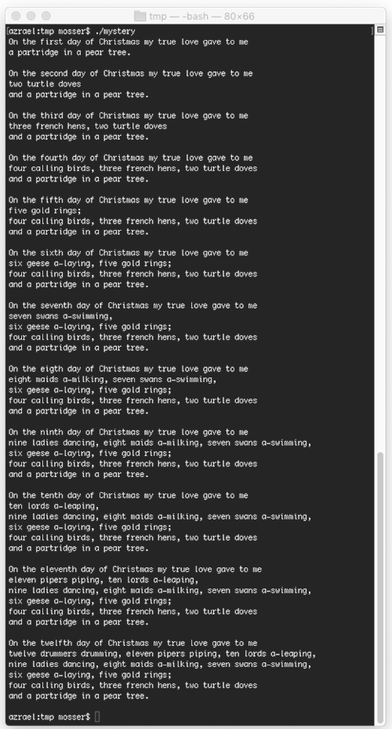
</td>
</tr>
</table>

Il s'agit d'un chant de Noël évidemment! Non, pas évident du tout.

Essayons comme cela :

    public class Mystery {
        private static String[] gifts = {
            "A partridge in a pear tree.", "Two turtle doves and",
            "Three french hens", "Four calling birds",
            "Five golden rings", "Six geese a-laying",
            "Seven swans a-swimming", "Eight maids a-milking",
            "Nine ladies dancing", "Ten lords a-leaping",
            "Eleven pipers piping", "Twelve drummers drumming",
            "And a partridge in a pear tree.", "Two turtle doves"
        };
        
        private static String[] days = {
            "first", "second", "third", "fourth", "fifth", "sixth", "seventh",
            "eighth", "ninth", "tenth", "eleventh", "Twelfth"
        };
        
        public static void main(String[] args) {
            for (int i = 0; i < days.length; i++) {
                System.out.printf("%nOn the %s day of Christmas%n", days[i]);
                System.out.println("My true love gave to me:");
                for (int j = i; j >= 0; j--)
                    System.out.println(gifts[i == 11 && j < 2 ? j + 12 : j]);
            }
        }
    }

Qu'en pensez-vous? C'est mieux?

Et si on restructurait la méthode main comme ceci :

    public static void main(String[] args) {
        List<Event> events = new ArrayList<>();
        Event first = new Event(new Gift("a partridge in a pear tree"));
        events.add(first);
        Event second = first.buildNext(new Gift("two turtle doves"));
        events.add(second);
        // …
        events.forEach(System.out::println);
    }

4 versions du même code et tous produisent le même résultat! Laquelle préféreriez-vous travailler avec si je vous demandait de la modifier?

L'objectif du cours est de vous apprendre à produire du code comme ces deux derniers exemples.

#### Analyse multi-dimensionnelle

Lorsqu'on conçoit un logiciel, il faut prendre des décisions quant aux caractéristiques sur lesquelles nous voulons nous concentrer :

* Est-ce que le logiciel doit être maintenable, ou est-ce qu'il s'agit d'un script "one-shot"
* Par qui sera utilisé le logiciel? Doit-il être convivial?
* Quel est le niveau de performance requis? 
  * Est-ce que certaines opérations doivent être effectuées en dessous d'un certain seuil de temps?
* De qui sera composée l'équipe de développement? 
  * Le code doit-il pouvoir être facilement compris par des développeurs junior?
* Etc.

Il est impossible de faire un logiciel parfait sous toutes les dimensions. Parfois on devra sacrifier de la maintenabilité pour obtenir de la performance, ou de la convivialité pour gagner du temps. C'est à l'architecte logiciel et au chargé de projet de prendre les meilleures décisions par rapport à ces facteurs.

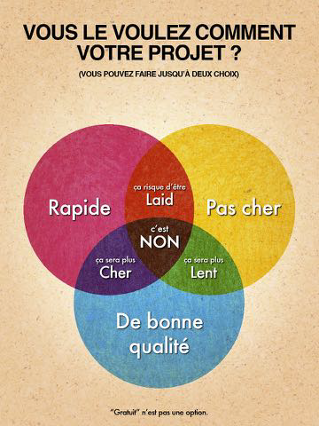

## Section 3 - Principes de Génie Logiciel

#### Objectif : Livrer de la valeur

Le principe de base du génie logiciel est d'insister sur le "**quoi**" plutôt que sur le "**comment**". Dans beaucoup des exemples que l'on va voir, les détails spécifiques d'implémentation n'auront pas d'impact sur la valeur finale du produit; c'est la structure générale qui crée notre valeur ajoutée.

##### Un peu de vocabulaire

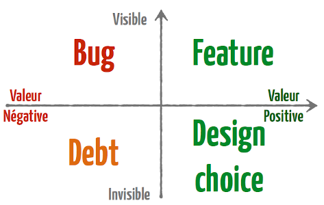

Lorsqu'on parle de valeur, on ne parle pas nécessairement de fonctionalité (_features_). Les choix de conception sont invisible aux utilisateurs mais ont définitivement une valeur dans un logiciel. C'est ces choix qui auront un effet sur la facilité avec laquelle vous allez pouvoir faire évoluer votre logiciel (maintenabilité) et la quantité de bogues qu'il contiendra.

Dans le langage du génie logiciel, lorsqu'on parle d'une mauvaise conception qui n'a pas d'impact visible sur l'utilisateur, on utilisera le terme "dette technique". Concrètement, la dette technique est une métrique qui représente l'effort de programmation nécessaire pour que le logiciel soit considéré "bien conçu". Chaque mauvaise décision de conception ajoute à la dette technique, et cette dette grandit le plus vite au début du développement d'un logiciel.

#### Refactoring

Lorsqu'un logiciel est dans un état où son évolution devient difficile (lire : son code est trop spaghetti), il faut considerer le réusiner (faire du "_refactoring_"). Le refactoring n'ajoute pas de valeur immédiate pour les utilisateurs du logiciel, alors il est parfois difficile de justifier dans le câdre d'un projet d'entreprise d'investir du temps sur cette tâche. C'est pourquoi il est important de prioriser les tâches de refactoring pour effectuer les plus importantes en premier au cas où on manquerait de budget ou de temps pour tout faire. 

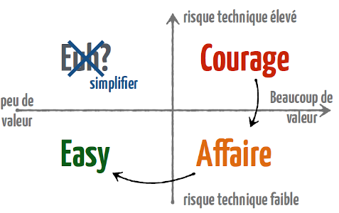

L'ordre recommandé est de commencer par la partie la plus compliquée et qui ajoute le plus de valeur. C'est évident qu'on cherche le plus de valeur, mais pourquoi la plus compliquée? Dans un projet, les coûts et les risques d'effectuer des changements augmentent plus le projet progresse. On veut régler les problèmes les plus complexe le plus tôt possible pour minimiser les risques d'impacts sur le reste du projet (et éviter qu'on ait à refaire du travail qu'on a déjà fait!).

#### La conception pour estimer

On peut exploiter les modèles de conception pour estimer le risque d'intégration d'une fonctionnalité dans un logiciel. Parfois un client peut effectuer des demandes sans nécessairement comprendre les implications sur le code. Les modèles comme UML peuvent être utilisé pour aider à expliquer les impacts d'une demande sans avoir à lui montrer du code directement (petit conseil : évitez de montrer du code à des clients non-techno : vous allez les perdre immédiatement).

Effectuer une bonne conception et architecture permet de mieux anticiper, assurer une livraison dans les délais et le budget alloué et s'assurer que toutes la spécification est respectée.

### Parlons Orienté-Objet

La programmation orienté-objet est le paradigme le plus populaire dans l'industrie de nos jours. Ses principes permettent de plus facilement créer du code qui représente des concepts dans le monde réel. L'orienté-objet permet de créer du code plus facilement lisible et maintenable que la programmation procédurale (son ancêtre direct).

#### L'orienté-objet est-il la seule réponse?

Il existe d'autres paradigmes que l'orienté-objet et le procédural. Chaque méthode a des avantages et désavantages propres. Ce cours se concentre principalement sur l'application du génie logiciel à la programmation orienté-objet (du fait que tout le curriculum est basé sur ça), mais certains problèmes ont certainement des réponses tout aussi valide, sinon parfois meilleures, dans d'autres paradigmes comme la programmation fonctionnelle ou la méta-programmation.

Autant que possible, ce cours portera sur des principes généraux applicables en programmation et en conception, mais l'emphase sera mise sur la programmation orienté-objet et spécifiquement Java.

#### Les principes S.O.L.I.D.

La programmation orienté-objet est guidée par 5 principes de base qui peuvent être mémorisés par la mnémonique SOLID :

* _Single responsibility principle (SRP)_  
  Une classe ne doit avoir qu'une seule préoccupation et chaque méthode ne doit effectuer qu'une seule action.  
  E.g. : Une classe Livre ne devrait pas dépendre sur des classes du module de facturation!

* _Open/closed principle (OCP)_  
  Une classe doit être ouverte à l'extension et fermé à la modification.  
  E.g. : L'implémentation d'une classe devrait toujours être privée pour éviter qu'un objet externe en dépende.
  
* _Liskov substitution principle (LSP)_  
  Les objets d'un programme doivent pouvoir être remplacés par des instances de leurs sous-types sans "casser" le programme.  
  E.g. : Si ArrayList est un sous-type de List, je devrais pouvoir utiliser ArrayList à tous les endroits où List est requis.
  
* _Interface segregation principle (ISP)_  
  Il vaut mieux plusieurs interfaces spécifiques qu'une unique interface générique.
  E.g. : Architectures microservices, REST.

* _Dependency inversion principle (DIP)_  
  Il faut dépendre des abstractions, pas des implémentations.
  E.g. : Éviter de dépendre d'ArrayList lorsque List (son type parent) suffit.

Nous verrons des applications de ces principes tout au long de la session et pourrons discuter de leur raison d'être.

#### Test Unitaires

> _A good programmer looks both ways before crossing a one-way street._  
> --_Scott W. Ambler_

> _Du code qui compile pas, ça a jamais tué personne. Alors que du code qui compile par contre..._

Il est important de tester son code et les tests unitaires sont l'outil le plus important pour ce faire. Rappelez-vous la loi de Murphy : si quelque chose doit planter, ça va se faire au pire moment possible (probablement durant votre présentation de projet de session ;).

## Section 4 - Langage de modélisation (UML)

Ceci n'est pas un cours de UML, mais UML est un outil utile pour décrire des programmes de façon visuelle et n'est au final qu'un langage pour communiquer des concepts (c'est même écrit dans son nom!).

#### Pourquoi modéliser?

On peut vouloir

* Spécifier la structure et le comportement d'un système;
* Aider à la construction d'un système;
* Visualiser un système;
* Documenter des décisions.

#### Unified Modeling Language

UML a été inventé dans les années 90 parce qu'il y avait une pléthore de notations et de méthodes pour décrire des systèmes (OMT, Booch, et j'en passe...). Plus personne n'y comprenait quoi que ce soit (phénomène de la tour de Babel). Évidemment, la solution à trop de langages était d'en créer un de plus (hmm...).

L'entreprise Rationale a commercialisé le langage UML qui est devenu le langage universel en industrie et en recherche pour modéliser des concepts orienté-objet. L'UML est moins utilisé lorsqu'on parle d'autres paradigmes pour toutes sortes de raisons (qu'on pourra discuter en classe si ça vous intéresse!).

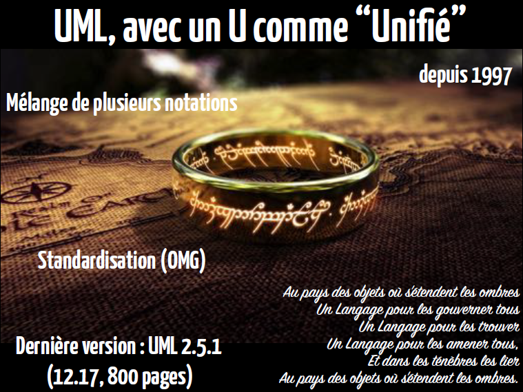

UML vient avec une panoplie de différents types de diagrammes :

* Fonctionnels
  * Cas d'utilisation
  * Activités
  * Séquencement
* Dynamique
  * États
  * Activités
  * Séquencement
  * Communication
* Statique
  * Objets
  * Classes
  * Packages
  * Composants
  * Déploiement
  
Les diagrammes qui seront les plus utilisés dans ce cours sont les diagrammes d'objets, de classes et de séquencement. Voici un paquet d'exemples de chacun :

##### Diagramme d'objets

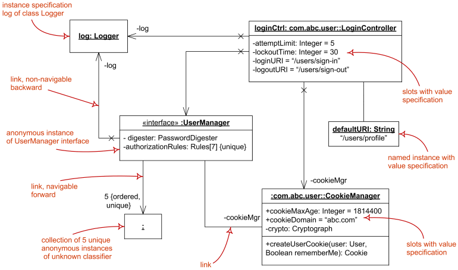

Il existe certains langages, comme PlantUML, qui facilitent la création de diagrammes UML :

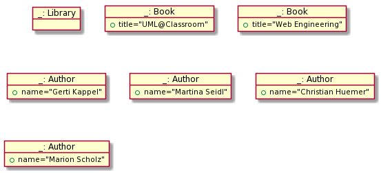

    object "_: Library" as L
    
    object "_: Book" as UML {
        +title="UML@Classroom"
    }
    
    object "_: Book" as WE {
        +title="Web Engineering"
    }
    
    object "_: Author" as GK {
        +name="Gerti Kappel"
    }
    
    object "_: Author" as MS {
        +name="Martina Seidl"
    }
    
    object "_: Author" as CH {
        +name="Christian Huemer"
    }
    
    object "_: Author" as MSc {
        +name="Marion Scholz"
    }
  
##### Diagramme de classes
  
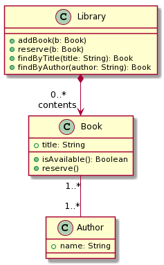

    class Library {
        + addBook(b: Book)
        + reserve(b: Book)
        + findByTitle(title: String): Book
        + findByAuthor(author: String): Book
    }
    
    class Book {
        + title: String
        + isAvailable(): Boolean
        + reserve()
    }
    
    class Author {
        + name: String
    }
    
    Book "1..*" -- "1..*" Author
    
    Library *--> "0..*/ncontents" Book

##### Diagramme de séquencement

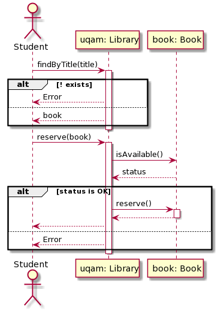

    actor "Student" as S
    
    participant "uqam: Library" as L
    
    participant "book: Book" as B
    
    S -> L: findByTitle(title)
    
    activate L
        alt ! exists
            L --> S: Error
        else
            L --> S: book
        end
    deactivate L
    
    S -> L: reserve(book)
    
    activate L
        L -> B: isAvailable()
        B --> L: status
        alt status is OK
            L -> B: reserve()
            activate B
                B --> L
            deactivate B
            L --> S
        else
            L --> S: Error
        end
    deactivate L

## Section 5 - Harry Potter (Code Kata)

Pour terminer cette première semaine, voici un petit projet à compléter sur un problème commun lorsqu'on conceptualise des systèmes de vente.

#### Spécifications

Les 5 premiers livres de la saga Harry Potter sont à vendre dans une librairie. Chaque livre coûte 8$. La librairie applique certaines politiques de rabais en fonction du total des achats qui sont faits :

* 2 livres différents : 5%
* 3 livres différents : 10%
* 4 livres différents : 20% 
* 5 livres différents : 25%

Il faut concevoir un programme qui reçoit en entrée une liste de livres et qui retourne le prix total incluant les rabais applicables.

Attention par contre, un rabais peut s'appliquer plus d'une fois sur la même liste d'articles!

#### À faire

Heureusement pour vous, j'ai déjà conçu la structure du programme en classe durant la première séance. Tout ce qui vous reste à faire est à implémenter les classes concrètes pour que tout fonctionne. 

L'objectif ici est que vous preniez connaissance de l'impact qu'une bonne conception peut avoir sur le développement d'un logiciel: un problème qui semble complexe peut devenir presque trivial à résoudre une fois la bonne structure mise en place!

Vous pouvez obtenir le code source à mettre à jour sur Github Classroom : https://github.com/INF5153-E20/Travaux

Pour remettre votre travail, il suffira de faire un push de vos modifications vers le github et je pourrai le récupérer à la date de remise.

 

Bonne chance et à la semaine prochaine!
