# INF5153 - Semaine 10

## Patrons de conception (niveau Chevalier Jedi)

Cette semaine nous nous pencherons sur la définition et l'utilisation des patrons de conceptions GoF. Nous avons déjà vu Stratégie en détail et utilisé Visiteur et Composite. Cette fois-ci, nous regarderons **Singleton**, **Observateur**, **Décorateur**, **Façade**, **Fabrique** et **Adapteur**.

### Niveaux dans l'apprentissage

L'idée de voir ces définitions et exemples est de vous faire comprendre comment les appliquer pour qu'éventuellement vous puissiez développer une _approche intelligente_ et sachiez utiliser le bon patron au bon moment. Pour en arriver là, il est nécessaire d'avoir de l'expérience en développement orienté-objet (plus que ce qu'un cours d'université peut vous offrir). C'est au cours de votre carrière que vous développerez l'expérience nécessaire pour bien concevoir des systèmes.

Dans cet objectif, il n'importe pas que vous appreniez tous les détails de chacun des patrons "_par coeur_" et que vous sachiez réciter leur définition, mais plutôt que vous soyez en mesure de vous souvenir que ces patrons existent lorsque vous rencontrez un problème qu'ils peuvent résoudre.

## Section 1 : Singleton

Le Singleton est probablement le patron de conception GoF le plus controversé. Nous commencerons par lui parce qu'il est simple à comprendre (mais complexe à utiliser correctement).

### Mise en situation
Vous travaillez dans une fabrique de chocolat et on vous demande de programmer un dispositif pour contrôler la chaudière de fonte de chocolat. La classe pourrait ressembler à quelque chose comme ça :

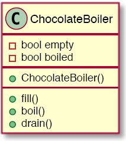

    public class ChocolateBoiler {
        private boolean empty;
        private boolean boiled;
        
        public ChocolateBoiler() {
            empty = true;
            boiled = false;
            
            // Initialisation de la machinerie.
        }
        
        public void fill() {
            if(isEmpty()) {
                empty = false;
                boiled = false;
            }
            
            // Communication avec la machine.
        }
        
        public void drain() {
            if(!isEmpty() && isBoiled()) {
                empty = true;
            }
            
            // Communication avec la machine.
        }
        
        public void boil() {
            if(!isEmpty() && !isBoiled()) {
                boiled = true;
            }
            
            // Communication avec la machine.
        }
    }

Évidemment, il y aurait du code pour interfacer avec la machinerie, mais faisons-en abstraction pour les besoins de l'exercice.

La classe principale pour notre chocolaterie pourrait ressembler à quelque chose comme ça :

    class ChocolateFactory {
        private ChocolateBoiler theBoiler;
        
        public ChocolateFactory() {
            theBoiler = new ChocolateBoiler();
        }
        
        public void makeChocolateBars() {
            // ... preprocessing
            if (theBoiler.isEmpty()) {
                theBoiler.fill();
                theBoiler.boil();
                theBoiler.drain();
            } else {
                throw new RuntimeException("Busy Boiler!")
            }
            // ... postprocessing
        }
    }

Nous avons une instance de ``ChocolateBoiler`` dans ``ChocolateFactory``, représentant notre unique chaudière à chocolat physique. Lorsque la méthode ``makeChocolateBars`` est appelée, elle communique avec notre instance de classe pour pouvoir déléguer les étapes concernant la chaudière.

Imaginons qu'un programmeur fait évoluer cette application et qu'il rajoute une nouvelle méthode :

    public void makeChocolateTruffles() {
        // ... preprocessing
        
        theBoiler = new ChocolateBoiler(); // Erreur de débutant
        
        if(theBoiler.isEmpty()) {
            theBoiler.fill();
            theBoiler.boil();
            theBoiler.drain();
        } else {
            throw new RuntimeException("Busy Boiler!")
        }
        // ... postprocessing
    }
    
Ici il crée une nouvelle instance de ``ChocolateBoiler``. Le problème, c'est qu'il n'existe qu'une seule chaudière physiquement dans notre chocolaterie et que d'en instancier une nouvelle dans le code va rappeler le code d'initialisation du constructeur à nouveau et potentiellement causer un comportement inattendu dans la machinerie!

Notre problème ici est que **n'importe qui peut créer une instance de ``ChocolateBoiler``**. C'est au développeur de faire attention.

### Définition

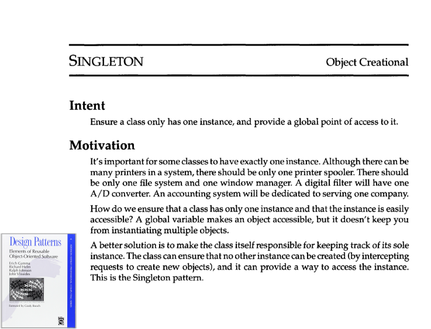

Le Singleton est un patron permettant de s'assurer qu'une classe n'ait qu'une seule instance et qu'elle soit accessible globalement.

Comme dans le cas de notre chocolaterie, il est parfois important qu'une classe de n'avoir qu'une seule instance. La façon de procéder et de faire en sort que la classe elle-même devient responsable de sa propre création.

On veut donc garantir l'unicité d'un objet, par sa construction.

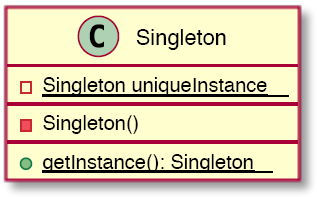

Quelques détails important à noter dans ce diagramme :

* L'attribut ``uniqueInstance`` et la méthode ``getInstance`` sont déclarés **statiques**. C'est-à-dire qu'ils font partie de la classe elle-même et non de ses instances (e.g. on pourra faire ``ChocolateBoiler.getInstance()``).
* Le seul constructeur de la classe ``Singleton`` est **privé**. Aucune autre classe dans le système ne pourra créer une instance de cette classe.

Voici un exemple d'implémentation.

    class Singleton {
        private static Singleton uniqueInstance = null;
       
        private Singleton() { ... }
        
        public static Singleton getInstance() {
            if(uniqueInstance == null)
                uniqueInstance = new Singleton();
            return uniqueInstance;
        }
    }
    
> À noter que cette implémentation de _Singleton_ n'est pas nécessairement _thread-safe_ (si vous utilisez du _multithreading_, il est possible que deux instances de la classe soit créées dans certaines situations).

Donc, si on applique ce patron à notre classe ``ChocolateBoiler``, on obtient quelque chose comme ça :

    public class ChocolateBoiler {
        private boolean empty;
        private boolean boiled;
        
        private static ChocolateBoiler singleton = null;
        
        private ChocolateBoiler() {
            empty = true;
            boiled = false;
        }
        
        public static ChocolateBoiler getSingleton() {
            if(singleton == null)
                singleton = new ChocolateBoiler();
            return singleton;
        }
    }

Et donc, on peut maintenant avoir la certitude qu'une seule instance sera créée, même en cas d'erreur d'un programmeur :

    class ChocolateFactory {
        private ChocolateBoiler theBoiler;
        
        public ChocolateFactory() {
            theBoiler = ChocolateBoiler.getInstance(); // Utilisation de getInstance au lieu de new.
        }
        
        // ...
        
        public void makeChocolateTruffles() {
            // Ligne superflue, mais ça retournera l'instance unique de toute façon.
            theBoiler = ChocolateBoiler.getInstance(); 
            
            if(theBoiler.isEmpty()) {
                // ...
            }
            
            // ...
        }
    }

### Singleton : Bon ou mauvais?

Comme mentionné plus tôt, ce patron est simple à utiliser mais plutôt controversé. Beaucoup de développeurs expérimentés et chercheurs en génie logiciel prennent la position que le patron _Singleton_ nuit à la qualité du code plus souvent qu'autre chose.

**_Singleton n'est pas une façon d'introduire des variables globales dans votre système!_**

Pour qu'un Singleton soit adéquat et ne nuise pas au système en introduisant du couplage ou des variables globales, on peut suivre ces deux règles :

* Gestion d'une seule instance avec une responsabilité unique.
* L'objet Singleton est immuable. En fait, il n'a pas d'état.

Quelques exemples de concepts qui peuvent former des singletons valides : journalisation, _caching_, formattage, interface avec la machinerie.

L'information suivante ne devrait jamais être représentée par un singleton : 

* L'utilisateur présentement connecté
* Le plateau d'un jeu
* Remplacement de variables globales

###### Mais pourquoi les singleton avec un état sont si mauvais?

Les singleton avec état introduisent des dépendances cachés entre les objets (chaque objet qui utilise le singleton a une dépendance envers son état, qui peut changer son comportement). Cela rend le code plus difficile à tester : il faut "_mocker_" le singleton (créer une classe pour le remplacer dans les tests) et c'est difficile de le faire, parce qu'un singleton n'est généralement pas facilement extensible par héritage.

De plus, comme mentionné plus haut, la plupart des implémentations de singleton ne sont pas _thread-safe_ et, même pour celles qui le sont, causent un goulot d'étranglement en cas d'accès multiples et concurrents.

###### Y a-t-il une alternative?

En utilisant l'injection de dépendance, on peut faire usage de ce patron de façon plus contrôllée et sécuritaire. Je pourrai en faire démonstration durant l'une des séances de cours.

## Section 2 : Observateur

### Mise en situation

Imaginons que nous avons à bâtir un système de gestion d'enchère.

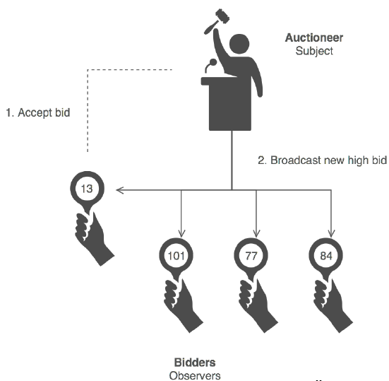

Chaque membre de l'audience peut interagir avec le commissaire-priseur en augmentant l'enchère. Lorsqu'un membre le fait, les autres membres doivent être notifiés que l'enchère a monté pour pouvoir continuer à participer.

C'est une situation classique d'une application avec deux aspects co-dépendant. Un changement sur un objet impose de modifier d'autres objets du système. On ne sait pas à l'avance combien d'objets sont impactés et les objets en question ne se connaissent pas nécessairement (pas couplés).

Notre intention est donc d'établir une relation "1-n" de telle façon que si l'on change le sujet d'état, tout ses dépendants sont prévenus et mis à jour automatiquement.

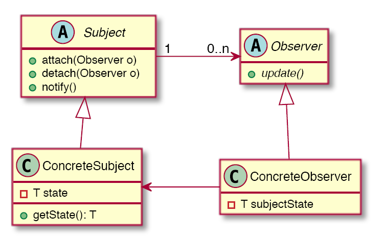

Voici comment tout ça fonctionne. Les objets qui veulent _observer_ le ``Subject`` doivent hériter de la classe ``Observer`` (ce pourrait aussi être une interface). Ensuite, ils doivent s'inscrirent au prêt de ``Subject`` en appelant sa méthode ``attach``.

Lorsque ``Subject`` changera, il pourra appeler sa propre méthode ``notify`` qui sera chargée d'appeler les méthodes ``update`` de tous les ``Observer`` inscrits.

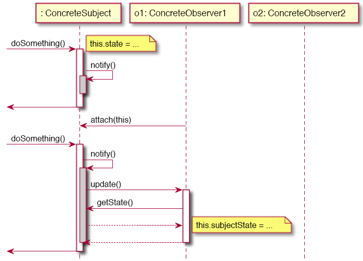

    public class Auctioneer {
        private Set<AuctioneerObserver> observers;
        
        // ...
        
        public Auctioneer() {
            // ...
            observers = new HashSet<>();
        }
        
        public void changePrice (double newPrice) {
            // ...
            notify();
        }
        
        public void attach(AuctioneerObserver o) {
            observers.add(o);
        }
        
        public void detach(AuctioneerObserver o) {
            observers.detach(o);
        }
        
        public void notify() {
            Set<AuctioneerObserver> targets = new HashSet<>(observers);
            targets.parallelStream().forEach(AuctioneerObserver::update);
        }
    }

### Conséquences

Comme vous pouvez le remarquer, ce patron est très invasif sur le sujet observé. La classe doit faire tout le travail de maintenir une liste d'observateurs et de la mettre à jour. En Java, ni l'héritage ou la composition permettent réellement de mitiger ces conséquences.

Les avantages par contre, sont que nous avons évité un certain couplage fort entre les objets et que le mécanisme de mise à jour fonctionne correctement. Nous pouvons maintenant créer autant de types d'objet ``AuctioneerObserver`` et ils pourront tous être notifié et faire partie de l'enchère.

L'observateur a longtemps été le principe classique d'interaction entre une interface graphique et son modèle. Par exemple, le clic d'un utilisateur sur un bouton déclanchera la notification de ses observateurs. Il s'agit d'une simplification orienté-objet des mécanismes de publication/inscription des systèmes de chorégraphies d'événements.

Le langage C# utilise une approche différente pour ses interfaces graphiques, avec un concept de ``Delegate`` qui ressemble plus à la programmation fonctionnelle (fonctions _lambda_).

## Section 3 : Décorateur

Le décorateur est un patron qui permet d'ajouter des comportements à des objets de façon dynamique.

### Mise en situation

Nous avons un restaurant de la marque "Van Horton" et nous devons concevoir un système de gestion pour leur vente de café. Le système doit calculer le prix d'un café.

Ils existe différents types de cafés :

* Café avec lait de soja
* Café avec crème fouetté et une done d'expressi
* Café avec ...

L'idée ici est de concevoir un système qui permet de gérer des objets qui peuvent changer dynamiquement de comportement. Les comportements d'un objet ne sont pas forcément connus à l'avance. Dans ces cas, l'approche par héritage génère une explosion combinatoire alors qu'on essaie de créer un type pour chaque combinaison de comportements possible.

Les changements de comportement sont au niveau de chaque objet, et non de la classe!

On veut donc attacher dynamiquement au niveau de l'objet des capacités additionnelles et fournir une alternative plus flexible à l'héritage.

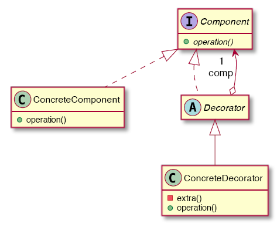

L'idée ici est que notre composant (``ConcreteComponent``) implémente une _opération_ à laquelle on veut pouvoir rattacher des nouveaux comportements (dans notre exemple de restaurant, l'opération sera ``getPrice``). ``ConcreteComponent`` va implémenter l'inteface générique ``Component``. Chaque nouveau comportement potentiel héritera de la class ``Decorator`` qui implémente aussi ``Component``.

    Component c = new ConcreteComponent();
    Component d1 = new ConcreteDecorator1(c);
    Component d2 = new ConcreteDecorator2(d1);
    
    d2.operation();

Chaque ``Decorator`` agira comme un _wrapper_ qui englobera un ``Component``, ce qui mènera à une structure d'exécution comme la suivante :

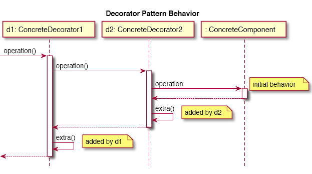

Lorsque la méthode ``operation`` est appelée sur un ``Component``, les décorateurs vont exécuter leurs méthodes une après l'autre pour finalement exécuter celle du ``ConcreteComponent`` initial.

Voici ce à quoi ça pourrait ressembler avec notre application de "Van Horton" :

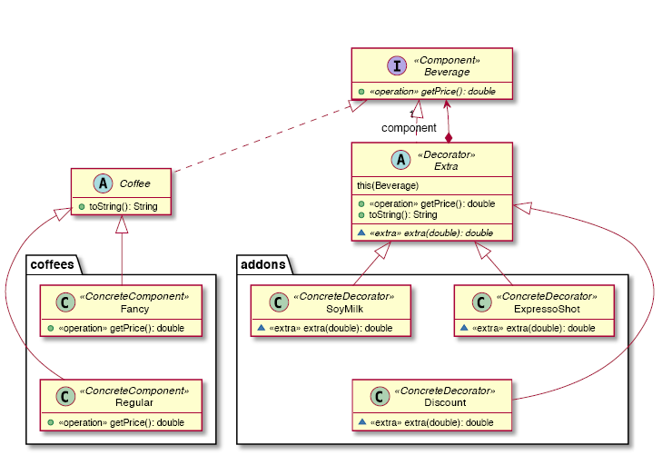

Nous avons deux ``ConcreteComponent``, représentant les deux "bases" à partir desquelles on peut monter un café : ``Fancy`` et ``Regular``.

De plus, nous avons trois ``ConcreteDecorator`` qui représentent des "extras" que l'on peut appliquer à chaque café : ``SoyMilk``, ``ExpressoShot`` et ``Discount``.

Avec cette structure, on peut combiner autant d'extras que l'on veut sur une des deux bases pour obtenir le café voulu et calculer le prix automatiquement. Par exemple :

    public static void main(String[] args) {
        System.out.println("# Selling plain coffees");
        displayBeverage(new Regular());
        displayBeverage(new Fancy());
        
        System.out.println("\n# Adding extras");
        displayBeverage(new SoyMilk(new Regular()));
        displayBeverage(new ExpressoShot(new Fancy()));
        displayBeverage(new SoyMilk(new ExpressoShot(new Fancy())));
        displayBeverage(new ExpressoShot(new ExpressoShot(new Regular())));
        
        System.out.println("\n# Messing up with discounts (aka order matters)");
        displayBeverage(new Discount(new Regular()));
        displayBeverage(new Discount(new ExpressoShot(new Regular())));
        displayBeverage(new ExpressoShot(new Discount(new Regular())));
    }

    private static void displayBeverage(Beverage b) {
        System.out.println(b + ": $"+String.format("%.2f", b.getPrice()));
    }
    
Et l'implémentation de chaque composants pourrait ressembler à :

    public class Regular extends Coffee {
        @Override public double getPrice() { return 2.0; }
    }
    
    public class Fancy extends Coffee {
        @Override public double getPrice() { return 3.25; }
    }
    
    public class ExpressoShot extends Extra {
        public ExpressoShot(Beverage inner) { super(inner); }
        
        @Override protected double extra(double price) { return price + 0.80; }
    }
    
    public class SoyMilk extends Extra {
        public SoyMilk(Beverage inner) { super(inner); }
     
        @Override protected double extra(double price) { return price + 1.25; }
    }

### Conséquences

Le patron décorateur nous permet de concevoir un système qui offre plus de flexibilité qu'avec l'approche par héritage. Elle évite d'avoir à créer un paquet de classes pour chaque situation ou combinaison de comportements.

Les décorateurs sont des comportements du composant, mais sont encapsulés dans des classes différentes. Le composant n'a pas à savoir quels décorateurs existent dans le système. Il doit cependant savoir qu'il fait partie du patron (en implémentant l'interface ``Component``).

Le patron crée cependant beaucoup de petits objets et beaucoup d'appels d'indirection entre objets, ce qui peut nuire à la compréhensibilité du code.

On peut voir ce patron généralement dans les système de définition d'interface graphiques ou de mise en forme de documents (CSS, Word, LibreOffice). Il est utilisé en Java dans l'API de gestion des I/O :

 ``BufferedReader br = new BufferedReader(new FileReader(fileName))``
 
 C# utilise aussi une approche similaire.

## Section 4 : Façade

### Mise en situation

Imaginons un système d'opération pour un cinéma maison. Le diagramme de classe pourrait ressembler à quelque chose comme ça :

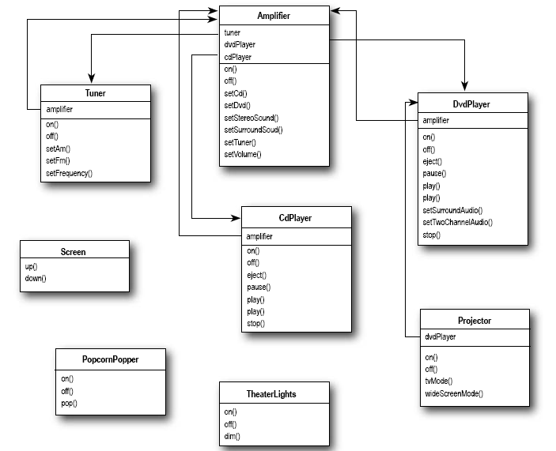

Comme on peut le constater, ce système contient beaucoup de classes et d'opérations différentes. Pour pouvoir interfacer avec ce système, le programme client devra non seulement connaître l'utilisation de chacun des objets, incluant possiblement un ordre particulier dans lesquels les opérer, mais en plus un couplage fort sera créé entre chaque objet et l'application client.

Un couplage fort sur les éléments de notre systèmes créera des dépendances qu'il faudra considérer lorsque le système évoluera : par exemple, on ne pourra plus retirer aucune méthode ou classe publique au système au risque de briser la rétro-compatibilité de notre librairie!

L'intention du patron façade est de fournir une interface unique et simplifiée qui servira à isoler le client du sous-système. Cela permettra de continuer à faire évoluer le sous-système en découplant le client pour éviter les dépendances fortes.

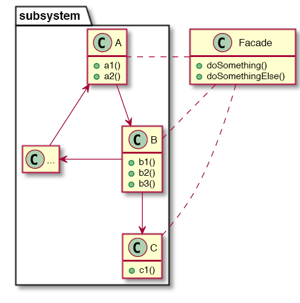

La classe ``Facade`` contiendra les différentes opérations accomplie par le sous-système et se chargera de coordonner les délégations nécessaires pour accomplir ses actions.

### Conséquences

L'utilisation d'une façade améliore la compréhension et la facilité d'utilisation d'un système. Elle permet aussi la diminution du couplage. La façade est plus flexible que se fier uniquement au principe Ouvert/Fermé (visibilité des méthodes et classes). Le système pourra être modifié sans impacter les clients.

Par contre, il faut faire attention lors de la conception pour éviter de rendre la façade trop restrictive. Certains systèmes sont complexes de nature et ne peuvent être encapsulés correctement par une façade.

Les applications réparties, telles les interfaces de services (ou micro-services), utilisent la façade pour afficher leur API.

## Section 5 : Fabrique

La fabrique (ou _factory_) gère la création d'instances de classes dans le système et vise à remplacer le mécanisme de base d'instantation du langage (e.g. ``new`` en Java).

### Mise en situation

Pour implanter un système de journalisation (_logging_) dans une application, il existe plusieurs choix. Le journal peut être local ou distant au serveur. On peut journaliser en JSON, XML, texte, etc. Il existe différents _framework_, par exemple en Java : Log4J, SLF4J, util.Logger, etc. 

Et on peut vouloir changer d'avis sur ces décisions au cours du développement de l'application!

Le problème alors est de déterminer une façon de procéder pour éviter qu'un changement dans ces décisions impacte le code partout dans l'application. On a vu que la journalisation est une _préoccupation transversale_, c'est-à-dire qu'elle est répartie partout dans le code. Une modification à ce système pourrait potentiellement impacter toutes les classes de notre application!

Il nous faut donc un moyen de masquer la complexité de notre implémentation. Nous devrons reposer uniquement sur des abstractions et offrir un moyen de configurer les objets potentiellement complexes. La complexité doit être isolée et le client ne doit pas en dépendre.

La fabrique permet de définir une interface pour la création d'un objet donné. C'est les sous-classes de cette interface qui détermineront le choix de l'implémentation. On pourra aussi déléguer à une classe _qui sait faire_ les instantiations complexes (spécialiste de l'information).

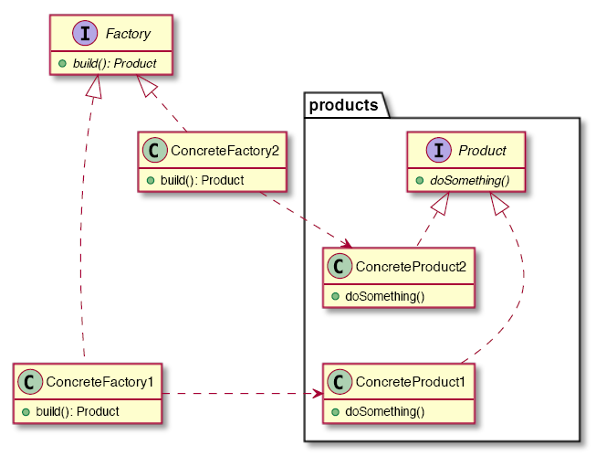

Lorsqu'on veut instancier un objet du type ``Product`` (e.g. un ``Logger``), on doit passer par notre ``Factory`` (e.g. ``LoggerFactory``). L'implémentation de cette factory détermine quel type d'instance de ``Product`` sera utilisé tout au cours de notre système : ``ConcreteFactory1`` instanciera des ``ConcreteProduct1``, et ainsi de suite.

Lorsqu'on utilise ces instances, c'est toujours par l'intermédiaire de l'interface ``Product``, car on ne sait jamais quel instance concrète notre système utilise (ça dépend de la configuration!).

Voici un exemple d'implémentation de ``Product`` dans le cadre de notre système de journalisation :

    public interface Logger {
        void log(String message);
    }
    
    public class ConsoleLogger implements Logger {
        @Override
        public void log(String message) { ... }
    }
    
    public class FileLogger implements Logger {
        public FileLogger(String logFileName) { ... }
    
        @Override
        public void log(String message) { ... }
    }

Et les fabriques qui iraient avec :

    public interface LoggerFactory {
        Logger getLogger();
    }
    
    public class ConsoleLoggerFactory implements LoggerFactory {
        @Override
        public Logger getLogger() {
            return new ConsoleLogger();
        }
    }
    
    public class FileLoggerFactory implements LoggerFactory {
        private final String logFileName;
    
        public FileLoggerFactory(String logFileName) {
            this.logFileName = logFileName;
        }
    
        @Override
        public Logger getLogger() {
            return new FileLogger(logFileName);
        }
    }
    
La façon de procéder serait de garder une référence vers notre LoggerFactory que l'on veut utiliser (instanciée au démarrage du système par exemple) et de l'utiliser lorsqu'on veut créer un Logger : ``systemLoggerFactory.getLogger()``.

Souvent, on peut combiner les patrons fabrique et singleton pour encapsuler le comportement du singleton et éviter certains de ses désavantages. Par exemple, pour éviter que plusieurs journaux soient créé sur le même fichier, on pourrait implémenter ``FileLoggerFactory`` avec le patron singleton :

    public class FileLoggerFactory implements LoggerFactory {
        private final String logFileName;
        private Logger instance = null;
    
        public FileLoggerFactory(String logFileName) {
            this.logFileName = logFileName;
        }
    
        @Override
        public Logger getLogger() {
            if(instance == null)
                instance = new FileLogger(logFileName);
            return instance;
        }
    }
    
### Conséquences

La fabrique retire la responsabilité aux autres classes de l'application d'instancier des objets, en lien avec le patron GRASP de "Création". Cette façon de procéder nous ocroie un gain en flexibilité dans les interfaces et les objets construits et rend notre système plus facilement testable.

On retrouve des fabriques dans beaucoup d'API dans le JDK. C'est un patron populaire aussi dans les applications réseaux pour construire les types de connexions au systèmes distants. De plus, les systèmes de modélisation ou de génération de code en font aussi grand usage.

## Section 6 : Adaptateur

L'adaptateur est un patron utile lorsqu'on a du code défini selon une interface X mais qu'on veut l'utiliser dans une interface Y. Par exemple, si on veut intégrer deux librairies qui n'ont pas été conçues pour fonctionner ensemble.

L'idée est de convertir une interface en une autre et de faire collaborer des objets qui ne pourraient pas normalement. De plus, on doit garantir que les éléments adaptés n'ont pas de dépendances supplémentaires et qu'on puisse les faire évoluer indépendemment.

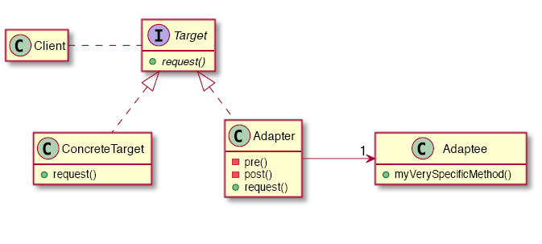

Voici comment tout ça fonctionne : nous avons une interface cible (``Target``) que ``Client`` utilise, mais au lieu de l'implémentation par défaut (``ConcreteTarget``), nous voudrions utiliser notre propre implémentation (``Adaptee``). Par contre, cette implémentation n'a pas les mêmes méthodes que l'interface ``Target`` et donc, ne peut en hériter. De plus, on ne veut pas avoir à modifier ``Adaptee`` pour la rendre conforme à l'interface (possiblement qu'elle a déjà des dépendances sur ses méthodes).

La solution est d'utiliser une classe adaptateur (``Adapter`` ici). Cette classe implémentera l'interface ``Target`` et agira comme _wrapper_ pour ``Adaptee``, déléguant les appels de l'inteface ``Target`` vers les bons appels de méthode sur ``Adaptee``.

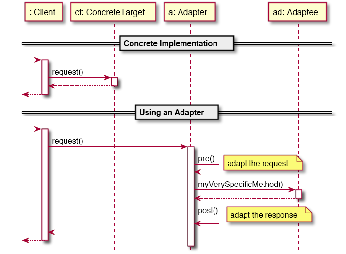

### Conséquences

Utiliser un adaptateur permet d'intégrer des interfaces "exotiques" à un programme. Par contre, ce patron a un prix : le code d'adaptation peut être plutôt "sale" (difficile à comprendre ou peu relié à la logique d'affaire). Il est aussi impossible d'adapter une hiérarchie de classe ou une famille de produit.

On peut voir l'adaptateur utilisé dans des situations où on doit transformer un format vers un autre (e.g. RGB vers CMYK). Dans les système distribués, les adaptateurs sont utilisés fréquemment pour faire communiquer les systèmes ensemble.
