# INF5153 - Semaine 11

## Patrons de conception (niveau Maître Jedi)

Cette semaine nous verrons les patrons de conception GoF suivants : State, Builder, Prototype, Composite, Visitor, Template Method et Proxy. Cela complétera notre survol des patrons de conceptions et les notes pour ce cours.

Le reste de la session sera consacrée à des études de cas en classes et une présentation concernant les tests unitaires. Évidemment, si vous avez des questions concernant les différents patrons de conception vus (ou même ceux que nous n'avons pas vu) ou si vous voulez plus d'exemple, n'hésitez pas à intervenir durant les séances!

## Section 1 : State

### Mise en situation

Imaginons un programme qui gère une machine distributrice de boissons. La machine doit gérer les produits qu'elle contiend ainsi que l'argent accumulé. Ces deux concepts peuvent être vus comme deux sous-états de l'état de la machine elle-même :

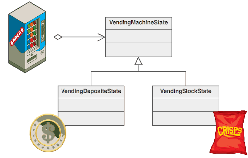

Le comportement global de la machine change dépendemment de ces deux sous-états. Si la machine n'a pas reçu l'argent requis, elle ne devrait pas dispenser de produit. Si l'argent a été inséré, elle doit dispenser le produit choisi. Il y a aussi des états intermédiaires : l'argent a été inséré mais le produit n'a pas encore été choisi.

Quelle serait la meilleure façon de modifier le comportement de notre machine quand son état interne change et obtenir le traitement voulu?

L'idée est d'éviter les instructions conditionnelles en masse (pyramides de ``if``). On veut aussi rendre simple ajouter de nouveaux états et donner l'impression que l'objet a été modifié alors que c'est uniquement son état qui a varié.

### Définition

Le patron _State_ (ou État) permet d'encapsuler les différents états d'un objet dans d'autres objets et de les interchanger sans avoir à modifier les autres propriété de l'objet. En ce sens, ce patron peut rappeler le patron Stratégie dans son fonctionnement.

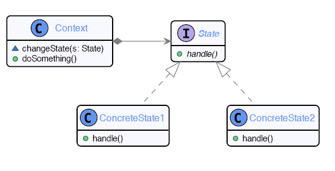

Ici la classe ``Context`` représente la machine distributrice dans notre exemple. L'interface ``State`` représente tous les différents états que nous pourrons implémenter pour notre machine : en attente de paiement, en attente de sélection de produit, machine vide, etc.

Lorsque la machine est activée, elle appelera la méthode ``handle()`` de son état actuel et l'état contiendra le code nécessaire pour traiter la demande.

Ici, on peut changer l'état avec la méthode ``changeState(State)``, mais il est possible de concevoir d'autres mécanismes pour assigner un état (e.g. par constructeur).

Les différentes implémentations d'états sont donc des parties mobiles du code de notre objet qui peuvent être interchangées sans affecter le reste de l'objet.

### Conséquences

L'utilisation de _State_ permet de séprarer les comportements relatifs à chaque état dans leur propres objets. Le code résultant démontre clairement les transitions des états lors des différentes actions (appel de ``changeState`` par exemple). L'appelant n'a pas à se soucier du patron : il utilise la classe ``Context`` tout simplement.

Ce patron est utilisé dans n'importe quel logiciel qui met en oeuvre une machine à état. Les logiciels gérant des connexions réseaux peuvent aussi en faire usage. L'implémentation de certaines intelligences artificielles (surtout dans des jeux) l'utilise aussi.

## Section 2 : Builder

Souvent en développement de logiciel, on se retrouve avec des objets qui sont complexes à créer. Par exemple, un objet représentant une fenêtre dans une interface graphique a beaucoup d'étapes de création : chaque élément faisant partie de la fenêtre (textbox, labels, etc.) doit être créé et affecté à la fenêtre. 

Évidemment, ce ne serait pas pratique de nécessiter que tous les éléments soient passé en paramètre au constructeur de la classe de la fenêtre. Le patron _Builder_ permet de gérer ce genre de situations.

### Définition

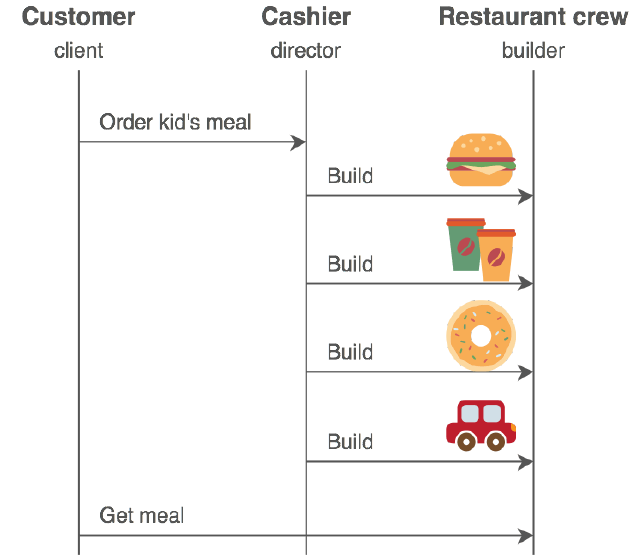

Lorsqu'on a besoin de créer des objets qui peuvent prendre plusieurs formes et dont la création nécessite beaucoup d'étapes ou de sous-objets, on peut faire usage du patron Builder. 

Ce patron gère l'assemblage d'un objet, indépemment des parties qui le composent.

L'intention est d'isoler la construction de l'objet de sa représentation (rappelez-vous le patron GRASP _Créateur_) et de contrôler le processus de construction. Au besoin, il permet aussi de changer la représentation interne de l'objet produit.

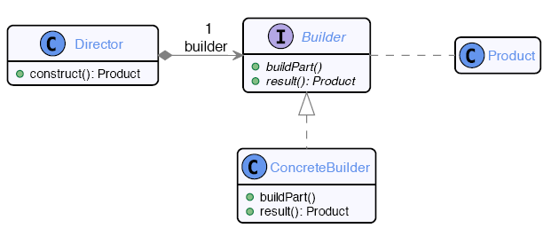

L'utilisation est simple : on instancie un objet de type ``Builder`` (``ConcreteBuilder``) qui permettra de créer des objets de type ``Product``. L'interface ``Builder`` aura une gamme de méthodes permetant d'initialiser les différentes parties de notre objet. Une fois l'initialisation terminée, on peut obtenir l'objet final à partir du ``Builder``.

Dans certains cas, vous pourriez vouloir implémenter différents ``Builder`` pour le même objet. Par exemple, si vous avez différents mode de communication pour envoyer des notifications dans votre système, vous pourriez avoir un design ressemblant à ceci :

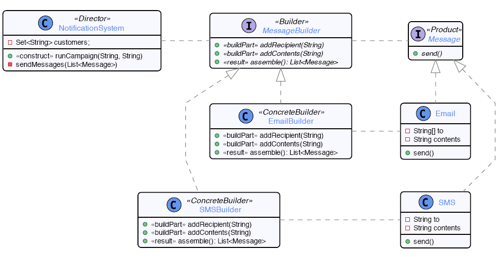

Ce système permet de séparer le choix du type de notification (SMS ou courriel) de sa construction en utilisant le patron Builder.

### Conséquences

Ce patron permet de définir un processus de construction de façon abstraite et de réutiliser ce processus pour des produits différents. On peut faire usage de polymorphisme pour construire différents produits en utilisant le même code. Le client (l'appelant) n'a pas à connaître le processus de fabrication.

Ce patron est utilisé à plusieurs endroits dans la librairie Java. Par exemple, vous pouvez utiliser un ``StringBuilder`` pour construire une ``String`` à partir de plusieurs autres objets.

Plusieurs systèmes et langages utilisent un concept appelé "Fluent API" qui est en fait une implémentation alternative du patron _Builder_.

Les librairies de création d'interface graphique l'utilisent constamment.

## Section 3 : Prototype

Dans les langages orienté-objet similaires à Java, la création d'objet se fait à partir de classes. En Java spécifiquements, les classes ne sont pas considérés comme des objets, mais comme des entités gérées par le compilateur (les classes n'ont pas de présence au runtime en Java). Dans d'autres langages, comme Smalltalk, les classes sont des objets qui ont des propriété et des méthodes, comme tous les autres objets.

En Smalltalk, lorsqu'on veut instancier un objet, on appelle la **méthode** ``new`` sur l'objet qui représente la classe qu'on veut instancier. Cet objet contient le code de création nécessaire pour créer des instances. JavaScript fonctionne d'une façon similaire, excepté qu'au lieu d'utiliser les classes, il utilise des _prototypes_ (JS est un langage dit _orienté-prototype_).

Le patron de conception _Prototype_ est une façon de simuler l'instanciation d'objet de Smalltalk ou JavaScript dans les langages où les classes ne sont pas des objets et où l'instanciation est normalement gérée par des règles de langage au niveau du compilateur (comme Java et Python).

### Définition

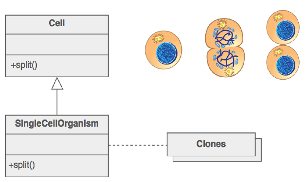

Le but derrière le patron _Prototype_ est de permettre d'utiliser un objet comme exemple d'instanciation pour les autres. Les instances de cet objet (autres que le prototype lui-même) seront crées par clonage. L'appelant utilisera la méthode ``clone`` du prototype au lieu du mot-clé ``new``.

### Exemple

Situation utilisant ``new`` pour chaque création d'objet :

    private static Set<Student> usingConstructor(){
        Set<Student> result = new HashSet<>();
        
        Student bob = new Student("Bob");
        bob.registerTo("INF5151");
        bob.registerTo("INF5153");
        bob.registerTo("OPT6000");
        result.add(bob);
        
        Student alice = new Student("Alice");
        alice.registerTo("INF5151");
        alice.registerTo("INF5153");
        alice.registerTo("OPT3000");
        result.add(alice);
        
        Student eve = new Student("Eve");
        eve.registerTo("INF5151");
        eve.registerTo("INF5153");
        eve.registerTo("OPT8000");
        result.add(eve);
        
        return result;
    }
    
Même code, mais utilisant le clonage :

    private static Set<Student> usingClones(){
        Set<Student> result = new HashSet<>();
        
        Student bob = new Student("Bob");
        bob.registerTo("INF5151");
        bob.registerTo("INF5153");
        
        Student alice = bob.duplicate();
        alice.setName("Alice");
        
        Student eve = bob.duplicate();
        eve.setName("Eve");
        
        bob.registerTo("OPT6000");
        result.add(bob);
        
        alice.registerTo("OPT3000");
        result.add(alice);
        
        eve.registerTo("OPT8000");
        result.add(eve);
        
        return result;
    }
    
### Conséquences

On peut factoriser des opérations coûteuse dans le prototype et le cloner pour éviter d'avoir à les réexécuter à chaque instanciation.

Par contre, le clonage peut être une opération difficile dans certains langages (clonage superficiel ou en profondeur?).

Le modèle de programmation par prototype peut sembler peu habituel à première vue.

En Java, il existe une interface ``Cloneable`` qui peut être implémentée pour effectivement utiliser le patron _Prototype_. Comme mentionné plus haut, il s'agit du modèle objet en JavaScript et est très semblable à celui de Smalltalk (quoi que ce dernier n'utilise pas nécessairement de clone).

## Section 4 : Composite

### Mise en situation

Nous voulons représenter une hiérarchie de fichiers dans un système d'exploitation. Il y a deux types d'éléments principaux dans cette hiérarchie : des fichiers et des répertoires. Un repértoire peut contenir d'autres fichiers ou répertoires.

Le patron ``Composite`` permet de répondre à ce besoin :

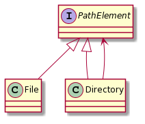

### Définition

Le ``Composite`` permet de représenter de manière uniforme une hiérarchie d'objets. On veut formaliser la structuration arborescente des objets et traiter feuilles et noeuds de manière uniforme (propagation récursive des comportements).

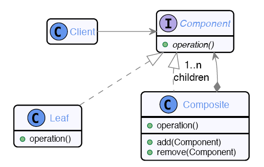

Le ``Component`` représente tous les éléments de la hiérarchie (``PathElement`` dans l'exemple plus haut). Le client maintient une référence sur le composant au sommet de la hiérarchie (e.g. un répertoire) et peut appeler une opération qui sera propagée par le patron _Composite_ sur tous les sous-éléments de la hiérarchie.

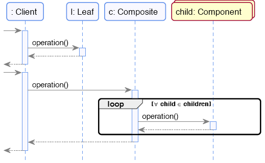

### Conséquences

Ce patron structure le code de façon hiérarchique simple et uniforme. Il permet d'étendre facilement en ajoutant de nouveaux types d'objets à la hiérarchie, ce qui propage le comportement de manière automatique.

Certaines limitations s'imposent : le patron peut parfois être trop rigide pour la situation (et si on avait besoin de noeuds ne pouvant contenir que certains types d'éléments?).

On peut trouver ce patron dans les systèmes de fichiers, les applications GUI, les compilateurs, les applications arithmétiques, etc.

Le patron se compose particulièrement bien avec la _Commande_ : une macro-commande peut être vue comme un composite de commandes!

## Section 5 : Visiteur

### Mise en situation

Reprenons notre exemple plus haut de hiérarchie de fichiers. On peut utiliser le patron _Composite_ pour propager des opérations, mais il est difficile de prévoir d'avance **_tous_** les types d'opérations que le client voudra pouvoir effectuer sur des fichiers. Le _Composite_ facilite l'extension en ajouter de nouveaux objets, mais il nous faudrait un moyen d'ajouter facilement de _nouvelles opérations_.

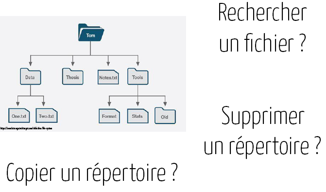

### Définition

Le patron _Visiteur_ permet de rendre externe à une hiérarchie d'objets la mise en oeuvre d'un comportement, pour pouvoir changer celui-ci sans avoir à changer les objets eux-mêmes.

On veut définir une abstraction pour les opérations à effectuer et le parcours de la hiérarchie. On pourra ensuite lancer une opération sur la hiérarchie sans avoir à la modifier pour ajouter l'opération à tous ses éléments.

Dans ce patron, le rôle de la hiérarchie est d'_accepter_ l'opération et ensuite _déléguer_ au visiteur l'exécution de l'opération.

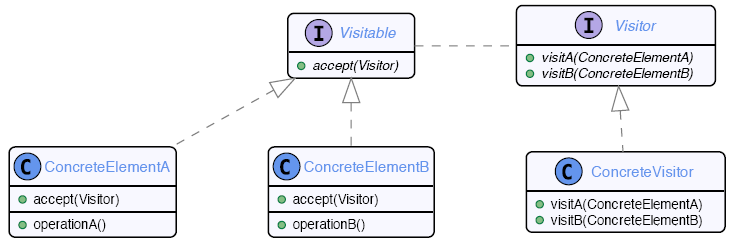

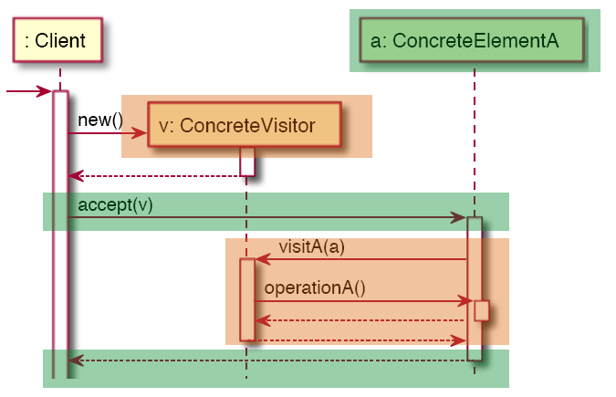

On voit que le client génère un objet _Visiteur_ qui représente l'opération qu'il veut exécuter (e.g. un ``DeleteVisitor`` pour supprimer un répertoire). Il demande ensuite à l'élément au sommet de la hiérarchie (ici ``ConcreteElementA``, qui pourrait représenter un répertoire) d'_accepter_ le _Visiteur_.

L'élément va ensuite immédiatement déléguer au visiteur pour qu'il exécute son opération et renvoyer le visiteur vers le prochain élément s'il y a lieu (e.g. si c'est un répertoire, il enverra le visiteur vers ses éléments contenus).

### Conséquences

On peut définir autant de visiteurs différents qu'on le souhaite. Il y a aussi moyen de le faire avec une approche fonctionnelle, qui élimine les effets de bords (je pourrai faire un exemple en classe).

Par contre, l'introduction d'un visiteur est invasive dans la hiérarchie (les classes de la hiérarchie doivent être préparées pour recevoir le visiteur en implémentant la méthode ``visit``). Ce patron a aussi un coût non négligeable à l'exécution.

Ce patron est utilisé dans les compilateurs pour visiter les arbres de syntaxes abstraits, dans les transformations de modèles et pour implémenter du _pattern-matching_.

Il s'agit probablement du patron de conception GoF le plus difficile à assimiler et à comprendre. C'est pourquoi je donnerai quelques exemples supplémentaires durant la prochaine séance.

## Section 6 : Template Method

### Mise en situation

Vous avez un algorithme général que vous voulez pouvoir spécialiser dans le futur.

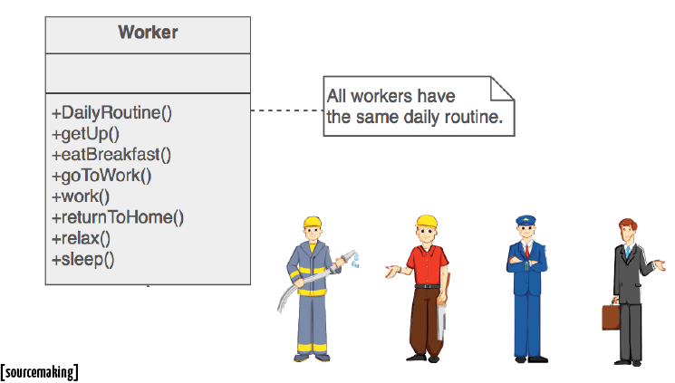

De quelle façon peut-on spécialiser des étapes spécifiques dans notre algorithme et les appliquer seulement pour certaines instances d'une classe?

### Définition

On veut définir un squelette d'algorithme dans une opération qui référence des étapes bien définies. Par héritage, on veut ensuite redéfinir certaines de ces étapes pour modifier l'algorithme sans modifier sa structure générale.

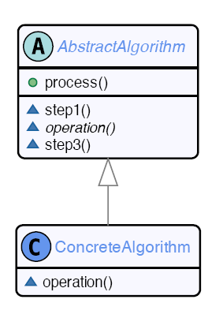

La classe abstraite ``AbstractAlgorithm`` contient la structure de base de l'algorithme, avec certaines opérations déclarées en tant que méthodes abstraites (donc sans implémentation). Ces implémentations seront remplies par les différentes classes enfant qui pourront spécifier de quel façon accomplir les opérations.

Il s'agit ici de faire usage du polymorphisme pour compléter l'implémentation d'un algorithme.

### Conséquences

Cette approche permet de ne pas avoir à redéclarer la structure générale de l'algorithme pour chaque cas où seulement une partie de l'algorithme (l'opération) change. Cela promouvoit la réutilisation du code. De plus, la structure de contrôle est inversé, où le choix de l'implémentation de la classe enfant déterminera le comportement de l'algorithme (principe SOLID d'inversion de dépendance).

La visibilité des méthodes permet de contrôler les capacité d'extensions du patron.

Par contre, ce patron repose sur l'utilisation d'héritage, qui complexifie et limite le programme dans les langages qui ne supportent pas l'héritage multiple.

On peut trouver le patron _Template Method_ dans les canvas de tests unitaires, et dans les librairies Java d'entrées/sorties (``InputStream``, ``Writer``, ...), de structures de données abtraites (``AbstractList``) et de gestion du protocole HTTP (``HTTPServlet.doXXX()``) entre autres.

## Section 7 : Proxy

### Mise en situation

On se retrouve parfois dans des situations où l'on voudrait modifier le comportement ou l'état d'un objet auquel on n'a pas accès. Par exemple, lors de l'exécution de test unitaires, il n'est généralement pas possible d'utiliser les entrées/sorties console ou une interface graphique pour interagir avec le logiciel. On veut cependant pouvoir tester le code qui interagit avec ces éléments. Une solution possible à ce problème est d'utiliser un _Proxy_.

### Définition

Le patron _Proxy_ permet de séparer l'interface d'une classe de son implémentation. En utilisant cette méthode, on peut se procurer un objet qui serait normalement inaccessible et travailler avec un substitut en lieu du vrai objet de manière transparente.

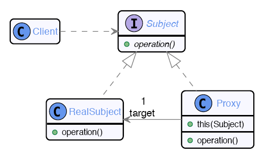

L'idée est que le _Proxy_ implémentera la même interface que l'objet réel, et fournira donc les mêmes opérations. Éventuellement, ``Proxy`` pourra mettre à jour ``RealSubject`` avec les changements nécessaires au moment où ce dernier deviendra accessible au système. À n'importe quel moment, on pourrait remplacer ``Proxy`` par ``RealSubject`` (principe de substitution de Liskov).

Voici un exemple implémentant une cache en utilisant un _Proxy_ :

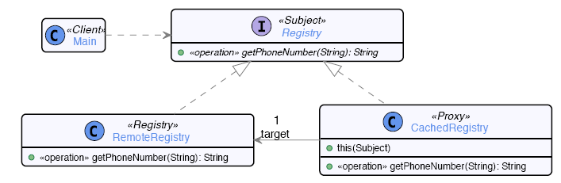

    public class CachedRegistry implements Registry {
        private RemoteRegistry target;
        
        private Map<String, String> cached;
        
        public CachedRegistry(RemoteRegistry r) {
            this.target = r;
            this.cached = new HashMap<>();
        }
        
        @Override
        public String getPhoneNumber(String person) {
            if(! cached.containsKey(person))
                cached.put(person, target.getPhoneNumber(person));
            return cached.get(person);
        }
    }
    
Le logiciel peut interagir aussi bien avec ``CachedRegistry`` qu'avec ``RemoveRegistry``. Si les opérations vers ``RemoveRegistry`` sont trop lentes dû à une latence élevée, on peut utiliser ``CachedRegistry`` pour stocker les opérations et les envoyer en _batch_ vers ``RemoteRegistry`` à un moment opportun (``CachedRegistry`` gérera ce comportement).

### Conséquences

Le fait que le sujet est inaccessible n'est pas visible à l'appelant : il utilise la même interface pour accéder au proxy. On peut donc aisément échanger proxy et sujet à n'importe quel moment.

Le proxy n'est pas une sous-classe du sujet (pas d'héritage inutile), mais implement une réplique exacte au même niveau de hiérarchie.

On peut trouver ce patron dans les logiciel faisant de l'échantillonage de données (e.g. image trop volumineuse pour charger au complet), la gestion des droits d'accès, les systèmes de gestion d'objets distants (WebServices, Java RMI) et dans les tests unitaires (objets _mocks_).

## Conclusion

Les patrons de conception GoF sont des conclusions naturelles des principes SOLID et des patrons GRASP pour des situations précises. L'objectif n'est pas de se forcer à utiliser le plus de patrons GoF possible dans chaque système, mais de comprendre les _principes fondateurs_ derrière ces patrons et d'être capable de les appliquer et surtout **les adapter** aux situations où ils sont utiles.

C'est avec l'expérience en programmation que vous allez pouvoir réaliser quand utiliser et ne pas utiliser ces différents patrons de conception dans votre code. Mais pour pouvoir s'y rendre, vous devez d'abord les utiliser et les pratiquer (d'où l'objectif de la phase 2 du projet de session et du travail 2).

Dans certaines situations, il peut être bien de _composer_ plusieurs patrons ensemble. Par exemple, il est fréquent de voir _Singleton_ et _Abstract Factory_ utilisés ensemble, ou _Composite_ et _Visiteur_.

Ceci conclut les notes de cours pour INF5153. Le reste de las session sera consacré à des études de cas et des exemples d'implémentation (ainsi qu'une présentation sur les tests unitaires).

Bonne chance dans vos travaux et n'hésitez pas à poser des questions durant les séances si vous en avez!

Merci et bonne fin de session!
