# INF5153 - Semaine 2

## Bibliographie de ce cours

<table>
<td>

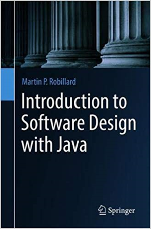  
Chapitres 2, 3 et 4.

</td>
<td>

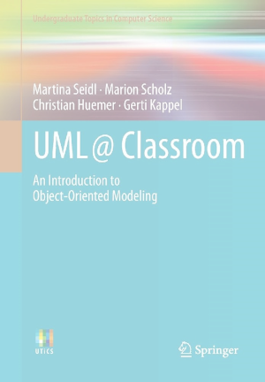  
Chapitres 4, 5 et 6.

</td>
</table>

## Encapsulation, Types, Interfaces et États

Ce cours utilise intensivement les principes mis en avant dans le livre de Martin Robillard (McGill) aux chapitres cités. Les exemples dans le livre sont ceux d'un jeu de cartes qu'on réutilisera dans les notes de cours, avec quelques modifications.

Faites attention à ne pas recopier le code du livre ou des notes de cours dans vos projets.

* Il s'agirait de **plagiat**
* Les problématiques rencontrées ne sont pas nécessairement les mêmes

## Section 1 - Étude de cas : Schotten Totten

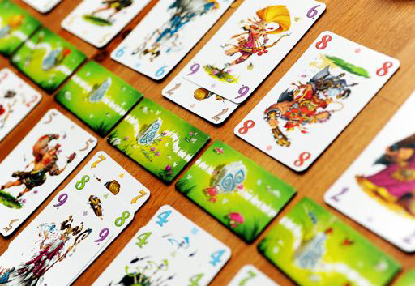

Commençons par étudier les règles d'un jeu de battailles basé sur des cartes (inventé par Reiner Knizia). Nous avons neuf (9) bornes représentant la frontière entre deux clans. 

Il y a cinquante quatre (54) cartes régulières, dites cartes "clan". Ces cartes ont chacune une valeur de un (1) à neuf (9) et sont de six (6) couleurs différentes. La version avancée du jeu possède aussi des cartes "tactiques". On peut poser jusqu'à trois (3) cartes clan devant une borne. 

À chaque tour, un joueur pose une carte devant une borne parmi les six (6) de sa main et pige une nouvelle carte pour revenir à six (6) cartes.

Un des deux joueurs est considéré gagnant lorsque :
* Il remporte cinq (5) bornes parmi les neuf (9);
* OU il remporte trois (3) bornes consécutives.

Pour déterminer qui remporte une borne, en cas d'attaque complète (trois (3) cartes clan de chaque côté), l'attaque la plus forte remporte. On peut aussi remporter une borne si on peut déterminer que l'adversaire n'a plus aucune chance de battre l'attaque d'un joueur vu les cartes en jeu sur la table (_pas dans les mains_).

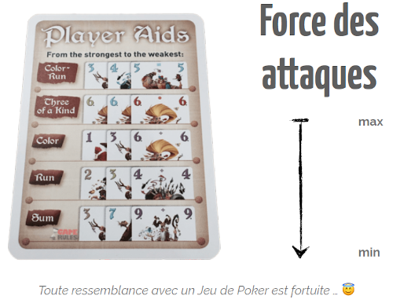

### Un exemple de partie

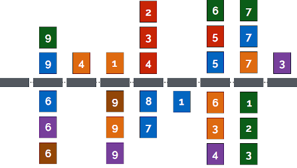

Les rectangles gris au centre représentent les neuf bornes. Chaque joueur joue d'un côté des bornes (donc un joueur en haut et un joueur en bas). À chaque tour un joueur place une carte de ses mains sur un borne et tente de créer une combinaison qui vaincra son adversaire sur cette borne.

Dans l'exemple ci-dessus, on peut déjà déterminer quelques bornes gagnées.

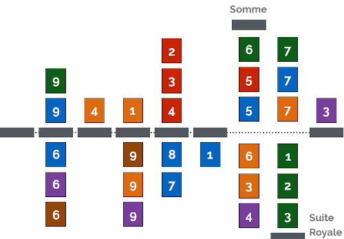

La borne 7 est gagnée par le joueur du haut parce qu'aucun n'a de combinaison et donc il gagne la somme les cartes (6 + 5 + 5 = 16 vs 6 + 3 + 4 = 13).

La borne 8 est gagnée par le joueur du bas parce qu'il a une suite de couleur avec 1-2-3 verts contre un brelan de 7.

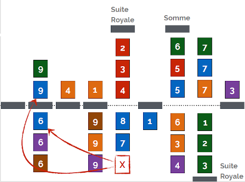

On peut aussi déterminer que la borne 5 est gagnée par le joueur du haut : il a déjà une suite de couleur en place et on peut constater que le joueur du bas ne peut pas possiblement compléter une suite de couleur de son côté parce que les deux cartes possibles (le 6 et 9 bleus) ont déjà été jouées ailleurs.

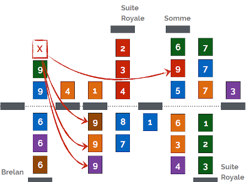

Dans la même logique, la borne 2 est gagnée par le joueur du bas parce que la seule façon que son adversaire pourrait gagner est s'il complétait son brelan de 9, mais tous les 9 des autres couleurs ont déjà été joués!

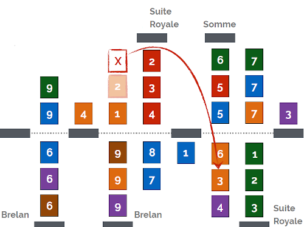

Sii on regarde la borne 4, le joueur du bas a un brelan de 9 en place. La seule façon de battre cette combinaison serait avec une suite de couleur. Le joueur du haut a un 1 orange en place. La seule suite de couleur possible est donc 1-2-3 oranges. Malheureusement, le 3 orange a déjà été joué. Le joueur du bas remporte donc cette borne.

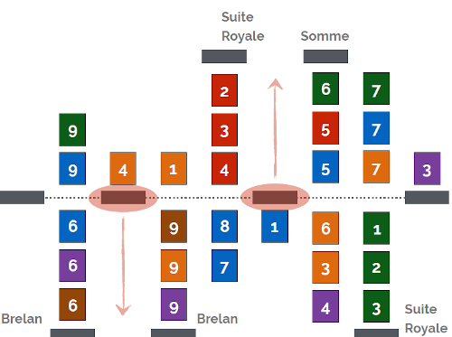

À partir de là, la partie continue. Les deux joueurs sont près d'égalité. Selon les règles, le joueur du bas gagne la partie s'il remporte la borne 3, parce qu'il aurait remporté les bornes consécutives 2, 3 et 4. Même chose pour le joueur du haut et la borne 6.

## Section 2 - Encapsulation

Maintenant que nous avons une bonne idée des règles du jeu, parlons conception. Nous allons concevoir un logiciel qui permettra de simuler une partie de ce jeu.

Un des principes de base en conception orientée-objet est l'encapsulation.

#### Pourquoi "encapsuler" ?

L'encapsulation permet de décomposer notre système en objets pour maîtriser la complexité globale (_diviser pour mieux régner_) et travailler de manière séparée sur les concepts (e.g. pour éviter les conflits Git).

##### Tout système décomposé est-il bon?

Il y a un équilibre à aller chercher lorsqu'on décompose un système en objets. Si notre décomposition est trop granulaire (trop de petits objets), on court le risque que nos objets soient tellement petits qu'ils ne représentent plus de concepts logiques dans notre conception. Le code devient donc difficile à comprendre et à maintenir.

Le problème inverse est aussi à éviter : comme vu dans la première séance de cours, un système où tout est conceptualisé dans le même objet peut fonctionner, mais nécessitera plus d'effort à comprendre (il faut comprendre le système au complet d'un seul coup) et à maintenir (une modification risque d'impacter le système complet au lieu de seulement un objet).

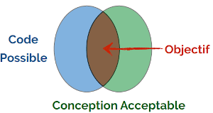

### Un exemple de conception des cartes

Si on regarde la spécifications, on peut retirer cette description concernant les cartes :

* Il y a neuf (9) cartes clan par couleurs
* Il y a six (6) couleurs de cartes

On pourrait donc encoder l'information dans un entier _card_ situé entre 0 et 54 (9 x 6). Pour trouver la valeur de la carte, on divise par 9 et on ajoute 1 :

    public static int value(int card) { return (card / 9) + 1; }

Pour trouver la couleur, on prend le modulo 9 :

    public static int color(int card) { return card % 9; }

> "_Hé tavu, il est opti mon code..._"

#### Quels sont les problèmes?

###### Vous jouez avec des cartes, ou avec des nombres entiers ?

On a une **représentation dans le code différente du domaine**. C'est-à-dire que notre définition de carte claire avec une valeur et une couleur devient une représentation _encodée_ dans un seul nombre entier qu'il faut _décoder_ pour comprendre. Commentaires dans le code ou pas, la tâche de compréhension devient plus difficile.

###### Représentation couplée à l'implémentation

Dans tout le programme, on utilisera le type int pour référer aux cartes. Si éventuellement on a besoin de faire évoluer le programme en ajoutant un nouvel attribut aux cartes ou de nouvelles cartes, il faudra changer ça partout où on utilise des cartes dans le programme (soit... **partout**).

###### On peut corrompre la structure de données aisément

Est-ce que -42 est une carte valide? C'est pourtant un int...

###### "_Ouais mais mon code opti..._"

L'optimisation prématurée du code est une des cause principale de dette technique dans un logiciel. Pourquoi exactement aurait-on besoin d'optimiser la représentation des cartes? Est-ce que notre système va être implémenter sur une cartouche NES ou un microprocesseur avec peu de mémoire?

On parle de "_Primitive Obsession_" quand un code utilise de manière inadéquate des types primitifs au lieu d'objets du domaine. C'est une **représentation possible** dans le code, mais **_pas acceptable_** du point de vue de la conception.

### On va "encapsuler" dans une classe alors...

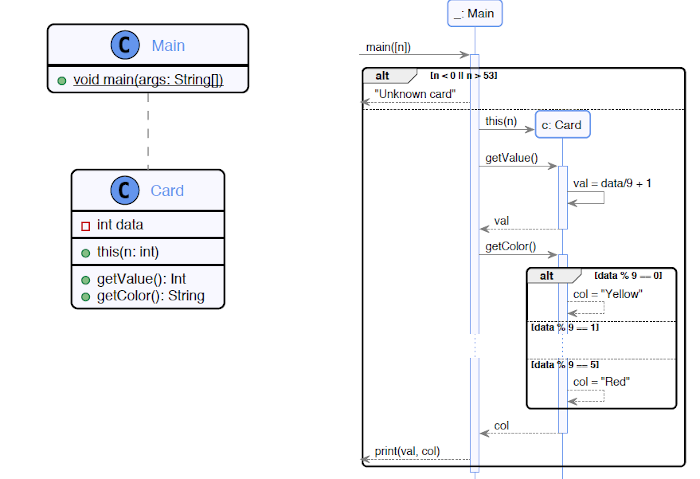

Voilà, on a une classe, on a un modèle UML, c'est facile la conception!

...Pas si vite.

#### Quels sont les problèmes?

###### La représentation est encapsulée, mais visible à l'externe de la classe

Le constructeur de notre classe demande un int qui représentera la valeur de la carte de façon interne à la classe. Le problème est que la partie du programme chargée d'instancier les cartes aura à manipuler et comprendre cette représentation pour la fournir au constructeur!

###### Obsession primitive

Les méthodes _getValue_ et _getColor_ retournent un _int_ et un _string_ respectivement. Il s'agit encore ici d'utilisation inadéquate de types primitifs. Est-ce que 108 est une valeur valide? Est-ce que "toto" est une couleur valide?

###### Principe de responsabilité unique

Le premier [principe SOLID](https://github.com/INF5153-E20/Notes/blob/master/semaine1.md#les-principes-solid) n'est pas respecté ici. La fonction main est chargée de faire le test de si la valeur de la carte est située entre 0 et 53. Ce n'est pas à main de connaître les spécificités de la représentation interne des cartes.

###### Switch

La méthode getColor utilise un _switch_ pour décoder la couleur de notre représentation interne. Généralement dans une conception orienté-objet, les _switch_ sont un signe de faiblesse dans la conception. Il y a des utilisations valides du _switch_, mais ici on l'utilise pour _hardcoder_ les différentes couleurs à l'intérieur de notre méthode. Si on voulait ajouter une couleur, c'est la méthode getColor qu'il faudrait modifier? Si on veut obtenir la liste des couleurs possibles, il faut regarder la méthode getColor?

##### Nombres magiques!

L'algorithme décrit dans le diagramme de séquence fait usage à outrance des nombres magiques. Un nombre magique est un nombre pur utilisé dans le code sans explication. Ici on utilise 0 et 53 pour la validation des cartes, on divise en 9 et ajoute 1 dans getValue, etc.

### Énumérations versus Classes

Abordons d'abord la notion de représentation des cartes. 

La plupart des langages de programmation proposent la notion d'**énumeration**. Une énumération est un ensemble de valeurs fini (e.g. les nombres pairs positifs inférieurs à 10 : [0, 2, 4, 6, 8]). En contrepartie, une classe est un ensemble d'éléments infini (e.g. tous les nombres pairs : [ n | n % 2 == 0]).

> On verra plus bas qu'on peut implémenter l'une de ces notions avec l'autre.

Dans le cas de nos cartes, quelles solutions s'offrent à nous?

##### Utiliser une énumérations de toutes les cartes

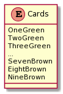

Pas idéal, ça rendrait la logique d'interaction entre les cartes (e.g. faire la somme des valeurs) très difficile à coder.

##### Énumeration pour les couleurs seulement

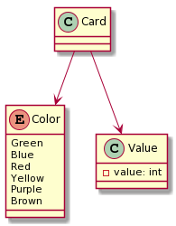

Ici on encapsule les couleurs dans une énumération au lieu d'utiliser le type infini _string_. La valeur est toujours dans un type infini _int_ par contre. On peut faire mieux!

##### Deux énumérations

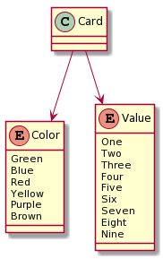

La classe _Value_ est maintenant aussi une énumération. Maintenant notre type _Card_ est fini : toutes les combinaison possibles sont représentables et aucune représentation invalide n'est possible!

Voici ce que ça donne en Java :
    
    class Card {
        private final Value value;
        private final Color color;
        
        public Card(Value value, Color color) {
            this.value = value;
            this.color = color;
        }
        
        public Value getValue() {
            return value;
        }
        
        public Color getColor() {
            return color;
        }
    }
    
    enum Value {
        One, Two, Three,
        Four, Five, Six,
        Seven, Eight, Nine
    }
    
    enum Color {
        Green, Blue, Red,
        Yellow, Purple, Brown
    }
    
Cette implémentation a plusieurs avantages :

* Le constructeur prend maintenant des valeurs de domaine (une couleur et une valeur) au lieu d'une représentation interne (un _int_);
* La représentation interne est cachée (les attributs _value_ et _color_ sont privés);
* La classe est immuable (ses attributs sont _final_).

On verra un peu plus bas en quoi avoir un objet immuable est intéressant.

### Qu'en est-il de la pioche?

La pioche contient toutes les cartes du jeu qui ne sont pas jouées ou dans les mains des joueurs. On doit pouvoir piger une carte au hasard dans la pioche.

Pourquoi pas ceci?

    public static void main(String[] args) {
        List<Card> drawPile = new ArrayList<>();
        drawPile.add(new Card(ONE, GREEN));
        // ...
        drawPile.add(new Card(NINE, BROWN));
        // ...
        System.out.println(drawPile.get(2).color.toString())
    }
    
#### Problèmes?

Encore une fois, la représentation interne est exposée dans le code (si on voulait utiliser autre chose qu'une _List_, il faudrait changer toutes les références dans le code). De plus, on peut corrompre la pioche en insérant des doublons par accident.

Il faut donc cacher notre représentation interne aux utilisateurs de la classe. Quelles sont les fonctionnalités qui doivent être exposées?

* On doit pouvoir initialiser la pioche avec toutes les cartes
* On doit pouvoir piger une carte au hasard

Donc...

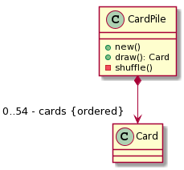

#### Problèmes?

La classe est peut-être *trop* encapsulée. Les fonctionnalités de base sont bien rendues publiques par l'interface de la classe et la représentation interne reste cachée.

Mais c'est un peu limitant : et si on voulait inspecter la pioche?

C'est encore ici une question d'équilibre entre l'encapsulation et la facilité d'utilisation : attention à l'_over-engineering_!

Par contre, il faut aussi faire attention à ne pas aller trop loin dans l'autre direction. On s'était mis d'accord que ``List<Card>`` était une représentation interne. L'exposer _ouvrirait la porte à toutes les fenêtres_.

Définir un accesseur ("_getter_") provoque aussi une fuite de données, alors c'est à éviter lorsque possible. Dans l'absolu, **ce qui est privé doit rester privé**.

Donc on fait quoi?

#### Retourner une copie de la donnée

> "_Pour tout problème complexe, il existe une solution simple, claire, directe et **fausse**._"  
> --_Albert Einstein_

On peut retourner une copie des données pour protéger notre représentation interne contre les changements externes. Si la copie est modifiée, notre objet original ne sera pas affecté. La copie peut être **superficielle** ou **profonde** et elle peut être en lecture seule. Le choix est complexe et dépend du contexte d'utilisation.

##### Comment copier?

* On peut utiliser une méthode _helper_ : ``copy(cp: CardPile): CardPile``
* Un constructeur par copie : ``CardPile cp' = new CardPile(cp)``
* Une méthode de clonage : ``CardPile cp' = cp.clone()``

Cloner a un coût! L'accesseur pourrait être appelé dans une boucle!

Par exemple, on pourrait faire :

    public void List<Card> getCards() {
        return new ArrayList<>(this.cards);
    }
    
Ici on a à faire au constructeur par copie de ``ArrayList``. On pourra donc modifier la liste retournée sans crainte d'affecter ``CardPile``.

##### Et si ``Card`` est _muable_?

Alors ce code ne fonctionne pas. Si l'utilisateur de ``getCards`` peut modifier les cartes individuelles, il affectera alors la liste originale contenue par ``CardPile`` aussi.

Le mieux, c'est de faire en sorte que la classe ``Card`` soit immuable (il n'y a aucune raison que cette classe puisse être modifiable de toute façon). Mais dans d'autres situations, ce n'est pas toujours possible.

Si on a affaire à une classe muable, il faut faire une copie profonde :

    public void List<Card> getCards() {
        List<Card> result = new ArrayList<>();
        for(Card c: this.cards) {
            Card copy = new Card(c.getColor(), c.getValue());
            result.add(copy);
        }
        
        return result;
    }

On peut constater que faire des copies profondes en Java peut devenir très complexe si la copie doit avoir _plusieurs niveaux de profondeurs_. Il faut aussi considérer l'espace mémoire utilisé si on fait beaucoup de copies profondes d'objets très larges (e.g. une liste d'images en mémoire).

### Bref, comprenez ce que vous utilisez!

    public void List<Card> getCards() {
        return this.cards;
    }
    
    public void List<Card> getCards() {
        return new ArrayList<>(this.cards);
    }
        
    public void List<Card> getCards() {
        List<Card> result = new ArrayList<>();
        for(Card c: this.cards) {
            Card copy = new Card(c.getColor(), c.getValue());
            result.add(copy);
        }
        return result;
    }

## Section 3 - Types et Interfaces

Avant de continuer dans notre conception, nous allons définir quelques notions concernant le typage dans les langages orienté-objet comme Java.

#### Différence entre _Type_ et _Classe_

Les termes _Type_ et _Classe_ représentent deux concepts reliés, mais différents. Il est important de comprendre qu'une classe est un type, mais un type peut être une variété d'autres choses qu'une classe.

Un type est une annotation supportée par le compilateur ou le _runtime_ qui aide à garder le code cohérent. On peut aussi voir ça comme un contrat entre consommateur et fournisseur de service. Par exemple, le type ``List`` en Java fourni les méthodes ``add``, ``remove``, ``clear``, etc. Cela signifie que si vous avez un objet qui correspond à ce type, vous avez la garantie que toutes ces méthodes sont disponibles.

Une classe est une définition d'objets similaires qui peut être conforme à plusieurs types. Par exemple, la classe Java ``ArrayList`` se conforme au type ``List``, mais aussi aux types ``Iterable``, ``Serializable``, et autres. C'est pourquoi notre méthode ``getCards`` plus haut peut utiliser une instance de ``ArrayList<Card>`` pour initialiser une variable de type ``List<Card>``.

### Distribuer les six premières cartes

Pour revenir à notre jeu, la première utilisation de la pioche (``CardPile``) sera de piger les 6 premières cartes au début du jeu. Voici comment ça pourrait se passer :

    public static List<Card> drawCards(CardPile cp, int howMany) {
        List<Card> result = new ArrayList<>();
        
        for (int i = 0; i < howMany; i++) {
            if (cP.isEmpty()) {
                return result;
            }
            
            result.add(cP.draw());
        }
        
        return result;
    }
    
Mais en fait, si on examine ce code en détail, on peut se rendre compte d'une chose importante. Faisons l'exercice :

La méthode ``drawCards`` fait deux choses :

* Vérifie s'il reste des cartes dans la pioche
* Pige une carte de la pioche

En fait, elle n'utilise aucune des fonctionnalité des cartes. Elle pourrait piger autre chose sans problème.

#### Abstraction du comportement réutilisable

Lorsqu'on est en présence de code spécifique pour des comportements plus généraux, on peut travailler notre code pour le rendre plus _abstrait_. Dans notre exemple de pige de carte ici, on peut extraire le concept d'un truc qui pige _quelque chose_ (appelons ça un _Drawer_) et d'une source où piger (appelons la _Source_) :

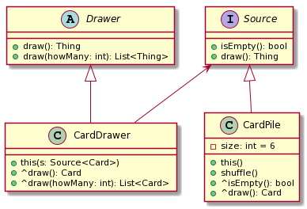

Ici la classe ``CardDrawer``, qui permet de piger des cartes, _hérite_ de la classe abstraite ``Drawer``, qui permet de piger des _choses_. Du même coup, notre ``CardPile`` _implémente_ l'interface ``Source`` qui offre les fonctionnalités de piger et de vérifier si la source est vide.

Notre conceptualisation a maintenant un _couple plus faible_ et est plus facilement _extensible_. Un programme utilisant nos classes peuvent dépendre simplement des abstractions ``Drawer`` et ``Source``, nous permettant facilement de modifier le comportement de ``CardDrawer`` et ``CardPile`` sans se soucier de briser le reste du programme (en autant qu'on ne change pas les abstractions).

#### Classe abstraite ou interface?

En Java, il y a deux concepts similaires pour faire des abstractions : la classe abstraite et l'interface. Dans d'autres languages, comme C++, seule la classe abstraite existe.

Une classe abstraite est une classe qui peut contenir des méthodes abstraite et ne peut être instanciée directement. Une méthode abstraite est une méthode sans implémentation (elle sera définie dans une classe qui en hérite, i.e. une classe enfant). Mais pourquoi a-t-on besoin d'interfaces alors?

Il se trouve que Java est un langage d'héritage simple. En d'autres termes, une classe Java ne peut hériter que d'une seule classe. Si notre classe hérite d'une classe abstraite, c'est tout, elle ne peut plus hériter de rien d'autres. Par contre, le I dans les principes SOLID est la ségrégation des interfaces, qui nous dit qu'il vaut mieux avoir plusieurs petites interfaces qu'un gros monolithe. Dans cette optique, il serait préférable de pouvoir hériter de plusieurs éléments...

Intervient l'interface Java : une interface offre des fonctionnalités similaires à une classe abstraite. L'interface possède une liste de méthodes et garantie que toute classe l'implémentant offrira ces méthodes. Le bonus? L'interface n'est pas une classe et une classe peut implémenter autant d'interfaces qu'elle veut!

L'interface a par contre le désavantage de ne pas pouvoir déclarer d'attributs. Elle peut cependant définir une implémentation par défaut pour ses méthodes (en Java 8), comme une classe abstraite/virtuelle le pourrait.

##### Alors on fait des classes abstraites ou des interfaces?

La question se pose au cas-par-cas. Dans l'exemple ci-dessus, ``Drawer`` est une classe abstraite et ``Source`` une interface. 

Lorsqu'une classe décrit surtout des _comportements_, comme ``Drawer`` décrit l'algorithme pour piger des cartes, une classe abstraite est souvent plus appropriée. La raison est que notre S dans SOLID demande que nos classes n'aient qu'une seule préoccupation. Si on héritait de plusieurs classes décrivant des comportements, ce principe ne serait plus respecté. Le désavantage de la classe abstraite n'a donc pas d'impact ici.

Si une classe décrit plutôt une liste de services, comme ``Source`` qui fourni les méthodes ``isEmpty`` et ``draw``, sans nécessairement se soucier de l'implémentation, on est plutôt en présence d'une interface. Une classe peut répondre à plusieurs listes de services (e.g. ``ArrayList`` qui est à la fois une ``List`` et un ``Iterable``) sans qu'elle n'ait plus qu'une préoccupation. Il est donc intéressant d'utiliser l'interface pour permettre d'en implémenter plusieurs.

##### Généralisation _versus_ Réalisation

Lorsqu'on parle de _généralisation_, on parle d'une relation taxinomique (classification). Par exemples : un chat est un mammifère, une carotte est un légume. Lorsqu'on est en présence d'une réalisation, on **peut** considérer utiliser l'héritage de classe plutôt que des interfaces.

Une _réalisation_ est une relation de mise en oeuvre, un lien entre une spécification et son implémentation. Par exemples : une collection said se trier, une pioche sait piger une carte.

**En pratique, ces deux relations sont très mal appliqués dans la plupart des programme orienté-objet.** On parlera d'héritage (généralisation) la semaine prochaine.

#### Exemple d'implémentation Java

    abstract class Drawer<T> {
        public abstract T draw();
        
        public List<T> draw(int howMany) {
            List<T> result = new ArrayList<>();
            
            for(int i = 0; i < howMany; i++) {
                T thing = draw();
            
                if(thing == null)
                    return result;
                else
                    result.add(thing);
            }
        
            return result;
        }
    }

    interface Source<T> {
        boolean isEmpty();
        T draw();
    }

    class CardDrawer extends Drawer<Card> {
        Source<Card> source;
        
        public CardDrawer(Source<Card> source) {
            this.source = source; 
        }

        @Override
        public Card draw() {
            if (source.isEmpty())
                return null;
            else return source.draw();
        }
    }

    class CardPile implements Source<Card> {

        @Override
        public boolean isEmpty() {
            // ...
        }

        @Override
        public Card draw() {
            // ...
        }
        
        // ...
    }

Remarquez que ``Drawer`` définit une méthode ``draw(int)`` qui dépend de l'implémentation de sa méthode abstraite ``draw()``. C'est une façon classique de déclarer une classe abstraite avec un comportement personalisable. ``CardDrawer`` peut hériter de cette classe et simplement définir ``draw()`` pour que le tout fonctionne.

``CardDrawer`` lui-même dépend de ``Source<Card>``, mais pourrait prendre ses éléments de n'importe quelle source : ``Drawer<T>`` n'a que besoin qu'on lui dise comment exécuter ``draw()`` pour obtenir un élément.

**Ceci n'est pas la seule conception possible ou efficace de ce problème!** Il y a plusieurs bonnes réponses à ce genre de problème, et une _infinité de mauvaises réponses_.

### Questions de conception

> "_Est-ce que j'ai besoin de créer une nouvelle interface?_"

Ça dépend!
 
> "_Que devrait spécifier cette interface?_"

Ça dépend!

Il faut trouver un équilibre pour éviter de tomber dans le piège de l'_over-engineering_, mais aussi sans trop créer de _dette technique_. Il s'agit d'un processus d'**essais-erreurs** et d'**expérience**.

Il n'y a pas de solution miracle, et les réponses dogmatiques sont souvent inutilisables en pratique.

### Allons-y avec un autre exemple : la comparaison dans Java

Les libraries de Java fournissent une gamme de "services" sous la forme d'interfaces "_-able_" :

* ``Cloneable``
* ``Comparable``
* ``Iterable``
* ``Runnable``
* ``Closeable``
* ...

Une classe peut implémenter "_X-able_" pour dire qu'elle sait faire X. Ces abstractions reposent sur des interfaces. Par exemple, si on veut trier une collection, il faut d'abord savoir _comparer deux objets_. Si nos objets implémentant ``Comparable``, les **tris deviennent disponibles**.

On définit ``Comparable<C>`` comme **une relation d'ordre sur l'ensemble des instances de la classe C**.

#### Comparer deux cartes de Schotten Totten

    public class Card implements Comparable<Card> {
        private Value value;
        
        public int compareTo(Card c) {
            return compareTo(c.value);
        }
    }

Heureusement pour nous, les énumérations en Java implémentent déjà ``Comparable`` (selon leur ordre de déclaration)!

Maintenant que nos cartes peuvent être comparées entre elles, on peut faire usage de toutes les méthodes de tri de la classe utilitaire ``Collections`` en Java.

#### Un problème de responsabilité

Malheureusement, nous avons un problème : on a donné à Carte la responsabilité de se comparer, mais ce choix n'est plus adapté si nos comparaisons varient dépendemment du contexte.

Notre implémentation plus haut compare les cartes selon leurs valeurs. Mais si on avait besoin de donner un ordre aux couleurs aussi dans certaines situations? Ou si dans certaines situation les as (1) pouvaient valoir plus que les autres valeurs?

On peut utiliser ce qu'on appelle des comparateurs dédiés. Chaque contexte pourrait fournir son propre comparateur de cartes et c'est ces comparateurs qui porteraient la responsabilité de déterminer l'ordre des cartes. Cette façon de faire provient du monde de la programmation fonctionnelle, mais est aussi utilisable en orienté-objet :

###### Exemple 1

    public class Card {
        private Value value;
        
        static class CompareByValue implements Comparator<Card> {
            public int compare(Card c1, Card c2) {
                return c1.value.compareTo(c2.value);
            }
        }
    }
    
    public class CardPile {
        public void sortByValue() {
            Collections.sort(this.cards, new Card.CompareByValue());
        }
    }
    
Ce premier exemple utilise une classe statique déclarée dans Card implémentant l'interface ``Comparator<Card>``. Cette interface est une _interface fonctionnelle_, parce qu'elle déclare une _méthode fonctionnelle_ et peut être utilisée dans des _expression lambda_.

Dans ce cas particulier, la méthode ``Collections.sort`` prend comme deuxième paramètre une interface fonctionnelle décrivant la manière de comparer les objets de la liste à trier. C'est ce que la classe CompareByValue fait.

###### Exemple 2

    public class CardPile {
        public void sort() {
            Collections.sort(this.cards, new Comparator<Card>() {
                public int compare(Card c1, Card c2) {
                    return c1.getValue().compareTo(c2.getValue());
                }
            });
        }
    }
    
Ici au lieu d'utiliser une classe déclarée ailleur, on utilise une _classe anonyme_ comme deuxième paramètre à ``Collections.sort``. Les classes anonymes ne sont utilisées qu'à l'endroit où elle sont déclarées. Sinon, le comportement est toujours le même qu'avant.

###### Exemple 3

    public class CardPile {
        public void sort() {
            Collections.sort(this.cards, (c1, c2) -> c1.getValue().compareTo(c2.getValue()));
        }
    }

Finalement, on utilise ici une _expression lambda_, concept de base de la programmation fonctionnelle, supporté en Java depuis la version 8. Dans le cas de Java, notre expression lambda n'est que du sucre syntactique pour déclarer une classe anonyme qui implémente une interface fonctionnelle (comme l'exemple 2).

La syntaxe pour les expressions lambda de Java peut mener à du code difficile à lire, alors c'est à utiliser avec partimonie. D'un autre côté, une expression lambda bien placée peut rendre un bout de code beaucoup plus simple à comprendre.

### Accéder aux cartes de la pioche

Retournons à un problème que nous avions plus tôt : nous voulons un moyen d'accéder aux cartes de la pioche. Nous avions déterminer qu'il était possible d'avoir une méthode ``getCards`` qui retournerait une copie de la liste des cartes interne à ``CardPile``. Mais pourquoi ne pas considérer ``CardPile`` directement comme une collection?

Java propose deux mécanisme pour itérer sur une collection :

* L'interface ``Iterator<T>`` pour traverser une collection d'objets (fournit les méthodes ``hasNext()`` et ``next()``)
* L'interface ``Iterable<T>`` qui produit un itérateur de T de manière uniforme avec la méthode ``iterator()``.

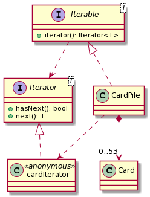

    public class CardPile implements Iterable<Card> {
        private List<Card> cards;
        
        public Iterator<Card> iterator() { return cards.iterator(); }
    }
    
Heureusement, ``List<T>`` implémente aussi ``Iterable<T>`` et donc l'implémentation dans ``CardPile`` devient simplement une question de délégation.

Mais quel avantage avons-nous gagné?

On peut maintenant itérer sur la liste des cartes sans avoir à exposer la liste à l'extérieur de ``CardPile``!

    CardPile cp = new CardPile();
    for(Iterator<Card> it = cp.iterator(); it.hasNext()) {
        Card c = it.next();
        // ...
    }
    
Ou en Java 8 :

    CardPile cp = new CardPile();
    for(Card c : cp) {
        // ...
    }

Pas mal, non?

#### Principe de ségrégation des interfaces

> "_Many client specific interfaces are better than one general purpose interface._"
> _Design principles, Martin, 2000_

On interagit avec les objets via leurs interfaces. On peut donc utiliser les interfaces pour décrire des objets à partir de leur fonctionnalités disponibles. Il s'agit du I dans l'acronyme SOLID.

L'idée est qu'une méthode ou classe ne doit pas dépendre d'interfaces qu'elle n'utilise pas. Minimiser les dépendances mène à une réutilisation plus facile et à une meilleure conception.

Quels sont les services proposés par la pioche?

* Se mélanger
* Fournir des cartes
* Pouvoir être parcourue

##### Proposition

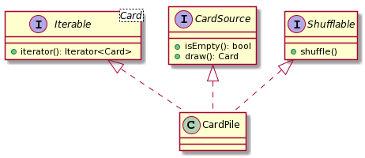

On a séparé nos comportements en interfaces et défini ``CardPile`` en termes des fonctionnalités qu'elle offre. Il n'y a qu'une dernière question à se poser : toutes nos interfaces semblent être au même niveau de hiérarchie. Est-ce qu'on a une interface qui dépend d'une autre?

En fait oui, le fait d'être ``Iterable<Card>`` dépend du fait que ``CardPile`` est une ``CardSource``. En d'autres termes, toute ``CardSource`` devrait automatiquement être ``Iterable<Card>``. C'est donc ``CardSource`` qui devrait implémenter ``Iterable<Card>`` :

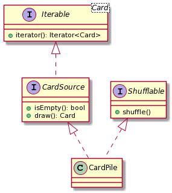

Une pioche est une source de cartes. On peut itérer sur une source de carte. Une pioche peut aussi être mélangée, qui est un concept unique à la pioche (ne provient pas du fait que c'est une source de cartes).

## Section 4 - État des Objets

### Principes ou paradigmes?

Prenons quelques instants pour discuter de la notion de principes de génie logiciel et des paradigmes de programmation. 

Un principe de conception est **stable** : il est généralisable et applicable dans la majorité des contextes. Par exemples : objets _stateless_, _stateful_, muables, immuables...

Un paradigme de programmation est une méthode construite sur des **principes**. Par exemple, les micro-services sont des entités **_stateless_** qui s'échangent des messages **immuables**.

##### Mais pourquoi on s'intéresse à l'état?

Dans la conception de logiciel, les concepts manipulés peuvent avoir de grands ordre de grandeurs. Considéront une classe ``Player``, contenant le score d'un joueur.

	class Player {
		int score;
	}
	
Il y a 2^32 instances possibles (!=) de ``Player``. Et si on ajoute un ``String name``, ça devient une infinité (autant que la mémoire le permet).

Si on considère la pioche de Schotten Totten, la pile peut contenir de 0 à 54 cartes ordonnées de n'importe quelle façon. Il y a 6.27 x 10^71 pioches différentes possibles!

> _On estime à 10^80 le nombre d'atomes dans l'univers._

##### On ne considère que les états utiles

L'utilité d'un état est déterminé à deux niveaux :

* Technique : Impossible de piger une carte dans une pile vide.
* Logique d'affaire : La pioche est-elle mélangée ou non?

Un diagramme d'états peut aider à modéliser les états "abstraits" du système :

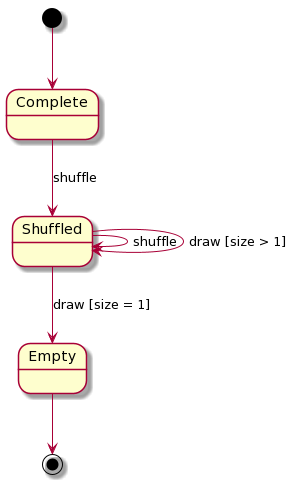

Faites attention à ne pas mettre trop de détails dans vos diagrammes; ils doivent rester utiles et lisibles!

##### Problèmes classiques de conception

Parfois, des concepteurs vont abuser des diagrammes UML et les utiliser pour résoudre des problèmes qu'ils n'ont pas été faits pour. Par exemple, utiliser un diagramme d'état comme un **flot de données**. Un état n'est pas une étape de calcul sur des données!

Il faut éviter de prévoir beaucoup d'états inutiles; on risque de tomber dans l'_over-engineering_, ou spécifiquement, _speculative generality_. Si votre justification d'une fonctionnalité est "_ça peut toujours servir_", c'est signe que vous introduisez une dette technique dans votre logiciel.

Augmenter l'espace d'états pour optimiser un programme est souvent peu recommandé aussi. L'optimisation possible avec cette méthode est souvent minime et ça deviendra une source de bugs dans le futur. C'est un problème connu sous le terme _temporary fields_, ou un système comporte un paquet d'états intermédiaires dans le but d'accélérer des calculs, mais qui complexifient la compréhension du système inutilement.

##### Problème avec _null_

L'inclusion de la valeur _null_ dans C est souvent citée comme étant [une des pires erreurs de conception de l'histoire de la programmation](https://www.infoq.com/presentations/Null-References-The-Billion-Dollar-Mistake-Tony-Hoare/).

La représentation de l'**absence d'information** est un problème important dans la conception de langage et de logiciels. Il faut une information concrète pour représenter l'absence d'info. Malheureusement, Java perpétue l'erreur d'utiliser la valeur ``null``. L'effet est que tous les types non primitifs (i.e. pas un int, long, double, etc.) peuvent potentiellement être ``null``. Et des millions de ``if (v != null)`` sont nés...

Les langages comme _Kotlin_ et _F#_ ont une approche différente : un type doit être déclaré comme pouvant être _null_. Pour utiliser une valeur _nullable_, on doit _extraire_ la partie concrète en vérifiant au préalable si la valeur est nulle :

En F# :

	let value = Some 4
	let nullValue = None
	
	match value with
	| Some x -> // Do something with x
	| None -> // Value is missing
	
	match nullValue with
	| Some y -> // Do something with y
	| None -> // Value is missing
	
Java propose une solution à ce problème sous la forme d'``Optional<T>``, qui fonctionne d'une façon semblable à F#, mais n'est malheureusement pas très répandue et plus difficile d'utilisation.

### Ajoutons une carte spéciale : Joker

Il est temps de revenir à notre jeu. Nous allons ajouter une carte _Joker_ qui peut remplacer n'importe quelle carte clan lors d'une attaque. Le contenu d'un _Joker_ est choisit au moment où on la pose. Elle n'a donc ni ``value``, ni ``color`` jusqu'à ce qu'elle soit jouée.

De quelle façon pouvons-nous concevoir cela?

##### Un héritage naif ne résout rien

	class Joker extends Card {
		public Color getColor() {
			throw new UnsupportedOperationException();
		}
		
		public Value getValue() {
			throw new UnsupportedOperationException();
		}
	}
	
Cette version viole la règle de substituabilité (le L de SOLID, plus sur ça la semaine prochaine).

##### Utiliser _null_ comme zéro

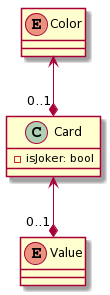

    public class Card {
        private Value value = null;
        private Color color = null;
        private boolean isJoker = false;
        
        public Card(Value v, Color c) {
            this.value = v;
            this.color = c;
        }
        
        public Card() {
            this.isJoker = true;
        }
        
        // ...
    }
    
Ici on ajoute un attribut booléen ``isJoker`` et le constructeur vide met ``null`` dans les champs ``value`` et ``color``. Tenter d'accéder aux attributs de Joker sans effectuer de tests (``if (card.getValue() != null)``) au préalable risque d'occasionner une ``NullPointerException``.

#### Choisir une valeur nulle

    public class Card {
        private Value value;
        private Color color;
        private boolean isJoker;

        public Card(Value v, Color c) {
            this.value = v;
            this.color = c;
            this.isJoker = false;
        }
        
        public Card() {
            this.value = Value.One;
            this.color = Color.Brown;
            this.isJoker = true;
        }
        
        // ...
    }

Et si on gardait le booléen ``isJoker``, mais qu'on initialise ``value`` et ``color`` avec des valeurs par défaut?

> _Pourquoi "1 marron"? "Parce que c'est comme ça."_

Et si on oublie de tester si c'est un joker? _Ça sera un "1 marron"._

On se retrouve en situation d'**usurpation d'identité** objet.

##### Créer la valeur nulle

    public Card() {
        this.value = Value.NA;
        this.color = Color.NA;
        this.isJoker = true;
    }

Si plutôt on ajoutait la valeur ``NA`` aux énumérations ``Color`` et ``Value``. La carte Joker serait créée avec ``Value.NA`` et ``Color.NA``.

Oui, mais pour initialiser la pioche, on voulait boucler sur les énumérations... Il faudrait rajouter une condition pour éviter d'initialiser une suite de couleur ``NA`` et une valeur ``NA`` dans chaque suite.

_Les différences sont subtiles, mais l'impact peut être subtantiel!_

#### Gérer l'absence de valeur : Optionnel

Le type ``Optional<T>`` en Java peut être utilisé pour gérer ce genre de situation. Il est basé sur une construction présente dans beaucoup de langages (surtout fonctionnels), tels Haskell, Scala, OCaml, F#, Python, ...

Un ``Optional<T>`` représente soit une valeur du domaine T, ou aucune valeur. Par exemple, ``Optional<Intger>`` représente n'importe quel entier, ou ``None``.

Essayons avec ça!

##### Optionnel visible

    public class Card {
        private Optional<Value> value;
        private Optional<Color> color;
        
        public Card(Value v, Color c) {
            this.value = Optional.of(v);
            this.color = Optional.of(v);
        }
        
        public Card() {
            this.value = Optional.empty();
            this.color = Optional.empty();
        }
        
        public boolean isJoker() {
            return this.value.isPresent();
        }
        
        public Optional<Value> getValue() {
            return this.value;
        }
        
        public Optional<Color> getColor() {
            return this.color;
        }
    }
    
Notre premier essai utilise des ``Optional`` à l'interne et dans les _getter_. On aurait pu aussi utiliser ``null`` dans les attributs et retourner des ``Optional`` dans les _getter_ seulement.

Le problème ici, c'est que l'utilisateur de notre classe a à se soucier de bien gérer les ``Optional`` : _on a une fuite de la représentation interne dans les données_!

##### Optionnel invisible

    public Value getValue() {
        return this.value.get();
    }
    
    public Color getColor() {
        return this.color.get();
    }

Et si on ne retournait que des valeurs concrètes? Notre code générerait une ``NoSuchElementException`` dès l'accès à la couleur ou à la valeur d'un joker. C'est mieux qu'une ``NullPointerException`` plus tard lorsqu'on essaie de l'utiliser.

_Attention : les types ``Optional`` en Java peuvent causer problème si vous tenter de sérialiser vos objets par la suite!_

## Mot de la fin

Nous avons vu cette semaine différents concepts au niveau de la création de classes et de la gestion de l'état des objets. Le génie logiciel n'a souvent pas de réponse claire à comment **bien** concevoir tous les systèmes : c'est avec le contexte de votre travail et l'expérience que vous allez arriver à prendre de bonnes décisions conceptuelles.

Par contre, pour pouvoir en arriver à prendre de bonnes décisions, il faut bien connaître les possibilités qui s'offrent à nous et faire des choix éclairés. 

Il sera important dans vos travaux de bien appliquer les concepts explorés pour créer des objets qui sont adaptés au contexte de votre code!

N'oubliez pas de consulter la deuxième partie du travail 1 disponible sur le [Github du cours](https://github.com/INF5153-E20/Notes/blob/master/travail1.md). Vous pouvez dès maintenant commencer à modéliser votre domaine objet et à créer vos classes de base pour le travail.
