# INF5153 - Semaine 5

## Bibliographie du cours

<table>
<td>

  

</td>
<td>

  

</td>
</table>

## Principes de conception (GRASP, SOLID)

Cette semaine nous introduirons les concepts généraux de patrons de conception orienté-objet. Pour se faire, une bonne compréhension des principes SOLID est nécessaire. Nous allons donc les revoir en détail.

## Section 1 - Rappels sur SOLID

### Le 5 principes SOLID

* **S**ingle Responsibility Principle (Principe de responsabilité unique)
* **O**pen/Closed Principle (Principe ouvert/fermé)
* **L**iskov Substitution Principle (Principe de subtitution de Liskov)
* **I**nterface Segregation Principle (Principe de ségrégation des interfaces)
* **D**ependency Injection Principle (Principe d'injection de dépendances)

#### Responsabilité unique (**S**olid)

Ce principe dicte qu'une classe ne devrait avoir qu'une préoccupation unique. En d'autres termes, l'information contenue par cette classe et les méthode qu'elles offrent devraient supporter un seul concept et être cohérent (_cohésion_).

Prenons par exemple une classe représentant une bibliothèque d'université :

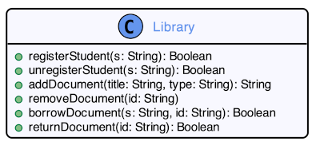

Cette classe a plusieurs problèmes, mais concentrons-nous sur sa responsabilité. En examinant ses méthodes, on remarque qu'il y a au moins deux responsabilités présentes : gérer les étudiants et gérer les documents. La méthode registerStudent n'a aucun lien avec la méthode addDocument (ils n'utilisent probablement aucun attribut interne en commun). C'est ce que l'on appèle un manque de _cohésion_ dans une classe, et ce que le principe de responsabilité unique nous sert à éviter.

Voici une conceptualisation de la bibliothèque où chaque objet a une cohésion maximale :

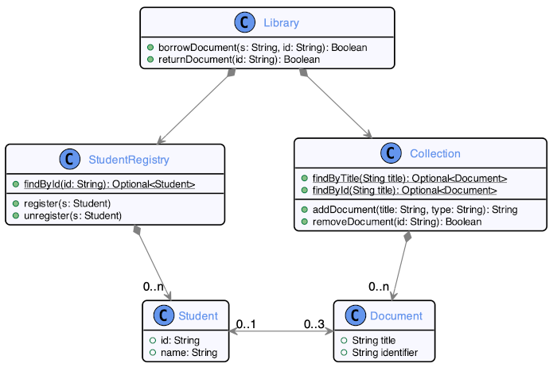

Ce modèle divise les responsabilité de ``Library`` en 6 classes différentes :

* ``Student`` est chargé de gérer les information associé à chaque étudiant.
* ``StudentRegistry`` gère la persistance des étudiants (possiblement dans une base de données externe).
* ``Document`` gère les informations des documents de la bibliothèque.
* ``Collection`` gère la persistance de ces documents et offre quelques méthodes de recherche.
* ``Library`` est l'interface publique (la _façade_) qui sera utilisée par les utilisateurs.

En plus de diviser les responsabilités au minimum pour chaque objet, cette version règle certains problème de surutilisation de valeurs primitives excessive (utiliser ``String`` pour représenter un étudiant ou un document).

#### Ouvert/Fermé (s**O**lid)

Ce principe nous dit que les classes de notre systèmes doivent être fermées à la modification, mais ouverte à l'extension. En d'autres termes, le système ne doit pas être en mesure de modifier ou de dépendre sur la représentation interne de nos classes, ce qui nous laisse la liberté de la modifier lors d'une évolution éventuelle. De plus, nos classes devraient être construites de façon à pouvoir les faire évoluer par _extension_ (héritage, composition).

Prenons un autre exemple :

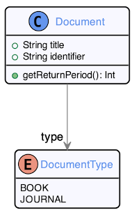

Nous avons ici une représentation de document pour notre bibliothèque. Un document peut être soit un livre ou un journal. Cette conceptualisation utilise un attribut ``type`` de type ``DocumentType``, une énumération, pour détermine le type du document. 

Étant donné que la période de retour d'un document est basée sur son type dans notre système, ce choix de _design_ fera en sorte que la méthode ``getReturnPeriod`` devra probablement être implémentée avec un switch sur le type de document :

    int getReturnPeriod() {
      switch(type) {
        case DocumentType.Book:
            return 14;
            break;
        case DocumentType.Journal:
            return 7;
            break;
        default:
            throw new IllegalStateException();
      }
    }

Le problème ici n'est pas que la représentation interne de notre document est exposée : elle ne l'est pas, tout le mécanisme est caché derrière ``getReturnPeriod``. Le problème est qu'il sera difficile d'étendre ``Document`` en utilisant les mécanismes orienté-objet de composition ou d'héritage.

Si nous voulions, par exemple, ajouter un nouveau type de document, il faudrait modifier l'énumération ``DocumentType`` pour ajouter notre nouveau type, ainsi que le ``switch`` dans ``getReturnPeriod``. En fait, pour chaque endroit où le type de document est utilisé pour déterminer la logique d'un document, un ``switch`` sera présent qu'il faudra modifier.

Modifier le code n'est pas nécessairement un problème pour la personne qui l'a conceptualisé, mais dans le cas d'un programmeur qui utilise le code comme faisant partie d'une librairie de classes, c'est impossible pour lui de modifier le comportement interne des classes (autrement qu'en ayant accès au source et en le recompilant).

Il y a une meilleure façon de faire en utilisant les principes de l'orienté-objet :

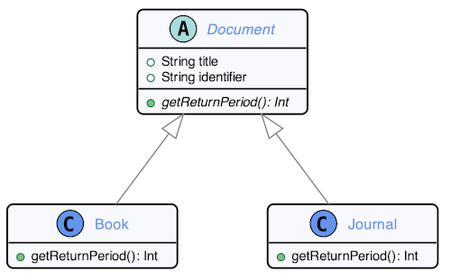

Cette fois-ci, on représente ``Book`` et ``Journal`` comme étant des sous-types de ``Document``, en utilisant l'héritage objet. Chaque sous-type peut implémenter sa propre méthode ``getReturnPeriod``, nous donnant le même résultat que la première implémentation plus haut.

La différence est au niveau de l'_extensibilité_ du code : il est beaucoup plus facile d'ajouter de nouveaux types de document, maintenant. Il n'y a qu'à créer une nouvelle classe qui héritera de _Document_. Aucune modification au code existant n'est nécessaire.

En général, on dira qu'un système est _extensible_ lorsqu'il permet d'ajouter des fonctionnalités en modifiant le minimum de code existant.

#### Substitution de Liskov (soLid)

L'héritage objet est l'outil de réutilisation le plus efficace de l'orienté-objet. Ça nous permet d'inclure un paquet de méthodes dans un nouvel objet sans avoir à les réimplémenter. Cependant, il faut faire attention à notre _taxinomie_ objet pour éviter de violer le principe de substitution de Liskov.

Ce principe nous dit que pour toute instance où une classe A est utilisée, on doit pouvoir remplacer A par un sous-type de A sans risquer de briser le code. Par exemple, si on utilise une _List_ dans le code, on pourrait remplacer _List_ par _ArrayList_ (un de ses sous-types) sans rien briser.

Voici un exemple où on utilise une généralisation (héritage) uniquement pour la réutilisation :

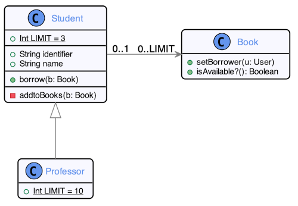

Dans notre bibliothèque, les professeurs peuvent aussi emprunter des livres. Étant donné que le système supporte déjà qu'un étudiant emprunte des livres, on fait _hériter ``Professor`` de la classe ``Student``_ pour pouvoir réutiliser les méthodes.

Le problème ici est que ``Professor`` n'est pas un ``Student``. Il est vrai que pour l'emprunt de livre, les deux classes fonctionnent de la même façon, mais pour le reste du système? Il y aura certainement des endroits où utiliser ``Professor`` en lieu de ``Student`` brisera le code, violant le principe de substitution de Liskov.

Pour éviter ce problème, il vaut mieux utiliser un concept comme celui-ci :

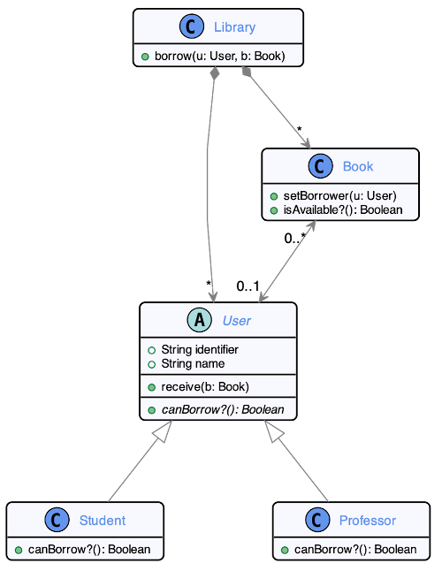

``Student`` et ``Professor`` héritent maintenant tous les deux de ``User`` et la bibliothèque utilisera la classe ``User`` au lieu de ``Student`` pour ses méthodes. Il n'y a plus de lien taxinomique entre ``Student`` et ``Professor`` (à part le fait qu'ils sont tous les deux des ``User``) et donc, plus de problème de substitution (on peut subtituer ``User`` par ``Student`` ou ``Professor`` sans problème).

Il y a d'autres façons que ce problème aura pu être réglé. Par exemple, sans utiliser l'héritage :

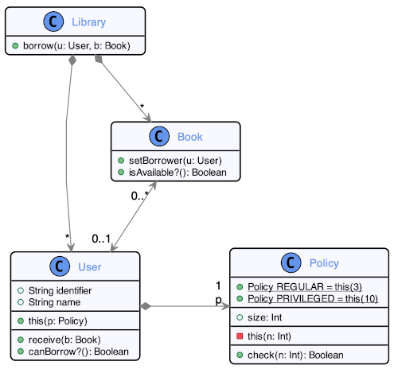

Ici on retire complètement le concept d'étudiant et de professeur de la bibliothèque. À la place, nous avons des utilisateurs qui ont un niveau de privilège (_composition_). Cette version est intéressante parce qu'elle dissocie le concept d'être un étudiant ou un professeur des droits d'accès à la bibliothèque. Ce système pourrait maintenant avoir un étudiant avec les droits d'accès d'un professeur, ou même ajouter des niveaux de privilèges sans avoir nécessairement à les associer à un type d'utilisateur particulier.

Quel conceptualisation préférez-vous? On pourra en discuter en classe!

#### Ségrégation des interfaces (solId)

Le principe de ségrégation des interfaces dit qu'il vaut mieux créer plusieurs petites interfaces qu'une interface géante avec tout dedans à la fois. Reprenons l'exemple de notre bibliothèque, mais cette fois-ci avec plus de fonctionnalités :

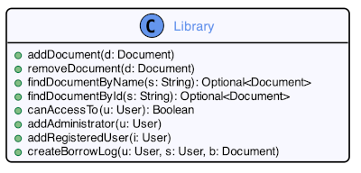

``Library`` a une interface avec beaucoup d'opérations variées. Ce _design_ va évidemment aussi à l'encontre du principe de responsabilité unique, mais ignorons-le pour le moment (nous y reviendrons).

Le problème à avoir une classe avec autant de méthodes différentes et qu'une classe aura rarement besoin de toutes ces méthodes à la fois. Une classe référencera ``Library`` pour faire usage de recherche de document, ou pour ajouter des utilisateurs, etc. Si le principe de responsabilité unique est respecté dans le système, il ne devra pas y avoir d'endroit où _toutes_ les fonctionnalités de ``Library`` sont nécessaires en même temps.

Cela signifie que toutes les classes qui veulent accéder à une partie des fonctionnalités de ``Library`` doivent créer une dépendance sur ``Library`` au complet et avoir un paquet de méthodes qui ne leur servent à rien (et qui potentiellement peuvent être utilisée à tort et créer des dépendances inutiles).

C'est pourquoi une conceptualisation comme celle-ci fonctionnera mieux :

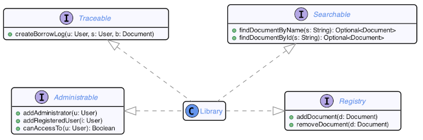

Les différentes méthodes de ``Library`` ont maintenant été distribuées dans une variété d'interfaces qui peuvent être utilisées indépendemment les unes des autres. Si une classe a besoin d'interagir avec ``Library`` pour ajouter des documents, elle peut créer une dépendance vers ``Registry`` seulement. Si elle a besoin de chercher des documents, elle peut référencer ``Searchable``, etc.

Ceci limite le _couplage_ du système et offre plus de flexibilité pour l'évolution et le _refactoring_. Par exemple, si une classe ne référence que ``Searchable``, elle ne sera pas affectée si on change autre chose dans ``Library`` (alors que si elle référençait ``Library`` directement, on n'a aucune garantie à ce niveau).

Cependant, ce _design_ viole toujours le principe de responsabilité unique, car ``Library`` est toujours prioriétaire de toutes ces méthodes. Voici une conception qui répond aux deux principes :

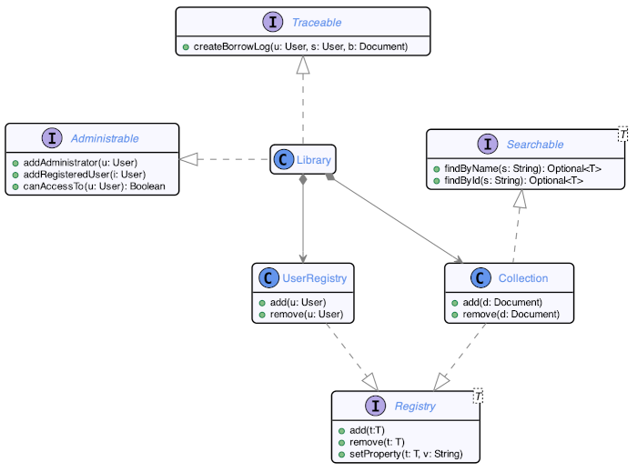

Un ``UserRegistry`` et une ``Collection`` deviennent responsables de gérer les utilisateurs et les documents et prennent les interfaces ``Registry`` et ``Searchable`` en charge. ``Library`` garde la responsabilité de gérer son administration.

###### Mais ``Library`` fait toujours deux choses!

Effectivement, ``Library`` a toujours deux préoccupations : gérer son administration et gérer la traçabilité. La traçabilité fait partie de préoccupations qu'on appelle _transversales_. Ces préoccupations transversales affectent plusieurs classent dans le système et cause une duplication de code à travers le système. La sécurité est un autre exemple de préoccupation transversale.

Le fait est que la programmation orienté-objet n'offre pas les outils nécessaires pour gérer efficacement ces préoccupation particulières, donc il y aura toujours quelques défauts dans un concept orienté-objet incluant ces fonctionnalités. Le _design_ orienté-objet parfait n'existe pas parce que l'orienté-objet n'est pas un paradigme parfait.

###### Existe-t-il des paradigmes qui peuvent gérer ces préoccupations?

C'est exactement le sujet sur lequel je travaille dans le cadre de mon doctorat!

La _programmation orienté-aspect_ a été créée spécifiquement pour addresser ces préoccupations. Il est en théorie possible de combiner aspect et objet pour créer un "meilleur" système, mais peu d'études ont été faites pour mesurer les effets réels de l'aspect sur l'objet. En Java, le framework _AspectJ_ permet d'intégrer la programmation aspect au langage.

Un langage supportant le _meta-programming_ (e.g. Common Lisp) peut faire usage de la programmation aspect sans avoir à recourir à une librairie externe comme _AspectJ_. (En fait, la première publication de programmation aspect donnait ses exemples en Common Lisp.)

Certaines fonctionnalités de la programmation fonctionnelle peuvent aussi être utilisées pour gérer certaines préoccupations transversale, facilitant la tâche aux langages qui supportent les paradigmes objet et fonctionnel (comme Kotlin et F#).

#### Injection de dépendances (soliD)

Notre dernier principe SOLID est le principe d'injection de dépendance. Celui-ci dit qu'une classe devrait autant que possible éviter d'instancier ses propres dépendances. 

Allons-y avec un autre exemple :

Ici nous avons un _design_ de ``Library`` qui fait en sorte que la ``Collection`` de documents de la bibliothèque sera créée et gérée de la même pour chaque instance de ``Library``. Si ``Collection`` implémente le registre de documents avec une ``HashMap``, toutes les instances de ``Library`` utiliseront une ``HashMap`` pour leur collection, parce que c'est le seul choix.

Le principe d'injection de dépendances dit que la dépendence vers l'implémentation de la collection ne devrait pas être décidée ni par ``Collection``, ni par ``Library``, mais par l'utilisateur de ces classes :

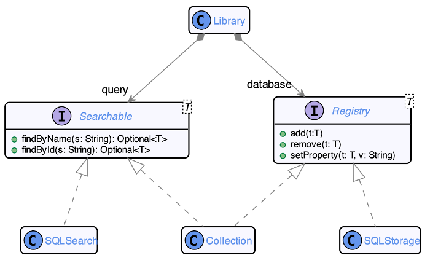

Dans cette conceptualisation, ``Library`` ne dépend plus du type concret ``Collection``, mais des interfaces ``Searchable`` et ``Registry``, qui peuvent être implémentées de différentes façon. Une ``Library`` pourrait être créée pour interfacer avec un serveur SQL en utilisant ``SQLSearch`` et ``SQLStorage`` comme implémentations de ses interfaces. Ou elle pourrait utiliser ``Collection`` à nouveau, qui hérite de ``Searchable`` et ``Registry``.

L'important ici est que le choix de des dépendances de ``Library`` a été relégué au créateur de ``Library`` et non à ``Library`` elle-même. Cela améliore grandement l'_extensibilité_ d'un système, car on peut facilement ajouter des nouvelles implémentations sans affecter le code déjà en place.

#### Questions concernant SOLID

Si vous avez des interrogations ou des parties que vous saissez moins bien concernant les principes SOLID, n'hésitez pas à **poser des questions durant les séances**. Je pourrai donner d'autres exemples concrets et des explications additionnelles si nécessaire.

Il est important de bien saisir ces principes pour comprendre les concepts plus avancés que nous explorerons durant le reste du cours.

## Section 2 - Patrons GRASP

Les principes SOLID ne sont cependant que des _principes_, et non une méthodologie pour les appliquer systématiquement. En fait, il n'est pas possible de créer une méthodologie pour générer des conceptions respectant SOLID. L'application des principes dépend toujours du contexte et des objectifs.

Au lieu d'une méthodologie systématique, on utilisera alors des patrons de conception (_design patterns_). Un patron est une solution générale à un problème récurrent ayant plus d'avantages que d'inconvénients pour résoudre ce problème.

L'important est d'avant tout bien identifier le problème et souvent d'adapter le patron à votre situation.

### L'approche GRASP

GRASP (_General Responsibility Assignment Software Patterns_) est une collection de 9 patrons de responsabilisation qui aident à la conception d'applications orienté-objet. L'idée et de guider, rationaliser et permettre de justifier des décisions de conception. Les patrons GRASP reposent sur le principe de **responsabilité**.

L'objectif est de réduire le décalage entre le code et la logique d'affaire en pensant le logiciel en terme de responsabilité. Nous avons déjà mis en oeuvre certains des principes GRASP, sans les nommer, dans les semaines précédentes. Vous reconnaîtrez sûrement certains concepts.

#### Liste des patrons GRASP

* Spécialiste de l'information
* Créateur
* Faible Couplage
* Contrôleur
* Forte Cohésion
* Polymorphisme
* Pure Invention
* Indirection
* Protégé des variations

Il est utile de connaître les noms et l'applicabilité de ces patrons pour pouvoir justifier des décisions de conception. Dans votre travail de session, il vous seront utiles pour prendre les bonnes décisions et expliquer votre raisonnement.

### Qu'est-ce qu'une responsabilité?

Une responsabilité est une abstraction de comportement. On ne parle pas nécessairement d'une méthode; une méthode peut être utilisée pour implémenter une responsabilité. Il existe différents types de responsabilités :

* La responsabilité de **savoir** quelque chose, connaitre ce qu'un objet peut calculer.
* La responsabilité de **faire** quelque chose, déclencher une action.

#### Un objet **connait** des choses

Un objet connait les valeurs de ses priorités, soit les données qu'il _encapsule_. Il connait les objets qui lui sont rattachés. Il connait aussi les données qu'il peut dériver ou calculer (e.g. la taille d'une collection).

C'est la responsabilité du développeur de gérer cette connaissance en respectant les principes d'encapsulation.

#### Un objet **fait** des choses

Un objet rend des services via invocation de ses méthodes, par exemple en faisant un calcul ou en fabriquant un nouvel objet. Il peut déléguer à un objet sachant faire quelque chose qu'il ne sait pas, par _composition_. Il coordonne les actions des autres objets :

_Je demande au meuble multimédia de se déverrouiller. Si l'action a échouée, je contacte le service de l'audiovisuel pour un déverrouillage distant. Ensuite, je bascule le local en mode "présentation"._

### Monopoly

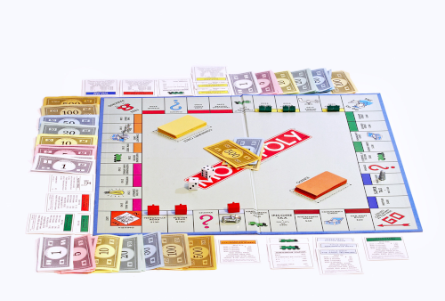

Tout au long de la présentation des patrons GRASP, nous développerons un _design_ partiel du jeu de société _Monopoly_ pour aider à illustrer les concepts.

### Patron #1 : Spécialiste de l'information

Ce patron intervient au moment où on se pose la question d'à quel objet donner une responsabilité. Le patron propose de donner la responsabilité à la classe qui **connait** les informations permettant de **faire** cela.

Par exemple, au Monopoly, nous avons des **joueurs** qui se déplacent sur des **cases** disposées sur un **plateau** de jeu. À qui devrait-on donner la responsabilité d'accéder à une case du jeu?

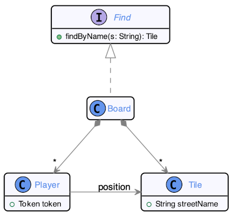

Le **plateau** de jeu **connait** l'information nécessaire pour accéder à une case. C'est donc la classe ``Board`` qui héritera de la responsabilité ``Find``. Il devra déléguer à ``Tile`` pour déterminer laquelle est la bonne, car c'est ``Tile`` qui connait son nom de rue.

On n'aura pas pu donner la responsabilité directement à ``Tile`` parce que la classe ne connaît que l'information d'une seule instance; seul ``Board`` connait toutes les instances de ``Tile`` en jeu.

Le spécialiste de l'information est le patron le plus utilisé pour affecter des responsabilités. C'est généralement une utilisation du **gros bon sens**. C'est un principe de base de la conception orienté-objet; l'encapsulation repose intrinsèquement sur ce patron.

> _Ça va sans dire, mais c'est toujours mieux quand on l'a dit._

#### Avantages et inconvénients

Ce patron favorise la création de classes **cohésives** et **encapsulées**. Il distribue par essence le comportement à travers les différents objets du système.

On évite les gros objets BLOB qui concentrent tout le comportement entourés de classes étant uniquement des structures de données ne rendant aucun service.

Par contre, l'accomplissement d'une responsabilité nécessite souvent que l'information nécessaire soit **partagée** entre différents objets, et donc crée des **dépendances** entre les objets.

### Patron #2 : Créateur

La créateur répond à la question de qui prend la responsabilité de créer une instance de classe. Le patron propose d'affecter à une classe C une responsabilité de créations des instances de C' si soit :

* C est composée d'instances de C'
* C possède des données permettant d'initialiser les instances de C'

Qui devrait créer les cases de jeu au Monopoly? Est-ce que ce devrait être le jeu lui-même (la classe englobant le jeu) ou le plateau?

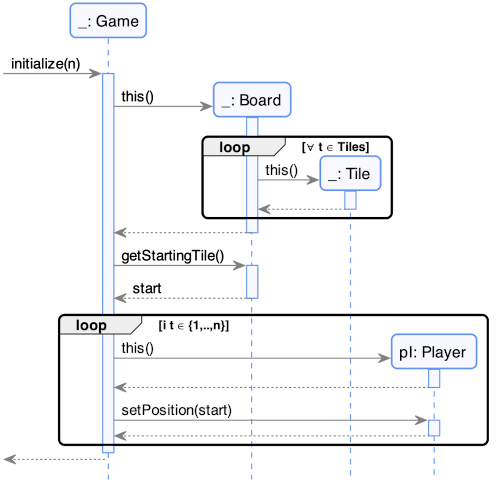

Étant donné que le ``Board`` est **composé** de ``Tile``, la responsabilité de créer ``Tile`` devrait aller à ``Board``, selon le patron Créateur. De plus, ``Board`` et ``Player`` seront créés par ``Game``, qui connait l'information nécessaire pour initialiser le jeu.

#### Avantages et inconvénients

Le patron créateur permet un faible _couplage_ entre les objets (tous les objets ne sont pas en train de faire des ``new`` à tout bout de champ, créant des dépendances). Moins de dépendances signifie une meilleure réutilisation possible des objets. On peut aussi faire des optimisations de création, par exemple en recyclant des objets.

Il n'est cependant pas toujours évident quand les objets sont partagés entre plusieurs classes de déterminer laquelle a la responsabilité de création. De même s'il existe un lien **bidirectionnel** entre objets (en général à éviter, mais pas toujours possible).

### Patron #3 : Faible couplage

L'idée de ce patron est de minimiser les dépendances entre les objets et réduire l'impact des changements lors de l'évolution et du _refactoring_. Le patron propose que lorsqu'on ajoute une dépendance entre deux objets, d'abord regarder s'il n'existe pas une autre solution qui réduirait le couplage.

Le couplage prend plusieurs formes. On dira qu'un type X est couplé à un type Y lorsque :

* X possède un attribut de type Y (couplage par composition)
* X a une méthode qui utilise Y (couplage transitoire)
* X est un sous-type de Y (couplage par réalisation)
  * X est une sous-classe de Y (couplage par généralisation)
  
Les types ci-haut sont ordonnés en ordre de priorité : le couplage par composition est celui qui cause les dépendances les plus fortes et donc est celui à éviter d'abord.

Par exemple, à qui devrait on donner la responsabilité de déplacer le joueur sur le plateau?

Comparons deux possibilités. Voici la première :

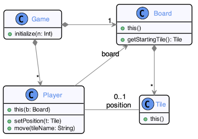

Ici on donne la responsabilité à ``Player`` de se déplacer lui-même, en lui spécifiant le nom de la tuile vers laquelle il doit se rendre. Le problème c'est que seul ``Board`` connait toutes les tuiles, et donc ``Player`` devra utiliser ``Board`` pour obtenir l'instance de ``Tile`` associée au nom fourni, créant un couplage par composition.

Considérons maintenant cette deuxième possibilité :

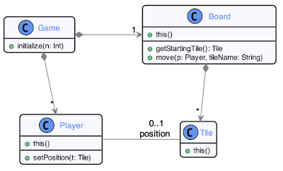

La méthode ``move`` est maintenant sous la responsabilité de ``Board``, qui reçoit ``Player`` et le nom de la tuile en paramètre et appelera la méthode ``setPosition`` de ``Player`` avec la bonne instance de ``Tile``. Un couplage est créé ici aussi, étant donné que ``Board`` utilise une méthode de ``Player``, mais le couplage créé est transitoire, et donc moins fort que celui créé par la première possibilité.

Un couplage fort force à changer tout ou une partie des classes couplées lors d'une évolution d'un logiciel. Il n'y a malheureusement pas de mesure spécifique pouvant nous dire si un objet est "trop couplé" : ça dépend!

L'évolution suivant le chemin de résistance moindre (i.e. faire la chose la plus simple possible pour implémenter une fonctionnalité) va souvent rajouter du couplage inutilement dans une application.

Un couplage fort n'est pas toujours un problème, particulièrement si les éléments couplés sont très stables (par exemple, être couplé à ``java.util`` n'est pas problématique).

La question à se poser est "est-ce que cet objet a **vraiment** besoin de connaître celui-ci?".

#### Avantages et inconvénients

Une classe faiblement couplée est facile à _comprendre_. Un faible couplage dans une application facilite grandement l'écriture de tests unitaires.

Par contre, il faut faire attention de ne pas aller trop loin dans le découplage. Si un système est complètement découplé, les objets deviennent incohérents et complexes, regroupant trop de responsabilité.

Il est aussi facile d'escroquer la métrique de couplage pour la faire passer pour faible, par exemple en stockant un identifiant d'un objet plutôt que de référencer l'objet en question. Le couplage existe toujours, mais est caché (et donc pire)!

### Patron #4 : Contrôleur

Le contrôleur porte sur la coordonnation des messages provenant de l'extérieur du logiciel (par exemple, de l'interface graphique). L'idée est de ne pas coupler le modèle objet avec l'extérieur. Le patron propose d'inventer un objet qui va servir de zone tampon entre le système et l'application objet (i.e. un objet _contrôleur_).

Au Monopoly, qui coordonne le jeu?

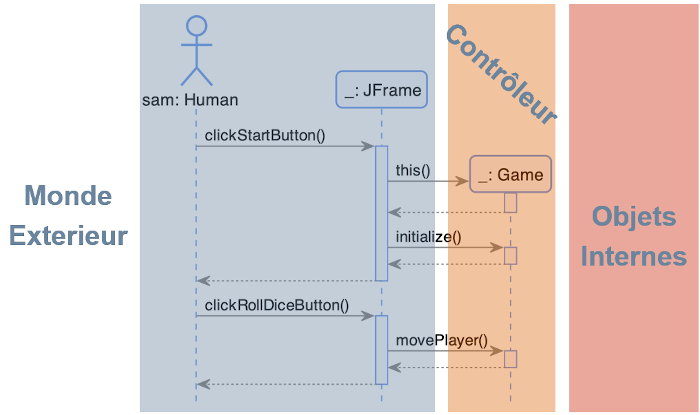

La classe ``Game`` est chargée de la responsabilité de _contrôler_ les entrées provenant de l'interface graphique (le ``JFrame``) et de relayer ces messages vers les objets internes du jeu.

Si vous avez entendu parlé des architectures suivant le paradigme MVC (Modèle-Vue-Contrôleur), il s'agit du même principe : le _contrôleur_ fait le lien entre le _modèle_ et la _vue_.

Ce patron permet de maintenir le système objet isolé du monde extérieur et d'éviter le "code marionnette" où notre logique d'affaire dépend de facteurs incontrôlés provenant de l'extérieur.

#### Avantages et inconvénients

Le contrôleur maintient l'isolation et améliore la réutilisabilité d'une application en évitant son couplage avec l'extérieur. Il permet aussi de contrôler l'accès au système objet. Un contrôleur pourrait aussi déléguer à un autre contrôleur pour rediriger vers le bon système.

Malheureusement, ce patron a tendance à être abusé pour créer des classes Dieu qui contrôle des structures de données sans aucun comportement. Idéalement, le contrôleur ne devrait pas manipuler les objets du système directement, mais seulement déléguer vers ces objets les message provenant de l'extérieur.

### Patron #5 : Forte cohésion

La cohésion permet de s'assurer que les objets du système restent compréhensibles et facile à gérer tout en contribuant à un faible couplage. Le patron de forte cohésion propose d'attribuer les responsabilités de sorte à ce que les liens entre ces responsabilités soient forts dans les objets, et d'appliquer ceci en tant que filtre entre plusieurs solutions.

La cohésion est une mesure de l'étroitesse (ou la force) des liens et de la spécialisation des responsabilités d'un élément. Une classe qui a des responsabilités étroitement liées les unes aux autres et qui **n'effectue pas un travail gigantesque** est fortement cohésive.

> "_Un objet bien conçu renferme une valeur lorsqu'il possède une telle quantité d'affordances que les personnes qui l'utilisent peuvent l'employer à des fins que le concepteur n'avait même pas imaginé._"  
> -- <cite>Donald Norman, 1994</cite>

Il n'y a pas de définition formelle de la cohésion, ça dépend du contexte! En général, on cherchera à maximiser la cohésion et minimiser le couplage.

Par exemple, prenons l'ensemble des responsabilités suivantes au Monopoly :

* Afficher la grille
* Déterminer si un mouvement est légal
* Déterminer l'état actuel d'une tuile (libre, vendue, maisons)
* Déterminer qui gagne le jeu

On pourrait tout attribuer à ``Board`` :

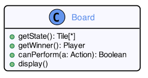

Mais la cohésion entre ces responsabilités n'est pas particulièrement forte. Par exemple, il n'y a pas grand lien entre déterminer si une action est légale et afficher la grille de jeu. Dans le but de maximiser la cohésion, on devrait plutôt distribuer les responsabilités :

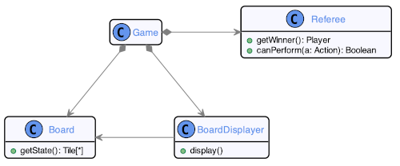

Deux nouvelles classes ont été créées : ``BoardDisplayer`` qui obtient la responsabilité d'afficher la grille et ``Referee`` qui obtient les responsabilités de déterminer si une action est légale et qui gagne la partie (forte cohésion parce que les deux responsabilités ont trait aux _règles du jeu_). 

``Board`` maintient la responsabilité d'affichage, car c'est lui qui possède l'information pour le faire (patron spécaliste de l'information).

Ce nouveau _design_ a maintenant plusieurs objets fortement cohésifs, plutôt qu'un seul objet Dieu qui contrôle tout (et donc peu cohésif).

Une classe de forte cohésion aura généralement un petit nombre de méthodes, avec des fonctionnalités hautement liées entre elles, et ne fera pas trop de travail.  Une bonne question à se poser pour déterminer si une classe est cohésive est : "_Est-ce que je peux décrire ma classe avec une seule phrase?_".

#### Avantages et inconvénients

Une forte cohésion améliore la _maintenabilité_ et l'_extensibilité_ d'un logiciel, le rendant plus facile à lire et à comprendre. Du même fait, les éléments du systèmes deviennent plus faciliment réutilisables et on évite le "_code spaghetti_".

Il est cependant difficile de maintenir la cohésion d'un système à travers l'évolution. Le chemin de moindre résistance en développement mènera toujours à diminuer la cohésion et augmenter le couplage (_je met ce code ici, ca va plus vite_).

### Patron #6 : Polymorphisme

Ce patron traite de comment gérer les alternatives structurelles et créer des composants qui supporte différentes dépendences. Il propose d'affecter la responsabilité aux types (au lieu des classes concrètes) et de proposer plusieurs réalisations alternatives qui peuvent être inter-changées.

Par exemple, on peut regarder de quelle façon on gérerait les cases de jeu différentes au Monopoly.

Le chemin de moindre résistance dicterait de faire un grand ``switch`` sur chaque type de case :

    class Game {
        private Board board;
        
        // ...
        
        void move(Player p) {
            int step = Dice.roll();
            board.move(p, step);
            
            Tile currentTile = board.getTile(p);
            
            switch(currentTile.getTileType()) {
                case TileType.Go:
                    p.addMoney(100);
                    break;
                case TileType.Jail:
                    p.lockedInJail();
                    break;
                // ...
            }
        }
    }
    
Cette approche fait en sorte qu'il sera difficile d'ajouter de nouveaux types de case, étant donné qu'il faudra retracer tous les endroits où le type sera utilisé pour modifier les ``switch``. De plus, avoir un ``switch`` géant dans une méthode est un bon signe d'un problème de conception!

Il y a plusieurs façons correctes d'implémenter une telle situation. L'une de ces façons serait d'utiliser le patron de conception Visiteur (pas un patron GRASP, il s'agit ici d'un patron GOF, que nous verrons plus tard dans la session) :

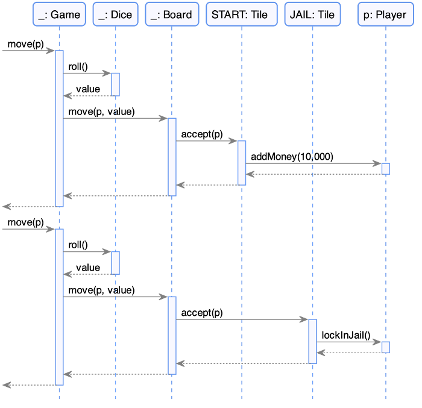

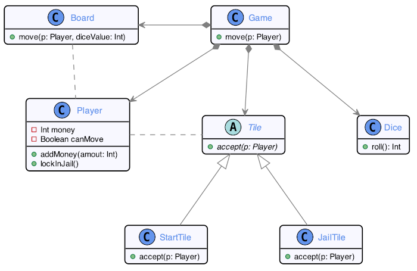

Sans s'attarder sur les spécificités du patron Visiteur, le concept est que chaque case implémentera une méthode ``accept`` qui sera appelée par ``Board`` lorsqu'un joueur s'arrêtera sur cette case. De cette façon, chaque case peut implémenter son propre comportement et on peut ajouter de nouvelles cases sans limitation et sans avoir à modifier le code de ``Board`` ou ``Game``.

Le polymorphisme repose sur le mécanisme de sous-typage et permet d'éviter d'écrire de gros blocs conditionnels dans le code. Il permet aussi de laisser à l'objet la responsabilité de décider de son comportement.

#### Avantages et inconvénients

Ce patron permet facilement la mise en oeuvre du principe ouvert/fermé en encapsulant le comportement dans une hiérarchie de classes. Les points d'extensions du code sont clairement identifiées et on peut facilement introduire de nouvelles implémentations sans affecter les consommateurs existant.

Par contre, le polymorphisme excessif peut rendre difficile la compréhension du code, car il y a beaucoup de niveaux d'indirections. De plus, certains langages limitent la hiérarchie d'héritage (ou ne supporte pas l'héritage du tout).

### Intermède : Approche fonctionnelle

Il y a une autre façon intéressante de résoudre le problème des différentes cases. On peut ajouter une méthode ``landOn`` à ``Tile`` qui serait appelée lorsque le joueur s'arrête sur une case. Cette méthode contiendrait le ``switch`` :

    class Tile {
        void landOn(Player p) {
            switch(tileType) {
                case TileType.Go:
                    p.addMoney(100);
                    break;
                case TileType.Jail:
                    p.lockedInJail();
                    break;
                // ...
            }
        }
    }

On a encore le ``switch`` géant, mais il est encapsulé dans ``Tile`` (spécialiste de l'information, forte cohésion). 

#### Lequel des deux _design_ choisir?

On a un choix à faire entre une conception orienté-objet (le visiteur) ou fonctionnelle ici. Les deux approches répondent correctement aux patrons GRASP et créent une fonctionnalité équivalente. La différence est au niveau de l'évolution.

Comme mentionné dans le patron de polymorphisme, l'approche objet permet de facilement ajouter de nouveaux types de cases au jeu, simplement en implémenter d'autres sous-types de ``Tile``. Dans l'approche fonctionnelle, chaque action sur une case devra être modifiée pour tenir compte du nouveau type (mettre à jour les ``switch``).

L'approche fonctionnelle a l'avantage inverse : elle rend plus facile d'ajouter de nouvelles actions : on n'a qu'à rajouter une méthode comme ``landOn`` avec un switch. On pourrait même séparer ces méthodes dans leur propre classe ou module (e.g. ``TileBehavior``). Dans l'approche objet, ajouter un nouveau comportement (une nouvelle action) nécessite de modifier toutes les classes représentant une case.

Les deux choix s'équivalent dans le contexte général. Qu'en est-il du contexte du jeu Monopoly?

Est-ce qu'il y a plus de chances qu'on veule ajouter de nouveaux types de case ou qu'on ajoute de nouveaux comportements aux cases? La réponse à cette question peut aider à choisir le _design_ approprié.

### Patron #7 : Fabrication pure

Comment fait-on lorsqu'il est impossible de représenter un objet du monde réel (du domaine d'affaire) en faible couplage ou forte cohésion? Le patron de fabrication pure propose d'affecter un ensemble de responsabilité fortement cohésive dans une classe créée artificiellement pour l'occasion.

La classe ``TileBehavior`` mentionnée plus haut est un exemple de fabrication pure. ``TileBehavior`` n'est pas un concept qui existe dans le "vrai" jeu de Monopoly, mais plutôt une classe conceptuelle qui permet de mieux regrouper du code qui serait autrement peu cohésif s'il était distribué ailleurs.

Une fabrication pure permet de maintenir un faible couplage et une forte cohésion dans une application objet et améliore par conséquent la réutilisabilité des éléments.

#### Avantages et inconvénients

On maintient un faible couplage et une forte cohésion dans l'application, mais il ne faut pas abuser des fabrications pure. Plus il y en a, plus le modèle objet perd sa cohérence avec la logique d'affaire et le code deviendra de plus en plus difficile à comprendre.

Souvent, ce genre d'abstraction vont nécessiter de la documentation pour être compris et maintenu.

### Patron #8 : Indirection

L'indirection permet d'éviter un couplage immédiat entre plusieurs éléments. Le patron propose qu'au lieu d'introduire un nouveau couplage dans entre deux objets, plutôt opter pour introduire un élément dédié à ce couplage pour laisser les éléments pré-existants isolés.

Par exemple, si on voulait faire en sorte d'éliminer le couplage entre les cases et les joueurs, comment est-ce qu'on pourrait s'y prendre?

Voici le _design_ actuel utilisant le patron Visiteur vu plus haut :

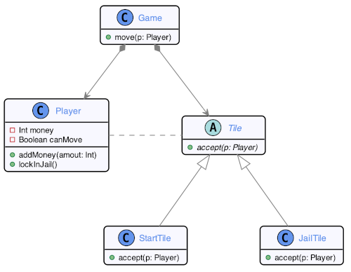

On voit que ``Tile`` est couplé à ``Player`` par couplage transitoire (sa méthode ``accept`` fait référence à la classe ``Player``).

On pourrait _refactorer_ le système de la façon suivante pour retirer cette dépendance :

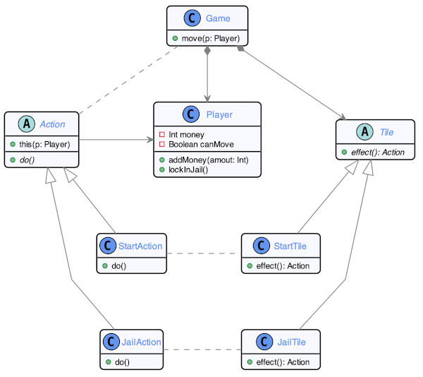

On extrait de ``Tile`` la responsabilité de gérer les actions lorsque le joueur s'arrête sur une case donnée, et on crée le concept d'``Action`` (une forme de _fabrication pure_) qui recevra cette nouvelle responsabilité.

Lorsque le mouvement d'un joueur se termine, la méthode ``effect`` de la case en cours est appelée, qui retournera un objet ``Action``. C'est cet objet ``Action`` qui interagera avec l'objet ``Player`` pour appliquer l'action voulue.

En utilisant l'indirection, nous avons extrait le couplage entre ``Player`` et ``Tile`` et l'avons transformé en couplage entre ``Player`` et une nouvelle classe ``Action``. Qu'est-ce qu'on a gagné? ``Tile`` est potentiellement un peu plus cohésif et moins couplé. ``Action`` est très cohésif aussi, puisqu'il ne fait qu'une seule chose. Par contre, on a complexifié le _design_.

Est-ce que ça vaut la peine? À vous de décider!

#### Avantages et inconvénients

L'indirection favorise un couplage faible et une cohésion forte. Le couplage est par contre déplacé et non éliminé. Le patron complexifie aussi la structure du modèle objet et a un coût en performance à l'exécution.

> "_Le seul problème qu'ajouter un niveau d'indirection ne peu pas règler est le problème de trop de niveaux d'indirection._"

### Patron #9 : Protégé des variations

Notre patron final traite de la façon de concevoir des objets qui ne seront pas impactés par les variations ou l'instabilité d'autres parties du système. Il propose de trouver les variations dans les objets et les encapsuler dans une interface stable.

Voyons comment cela fonctionne avec la gestion des cartes spéciales du Monopoly :

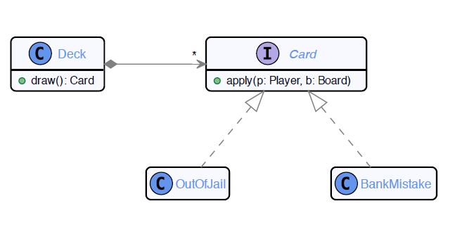

On implémente chaque carte spéciale comme étant une réalisation du type ``Card``, qui implémenteront chacune une méthode ``apply``. L'idée est que les comportements de ces cartes apportent des changements (variations) aux objets ``Player`` et ``Board`` et que de cette façon, on centralize ces variations dans une hiérarchie stable et compréhensible.

Si un développeur chargé de faire évoluer notre programme cherche les endroits où les objets de jeu sont modifiés, il pourra facilement les trouver en parcourant cette hiérarchie de cartes spéciales. De plus, si le besoin est d'ajouter de nouvelles cartes spéciales, cette hiérarchie permettre facilement de le faire.

#### Avantages et inconvénients

La protection des variations permet d'anticiper les évolutions éventuelles du projet et de livrer du code évolutif. Les points de variations du logiciel sont identifiés pour les futurs développeurs. 

Comme toujours, il faut faire attention à l'_over-engineering_. Protéger son code prend du temps et peut complexifier un logiciel autrement simple. 
