# INF5153 - Semaine 8

L'objectif de cette semaine est d'introduire une nouvelle gamme des patrons de conception.

## Bibliographie

<table>
<td>

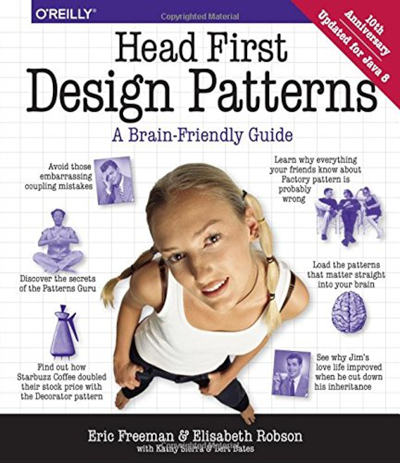  
Le style est discutable, mais le contenu raisonable.

</td>
<td>

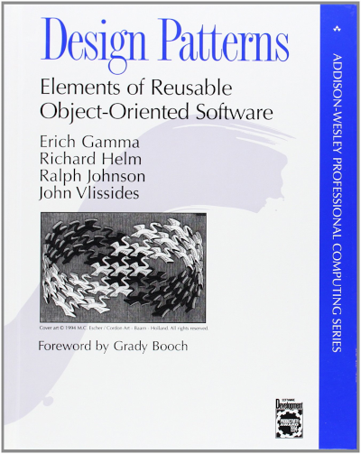  
Référence ultime, mais indigeste

</td>
</table>

## Intro aux Patrons de Conception (niveau Padawan)

L'objectif de cette semaine est d'introduire une nouvelle gamme de patron de conceptions orienté-objet (les patrons _GoF_, pour _Gang of Four_, les auteurs du deuxième livre ci-dessus). Avant de voir les patrons eux-mêmes, nous commenceront par mettre en contexte leur besoin avec quelques exemples.

## Section 1 : La danse des canards

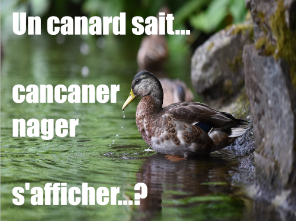

Une des choses les plus débatues dans le monde des langages de programmation est est la notion de type statique _versus_ typage dynamique. 

Les langages comme C++, Java, C#, F#, Haskell, etc., sont des langages dits typés statiques : le compilateur fait une analyse statique des types dans le code pour confirmer que tout est compatible ensemble. L'idée est que si le compilateur empêche ce genre d'erreur, ce sont des erreurs qui n'apparaîtront pas dans un programme compilé. (Malheureusement, certains langages le font mieux que d'autres.)

De l'autre côté, vous avez des langages comme Python, Ruby, Common Lisp, JavaScript, etc., qui sont dits typés dynamiques. La plupart du temps, ces langages sont des langages interprétés (Common Lisp étant une exception notable comme langage dynamique compilé) et donc, il n'y a pas de compilateur pour faire le travail de typage. Les objets n'ont donc un type qu'à l'exécution.

Quels avantages ont un le typage dynamique? Certains vont argumenter que les erreurs évitées par le typage statique seraient capturées par les tests unitaires de toute façon (qui sont nécessaires peu importe le type de langage que vous utilisez). De plus, le typage statique peut imposer un certain fardeau au programmeur, lui empêchant certains types de conception qui seraient possible en typage dynamique (par exemple, le _meta-programming_ est plutôt limité en typage dynamique).

### _Duck Typing_

> "_If it swims like duck and quacks like a duck, it's probably a duck._"

Le _Duck Typing_ est une de ces notions qui fait partie intrinsèque des langages typés dynamiquement. Lorsqu'une méthode est appelée sur un objet dans un langage dynamique, le _runtime_ regarde si l'objet possède une méthode de ce nom et l'appelle s'il en trouve une (la surcharge de méthode n'est généralement pas possible dans un langage dynamique).

L'effet est que si une méthode prend en paramètre un objet sur lequel il fait des appels pour les méthodes A et B, le _type_ de l'objet reçu n'a pas d'importance, tant qu'il implémente A et B.

    def handleDuck(duck):
        duck.swim()
        duck.squack()

> _Si ``duck`` implémente ``swim`` et ``quack``, tout fonctionne!_

### Canards orientés-objet

La question à se poser maintenant, c'est si on a besoin de cette fonctionnalité pour nos conceptions. Examinons un exemple avec cette taxinomie de canards :

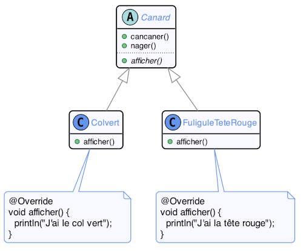

On peut s'imaginer qu'il y aurait beaucoup plus de sous-types de ``Canard`` ici, mais par soucis de lisibilité, on se limitera à ces deux là.

Nos canards savent cancaner, nager et s'afficher. Chaque canard s'affiche différemment mais partage le comportement des autres méthodes.

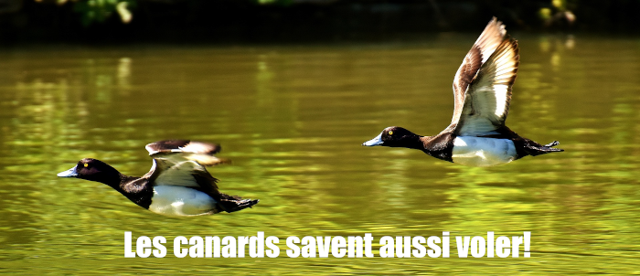

On veut rajouter une méthode pour que nos canards puissent voler. Étant donné que tous nos canards héritent de la classe ``Canard``, c'est plutôt simple :

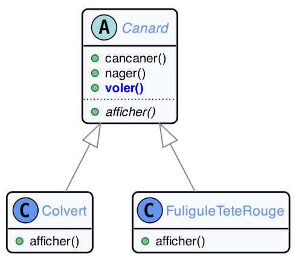

Et voilà, on ajoute la méthode à la classe ``Canard``.

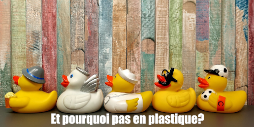

Si on veut ajouter un nouveau type de canard, il suffit donc d'hériter de la classe ``Canard`` déjà en place.

Oh mais attention, les canards en plastique ne volent pas!

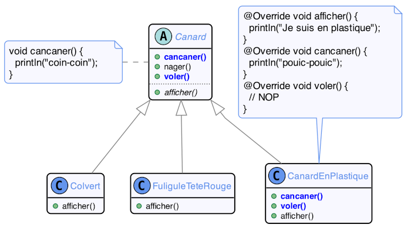

Donc on suppresse la capacité de voler en redéfinissant la méthode. On donne redéfini aussi la méthode ``cancaner`` pour donner un son plus approprié à notre canard en plastique.

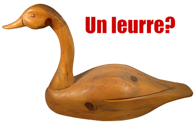

Un leurre est un canard qui ne vole pas et ne cri pas. Ajoutons ça à notre _design_...

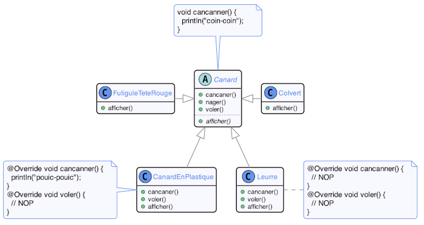

Est-ce que tout ça est raisonnable? On fait usage des piliers de l'orienté-objet, soit l'abstraction, le polymorphisme et l'héritage, mais notre concept semble se déteriorer à chaque évolution...

Notre classe ``Canard`` stipule que tous les canards savent ``voler``, ``nager`` et ``cancaner``. Cependant, le ``CanardEnPlastique`` est un canard qui ne sait pas voler et le ``Leurre`` est un canard qui ne sait ni voler ni cancaner.

Ce que nous sommes en train de faire, c'est d'augmenter l'entropie de notre _design_ à chaque évolution!

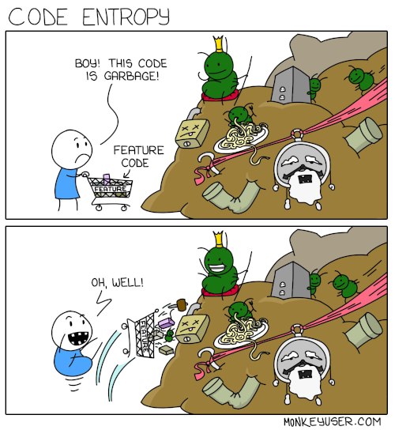

Notre solution ici est en train de devenir notre problème! 

Est-ce qu'utiliser l'héritage est réellement la bonne approche pour cette situation?

#### Interface plutôt qu'implémentation

> _Program to an interface, not an implementation_  
> -- _Design Principle_

Si on analyse la conception actuelle, on peut voir trois abstractions :

* Le fait d'être un canard
* Le fait de savoir cancaner
* Le fait de savoir voler

Et si on encapsulait ces abstractions?

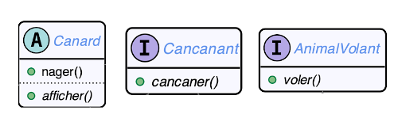

Maintenant on peut créer nos canards à la carte!

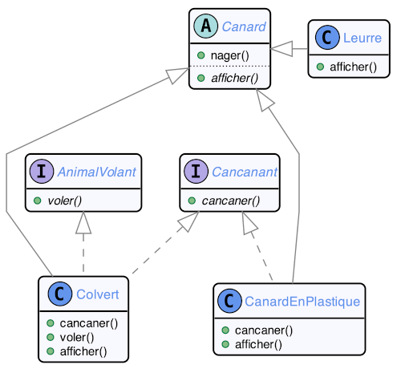

    public class Colvert
        extends Canard
        implements AnimalVolant, Cancanant { ... }
        
    public class CanardEnPlastique
        extends Canard
        implements Cancanant { ... }
        
    public class Leurre
        extends Canard { ... }

Mais... est-ce qu'on a pas juste déplacé le problème?

    Colvert colvert = new Colvert();
    c.voler();
    
    Canard unCanard = new Colvert();
    unCanard.voler() // Ne compile pas!!
    
    if(unCanard instanceOf AnimalVolant) {
      ((AnimalVolant)unCanard).voler();
    }

On ne peut plus appeler les méthodes ``voler`` ou ``cancaner`` sur ``Canard`` maintenant. Si on voulait le faire, il faudrait d'abord vérifier que l'instance particulière qu'on a supporte l'interface contenant la méthode que l'on veut, transformant notre langage typé statique en langage typé dynamique manqué!

#### Identifier ce qui varie

> _Identify the aspects of your application that vary and separate them from what stays the same.  
> -- _Design Principle_

Reprenons le problème du début : on veut isoler les différents comportements variables de notre modèle de façon à avoir une structure de base stable, complète et variable.

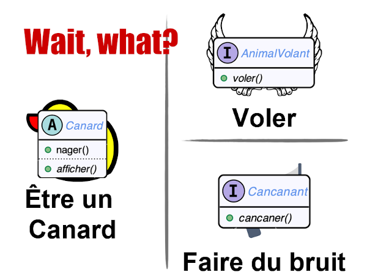

Notre problème en fait est que nous abusons présentement du mécanisme d'héritage. Il est vrai que ``Colvert`` est un ``AnimalVolant`` et un ``Canard``, mais ce n'est pas la seule façon de voir les choses.

#### Composition _versus_ héritage

> _Favor composition over inheritance_  
> -- _Design Principle_

Avant de continuer ici, je vais mettre un gros bémole sur ce principe de conception. De façon générale, _à tous facteurs égaux_, il vaut mieux faire usage de composition plutôt que d'héritage. 

Cela ne signifie pas de ne jamais utiliser l'héritage et de toujours tenter de forcer une composition. Les principes SOLID, GRASP et DRY sont toujours à prioriser : si votre conception cause une duplication significative de code, c'est que ce n'est probablement pas le bon choix.

Ceci dit, pour notre problème actuel, l'héritage ne fonctionne manifestement pas. Allons voir ce qu'on peut faire avec de la composition.

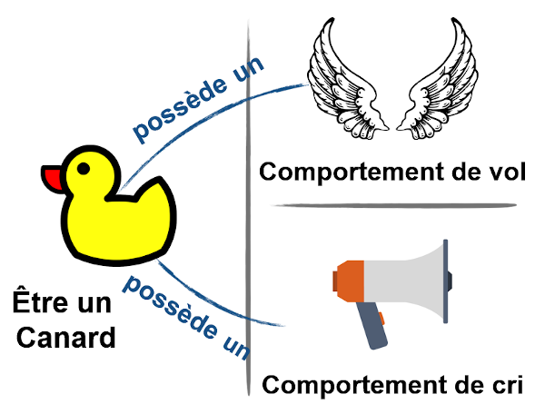

L'idée est qu'au lieu qu'un ``Canard`` soit un ``AnimalVolant`` et un truc ``Cancanant``, on réorganise nos objets pour qu'un ``Canard`` soit un objet qui possède un _comportement de vol_ et un _comportement de cri_.

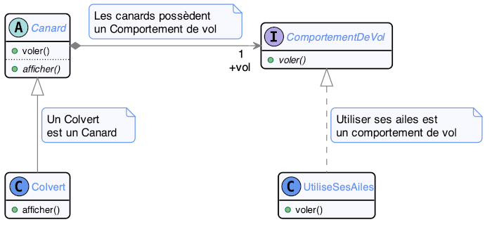

    public abstract class Canard {
        private ComportementDeVol vol;
        public void voler() { vol.voler(); }
    }
    
    public class Colvert extends Canard {
        public Colvert() { this.vol = new UtiliseSesAiles(); }
    }

Dans ce nouveau _design_, le constructeur d'une classe de type ``Canard`` spécifie les _comportements_ qui seront utilisés par la classe. Ici, la classe ``Colvert`` spécifie que ce type de ``Canard`` ``UtiliseSesAiles`` pour voler. 

L'utilisation semble intuitive. Qu'en est-il lorsqu'on fait évoluer le système en ajoutant d'autres comportements?

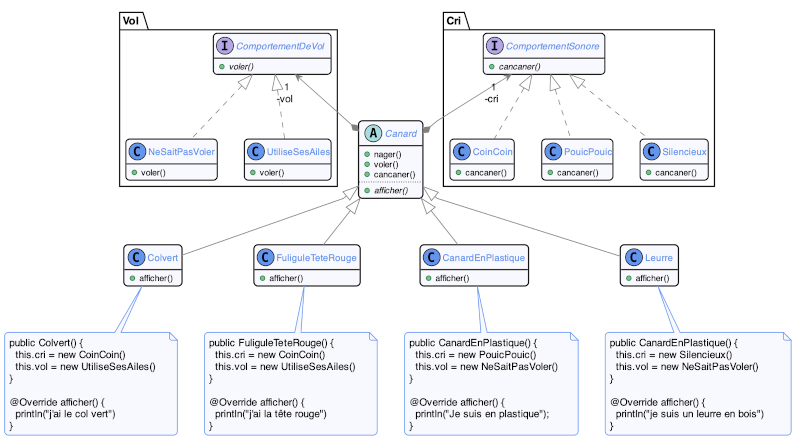

La structure reste régulière lorsqu'on ajoute de nouveaux types de ``Canard`` et lorsqu'on ajoute de nouveaux comportements.

Avec ce modèle, on peut même changer dynamiquement le comportement d'une instance si on le veut!

    public abstract class Canard {
    
    // ...
    
        void blesser() {
            vol = new NeSaitPasVoler();
            cri = new Silencieux();
        }
    }

Ce concept est beaucoup plus flexible que la version par héritage présentée plus haut.

### Premier patron de conception : Stratégie

Vous venez de voir l'implémentation du patron GoF _Stratégie_.

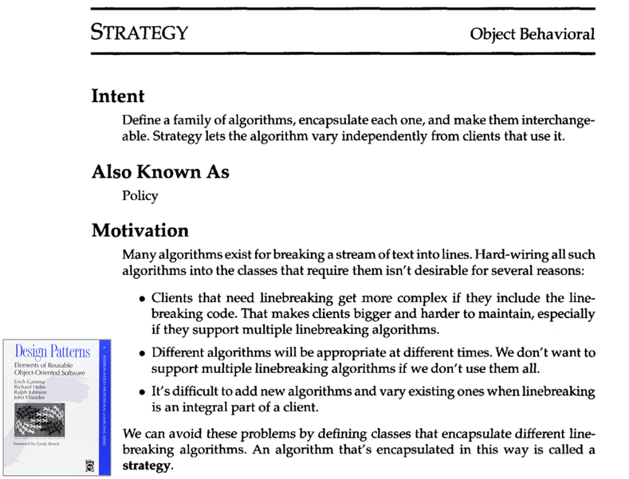

Ce patron de conception offre une façon s'assigner des comportements à des objets de façon dynamique et d'encapsuler ces comportements de façon à ce que votre conception reste compréhensible et cohérente.

Voici le skelette de base du patron :

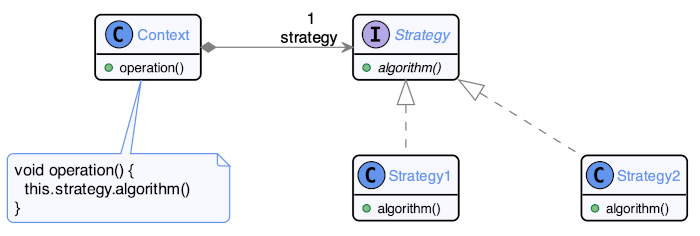

``Context`` représente l'objet qui recevra les différents comportements (``Canard`` dans notre exemple précédent). Il possède une ``Strategy``, représentant le comportement variable à implémenter (par exemple ``ComportementDeVol``). Lorsque ``Context`` a besoin d'utiliser le comportement, il appelle la méthode ``algorithm`` de ``Strategy``, qui appelera le comportement implémenté dans le sous-type de ``Strategy`` présentement instancié.

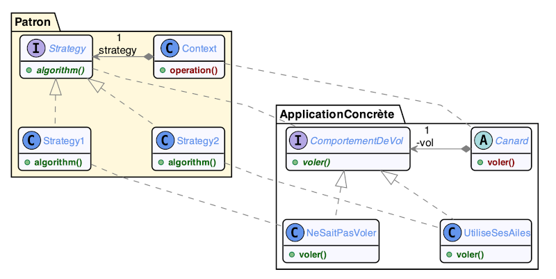

## Section 2 : Principes et classification

Maintenant que nous avons vu un exemple de patron de conception en contexte, il est temps de nous attarder sur les définitions et descriptions de ce qu'est un patron de conception GoF.

La _Gang of Four_ sont un groupe d'auteurs qui ont publié un livre "fondateur" pour la programmation orienté-objet nommé "_Elements of Reusable Object-Oriented Software_".

Le livre défini les patrons de conceptions comme étant des solutions élégantes à des problèmes récurrents en développement de logiciel. L'idée est de standardiser certains concepts de modélisation pour permettre aux concepteurs de communiquer ces concepts et faciliter la communication et maintenance des logiciels.

Dans notre exemple plus haut, on pourrait documenter que le cri des canards a été implémenté utilisant une "Stratégie".

Le livre présente 23 différents patrons divisés en trois catégories :

* Patrons créationels : qui ont trait à l'instanciation des objets
* Patrons structurels : qui ont trait à la structure interne des classes et des objets
* Patrons comportementaux : qui modélise des comportements entre les objets

Stratégie est un patron comportemental.

Voici un aperçu des 23 patrons :

* Création
  * _Abstract Factory_
  * _Builder_
  * _Factory Method_
  * _Protoype_
  * _Singleton_
* Structure
  * _Adapter_
  * _Bridge_
  * _Composite_
  * _Decorator_
  * _Facade_
  * _Flyweight_
  * _Proxy_
* Comportement
  * _Chain of Responsibility_
  * _Command_
  * _Interpreter_
  * _Iterator_
  * _Mediator_
  * _Memento_
  * _Observer_
  * _State_
  * _Strategy_
  * _Template Method_
  * _Visitor_
  
Durant le reste de la session, nous allons nous concentrer principalement sur l'étude de ces patrons de conception. Nous en avons déjà vu quelques uns en action dans les exemples jusqu'à maintenant (notament _Composite_, _Visitor_ et _Strategy_).

Dans les prochaines semaines, nous verrons en détail les besoins couverts par ces patrons à l'aide de mise en situation comme celle de cette semaine (moins détaillées par contre). Nous ne les verrons cependant pas tous, pour prioriser ceux qui sont les plus couramment utilisé ou utiles.

Voici la liste des patrons qui seront couverts dans le reste du cours :

* Création
  * _Abstract Factory_
  * _Builder_
  * _Factory Method_
  * _Protoype_
  * _Singleton_
* Structure
  * _Adapter_
  * _Composite_
  * _Decorator_
  * _Facade_
  * _Proxy_
* Comportement
  * _Observer_
  * _State_
  * _Strategy_
  * _Template Method_
  * _Visitor_
