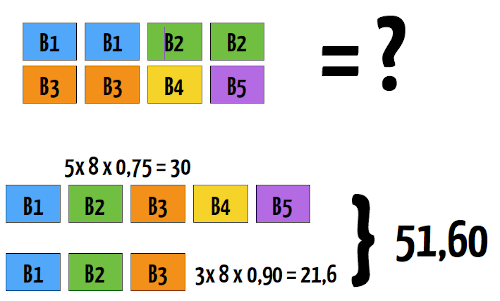
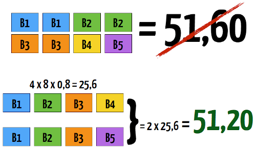
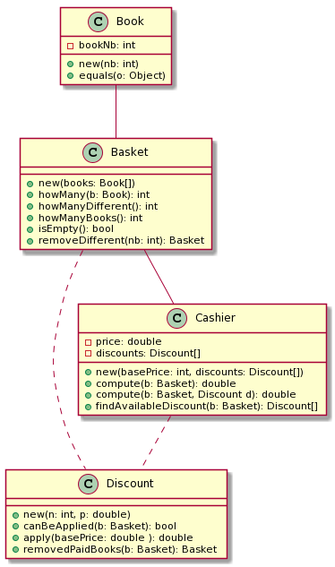

# Travail 1

Le premier travail pratique est divisé en deux parties qui seront données dans les deux premières semaines du cours. L'objectif est de vous familiariser avec les principes de base de la conception et que vous vous fassiez une idée de leur utilité.

La première partie consiste à compléter un programme en suivant une structure orientée-objet.

La deuxième partie vous demandera de restructurer un programme et de le faire évoluer.

Dans les deux cas, l'objectif principal est de faire passer les tests unitaires prédéfinis de chaque programme. Attention : les tests unitaires qui sont inclus dans le code source fourni sont des guides seulement; les tests unitaires qui seront utilisé pour la correction utiliseront des données différentes. Inutile d'essayer de tricher en faisant du code spécifique pour les tests unitaires ;)

## Partie 1 - Harry Potter (Code Kata)

Voici un petit projet que vous devez compléter sur un problème commun lorsqu'on conceptualise des systèmes de vente.

#### Spécifications

Les 5 premiers livres de la saga Harry Potter sont à vendre dans une librairie. Chaque livre coûte 8$. La librairie applique certaines politiques de rabais en fonction du total des achats qui sont faits :

* 2 livres différents : 5%
* 3 livres différents : 10%
* 4 livres différents : 20% 
* 5 livres différents : 25%

Il faut concevoir un programme qui reçoit en entrée une liste de livres et qui retourne le prix total incluant les rabais applicables.

Attention par contre, un rabais peut s'appliquer plus d'une fois sur la même liste d'articles!

#### À faire

Heureusement, nous avons déjà conçu la structure du programme en classe durant la première séance. Tout ce qui vous reste à faire est à implémenter les méthodes manquantes pour que tout fonctionne. 

Voici le graphe UML de la structure montée en classe :

    class Book {
        - bookNb: int
        + new(nb: int)
        + equals(o: Object)
    }

    class Basket {
        + new(books: Book[])
        + howMany(b: Book): int
        + howManyDifferent(): int
        + howManyBooks(): int
        + isEmpty(): bool
        + removeDifferent(nb: int): Basket
    }

    class Discount {
        + new(n: int, p: double)
        + canBeApplied(b: Basket): bool
        + apply(basePrice: double ): double
        + removedPaidBooks(b: Basket): Basket
    }

    class Cashier {
        - price: double
        - discounts: Discount[]
        + new(basePrice: int, discounts: Discount[])
        + compute(b: Basket): double
        + compute(b: Basket, Discount d): double
        + findAvailableDiscount(b: Basket): Discount[]
    }

    Book -- Basket
    
    Basket -- Cashier
    
    Cashier .. Discount
    
    Basket .. Discount

L'objectif ici est que vous preniez connaissance de l'impact qu'une bonne conception peut avoir sur le développement d'un logiciel: un problème qui semble complexe peut devenir presque trivial à résoudre une fois la bonne structure mise en place!

#### Récupération du code

Vous pouvez obtenir le code source à mettre à jour sur GitHub Classroom en utilisant le lien suivant : [https://classroom.github.com/a/jNioVm29](https://classroom.github.com/a/jNioVm29).

## Partie 2 - Poker

En deuxième partie, vous aurez à restructurer (_refactor_) du code légataire dans une mise en situation. Le programme en question est un algorithme pour analyser les mains de Poker.

### Spécifications

L'algorithme prend en entrée une chaîne de caractères représentant une main de 5 cartes encodées sous la forme suivante :

Valeurs : A 2 3 4 5 6 7 8 9 T J Q K  
Suites : H D S C

Exemple de main : _AS 4C TD QC 4C_

L'algorithme retourne ensuite le type de main en tant que valeur de l'énumération Java suivante :

    public enum Hand {
        HighCard,
        Pair,
        TwoPair,
        ThreeOfAKind,
        Straight,
        Flush,
        FullHouse,
        FourOfAKind,
        StraightFlush,
        RoyalFlush
    }
    
Voici une courte explication de chaque main, de la plus faible à la plus forte. Dans le cas où plusieurs types de main s'applique, l'algorithme retourne toujours la plus forte.

| Valeur        | Nom          | Description                                          |
| ---           | ---          | ---                                                  |
| HighCard      | Carte haute  | Aucune autre main visible.                           |
| Pair          | Paire        | Deux cartes de même valeur.                          |
| TwoPair       | Deux paires  | Deux paires différentes.                             |
| ThreeOfAKind  | Brelan       | Trois cartes identiques.                             |
| Straight      | Suite        | Cinq cartes de valeurs successives (e.g. 8-9-T-J-Q). |
| Flush         | Couleur      | Cinq cartes de la même suite.                        |
| FullHouse     | Main pleine  | Un brelan et une paire.                              |
| FourOfAKind   | Carré        | Quatre cartes identiques.                            |
| StraightFlush | Quinte flush | Cinq cartes de valeurs successives de la même suite. |

### À faire

Le code déjà en place satisfait les spécifications présentées. L'objectif ici sera de le restructurer en utilisant de bonnes pratiques de conception et programmation pour ensuite le faire évoluer : certaines fonctionnalités sont à ajouter.

#### Quinte flush royale

En plus des mains présentées ci-haut, le code devra aussi détecter la possibilité d'une quinte flush royale, dont voici la spécification :

| Valeur     | Nom                 | Description                        |
| ---        | ---                 | ---                                |
| RoyalFlush | Quinte flush royale | T, J, Q, K, et A de la même suite. |

Cette main a une valeur supérieure à toutes les autres et doit donc être priorisée.

#### Joker

En second lieu, l'algorithme devra maintenant permettre d'ajouter jusqu'à deux jokers dans une main. Un joker (représenté par l'encodage JK) prend la valeur et la suite de façon à ce que la main ait la valeur la plus élevée possible.

Par exemple, la main _8S JK 6S 5S 4S_ verra le joker prendre la valeur _7S_, car cela compléterait une quinte flush. De même, la main _AH JK JK 4S 7H_ verra les deux jokers prendre la valeur _A_ (ou _4_ ou _6_) pour donner un brelan.

#### Récupération du code

Vous pouvez obtenir le code source à mettre à jour sur GitHub Classroom en utilisant le lien suivant : [https://classroom.github.com/a/88qxfXhT](https://classroom.github.com/a/88qxfXhT).

## Critères de correction

Comme il s'agit du premier travail et que les notions de conception objet n'ont pas encore toutes été vues, la correction se fera en conséquence : je m'attends à du code cohérent qui passe les tests unitaires, respecte la structure en place pour la partie 1, et respecte les principes SOLID pour la partie 2.

Un 20% de la note sera attribué pour la clarté et qualité du code. Cela signifie donner des noms significatifs à vos noms de méthodes et classes, avoir des méthodes simples et compréhensibles (commentaires peuvent parfois aider) et simplement en général être facile à lire.

| Critère                                        | Poids |
| ---                                            | ---   |
| Les tests unitaires passent (Partie 1)         | 10%   |
| La structure en place est respectée (Partie 1) | 10%   |
| Les tests unitaires passent (Partie 2)         | 40%   |
| Les principes SOLID sont respectés (Partie 2)  | 20%   |
| Clarté et qualité du code                      | 20%   |

## Remise des travaux

Pour remettre votre travail, il suffira de faire un push de vos modifications vers le Github et je pourrai le récupérer à la date de remise. Vous pouvez dès aujourd'hui remettre votre travail, il n'y a pas de date minimale à attendre.

**Les travaux remis passé la date de remise ne seront pas évalués.**
